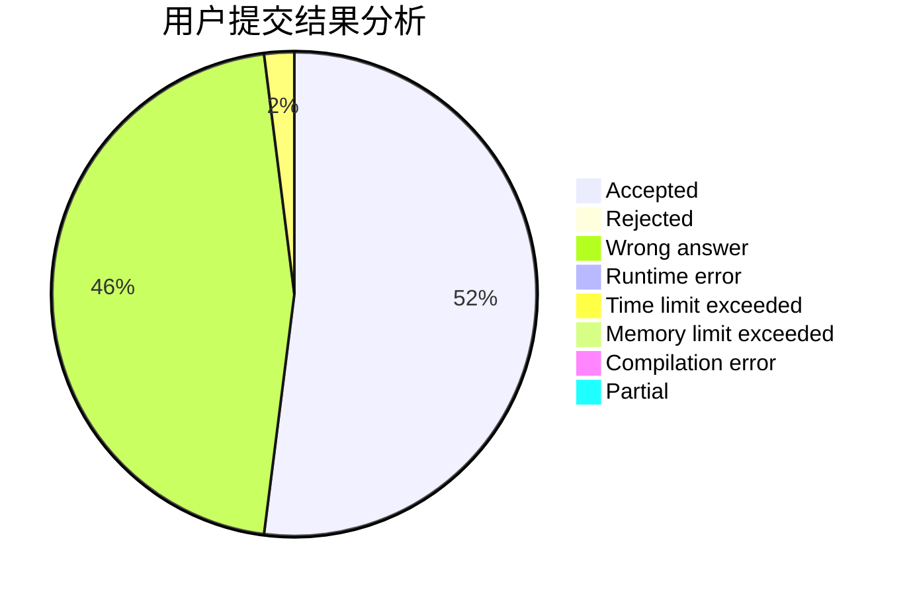
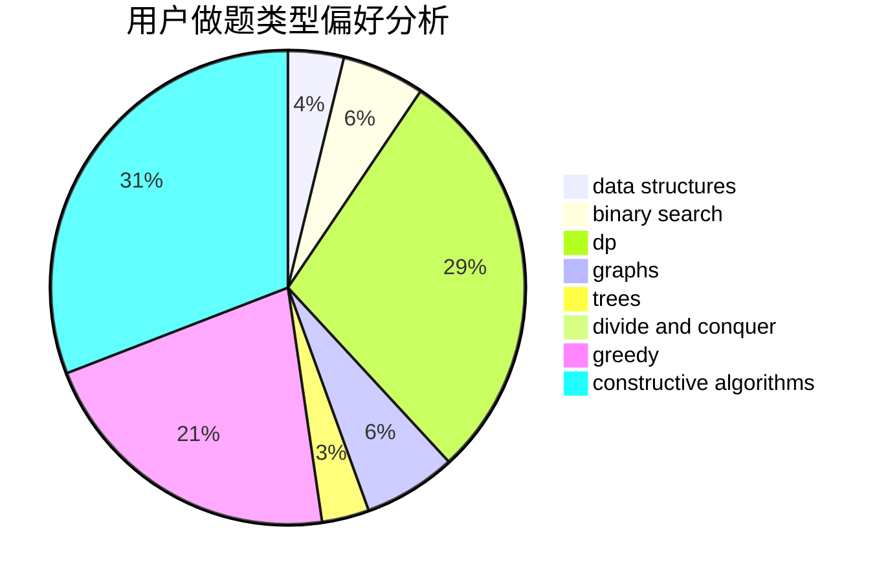
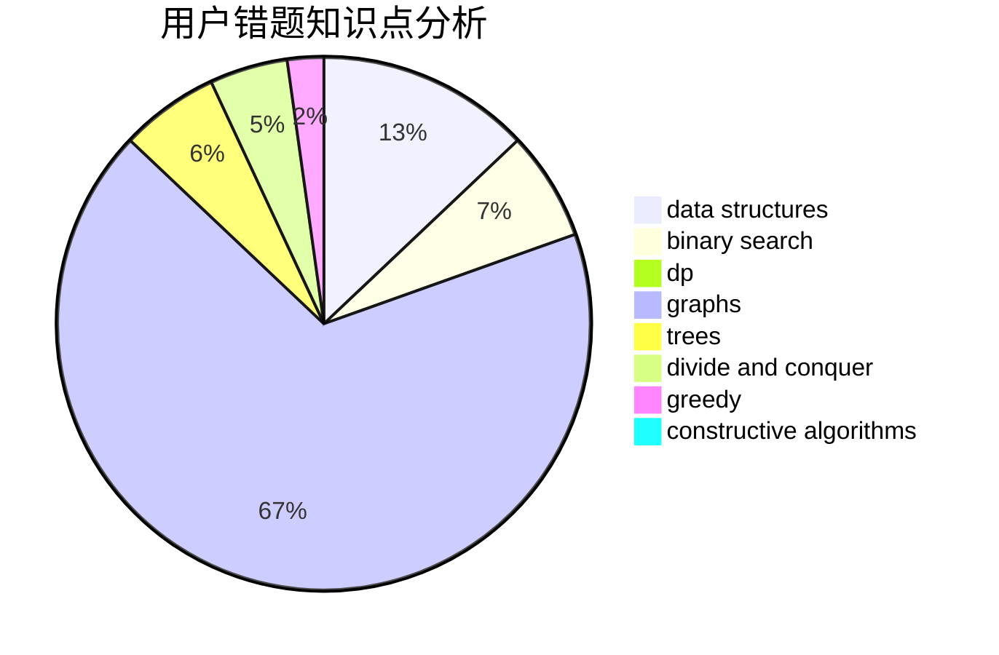

# gyf12138

<!-- tabs:start -->

#### **用户提交结果分析**

#### **用户做题类型偏好分析**

#### **用户错题知识点分析**

<!-- tabs:end -->
# 推荐题目
[1496C](https://codeforces.com/contest/1496/problem/C)		dsu,graphs,sortings,trees		  
[54A](https://codeforces.com/contest/54/problem/A)		implementation		  
[1087E](https://codeforces.com/contest/1087/problem/E)		dsu,graphs,sortings,trees		  
[1147F](https://codeforces.com/contest/1147/problem/F)		games,
                        interactive		  
[633H](https://codeforces.com/contest/633/problem/H)		data structures,
                        implementation		  
[409D](https://codeforces.com/contest/409/problem/D)		*special problem		  
[218A](https://codeforces.com/contest/218/problem/A)		brute force,
                        constructive algorithms,
                        implementation		  
[331E1](https://codeforces.com/contest/331E/problem/1)		constructive algorithms,
                        graphs,
                        implementation		  
[477E](https://codeforces.com/contest/477/problem/E)		data structures		  
[1209C](https://codeforces.com/contest/1209/problem/C)		constructive algorithms,
                        greedy,
                        implementation		  
