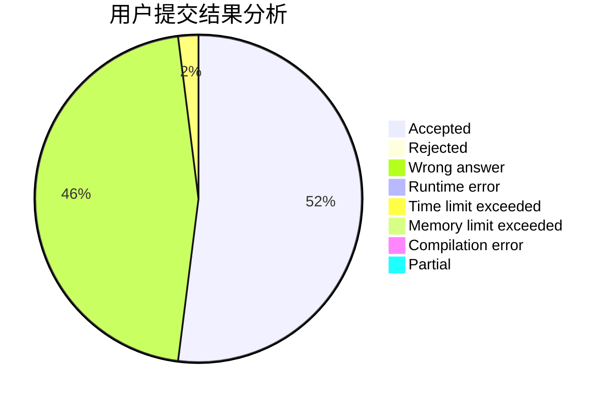
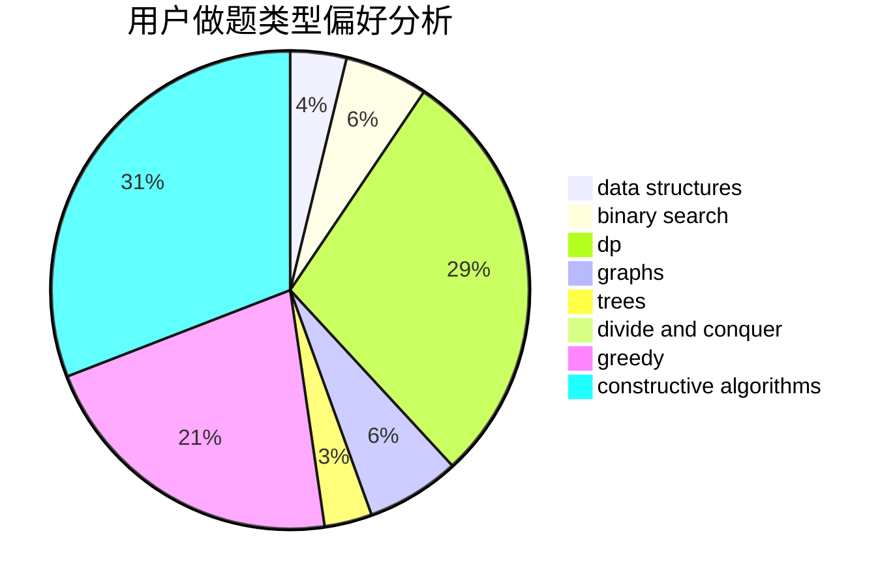
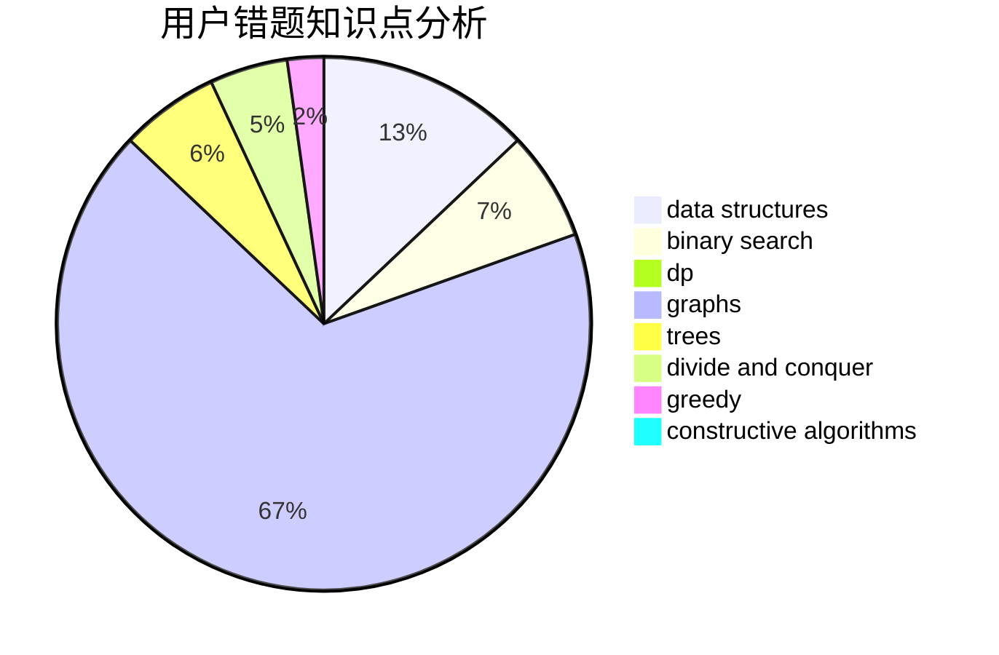

# gyf12138
<!-- tabs:start -->
#### **用户提交结果分析**

#### **用户做题类型偏好分析**

#### **用户错题知识点分析**

<!-- tabs:end -->
# 推荐题目
[New Year and Boolean Bridges](http://codeforces.com/problemset/problem/908/H)		nan		  
[Vasya and Templates](https://codeforces.com/contest/1087/problem/E)		greedy,
                        implementation,
                        strings		  
[Dreamoon and Notepad](http://codeforces.com/problemset/problem/477/E)		data structures		  
[Presents](http://codeforces.com/problemset/problem/54/A)		implementation		  
[Fibonacci-ish II](http://codeforces.com/problemset/problem/633/H)		data structures,
                        implementation		  
[Privatization](http://codeforces.com/problemset/problem/212/A)		flows,
                        graphs		  
[Arya and Bran](http://codeforces.com/problemset/problem/839/A)		implementation		  
[Buy One, Get One Free](http://codeforces.com/problemset/problem/335/F)		dp,
                        greedy		  
[The Big Race](http://codeforces.com/problemset/problem/592/C)		math		  
[Bracket Subsequence](http://codeforces.com/problemset/problem/1023/C)		greedy		  
<!-- tabs:start -->
#### **data structures**
[New Year and Boolean Bridges](http://codeforces.com/problemset/problem/477/E)		data structures		  
[Vasya and Templates](http://codeforces.com/problemset/problem/633/H)		data structures,
                        implementation		  
[Dreamoon and Notepad](http://codeforces.com/problemset/problem/1083/F)		data structures		  
[Presents](https://codeforces.com/contest/1180/problem/C)		data structures,
                        implementation		  
[Fibonacci-ish II](http://codeforces.com/problemset/problem/891/C)		data structures,
                        dsu,
                        graphs		  
[Privatization](http://codeforces.com/problemset/problem/5/E)		data structures		  
[Arya and Bran](http://codeforces.com/problemset/problem/1172/E)		data structures		  
[Buy One, Get One Free](http://codeforces.com/problemset/problem/1468/M)		data structures,
                        graphs,
                        implementation		  
[The Big Race](https://codeforces.com/contest/1480/problem/D1)		constructive algorithms,
                        data structures,
                        dp,
                        greedy,
                        implementation		  
[Bracket Subsequence](http://codeforces.com/problemset/problem/1492/C)		binary search,
                        data structures,
                        dp,
                        greedy,
                        two pointers		  
#### **binary search**
[New Year and Boolean Bridges](http://codeforces.com/problemset/problem/1238/D)		binary search,
                        combinatorics,
                        dp,
                        strings		  
[Vasya and Templates](http://codeforces.com/problemset/problem/1427/H)		binary search,
                        games,
                        geometry,
                        ternary search		  
[Dreamoon and Notepad](http://codeforces.com/problemset/problem/274/A)		binary search,
                        greedy,
                        sortings		  
[Presents](http://codeforces.com/problemset/problem/1492/C)		binary search,
                        data structures,
                        dp,
                        greedy,
                        two pointers		  
[Fibonacci-ish II](http://codeforces.com/problemset/problem/1463/D)		binary search,
                        constructive algorithms,
                        greedy,
                        two pointers		  
[Privatization](http://codeforces.com/problemset/problem/1490/G)		binary search,
                        data structures,
                        math		  
[Arya and Bran](http://codeforces.com/problemset/problem/1479/D)		binary search,
                        bitmasks,
                        brute force,
                        data structures,
                        probabilities,
                        trees		  
[Buy One, Get One Free](http://codeforces.com/problemset/problem/1436/E)		binary search,
                        data structures,
                        two pointers		  
[The Big Race](http://codeforces.com/problemset/problem/1461/D)		binary search,
                        brute force,
                        data structures,
                        divide and conquer,
                        implementation,
                        sortings		  
[Bracket Subsequence](http://codeforces.com/problemset/problem/1493/C)		binary search,
                        brute force,
                        constructive algorithms,
                        greedy,
                        strings		  
#### **dp**
[New Year and Boolean Bridges](http://codeforces.com/problemset/problem/335/F)		dp,
                        greedy		  
[Vasya and Templates](http://codeforces.com/problemset/problem/212/E)		dfs and similar,
                        dp,
                        trees		  
[Dreamoon and Notepad](http://codeforces.com/problemset/problem/319/C)		dp,
                        geometry		  
[Presents](http://codeforces.com/problemset/problem/1238/D)		binary search,
                        combinatorics,
                        dp,
                        strings		  
[Fibonacci-ish II](http://codeforces.com/problemset/problem/607/B)		dp		  
[Privatization](https://codeforces.com/contest/1480/problem/D1)		constructive algorithms,
                        data structures,
                        dp,
                        greedy,
                        implementation		  
[Arya and Bran](http://codeforces.com/problemset/problem/772/D)		bitmasks,
                        dp		  
[Buy One, Get One Free](http://codeforces.com/problemset/problem/1492/C)		binary search,
                        data structures,
                        dp,
                        greedy,
                        two pointers		  
[The Big Race](https://codeforces.com/contest/1457/problem/C)		brute force,
                        dp,
                        implementation		  
[Bracket Subsequence](http://codeforces.com/problemset/problem/1491/C)		brute force,
                        data structures,
                        dp,
                        greedy,
                        implementation		  
#### **graph**
[New Year and Boolean Bridges](http://codeforces.com/problemset/problem/212/A)		flows,
                        graphs		  
[Vasya and Templates](https://codeforces.com/contest/742/problem/E)		constructive algorithms,
                        dfs and similar,
                        graphs		  
[Dreamoon and Notepad](http://codeforces.com/problemset/problem/331/E1)		constructive algorithms,
                        graphs,
                        implementation		  
[Presents](http://codeforces.com/problemset/problem/723/D)		dfs and similar,
                        dsu,
                        graphs,
                        greedy,
                        implementation		  
[Fibonacci-ish II](http://codeforces.com/problemset/problem/891/C)		data structures,
                        dsu,
                        graphs		  
[Privatization](http://codeforces.com/problemset/problem/843/D)		graphs,
                        shortest paths		  
[Arya and Bran](http://codeforces.com/problemset/problem/1468/M)		data structures,
                        graphs,
                        implementation		  
[Buy One, Get One Free](http://codeforces.com/problemset/problem/1142/E)		graphs,
                        interactive		  
[The Big Race](http://codeforces.com/problemset/problem/1487/C)		brute force,
                        constructive algorithms,
                        dfs and similar,
                        graphs,
                        greedy,
                        implementation,
                        math		  
[Bracket Subsequence](http://codeforces.com/problemset/problem/1437/C)		dp,
                        flows,
                        graph matchings,
                        greedy,
                        math,
                        sortings		  
#### **trees**
[New Year and Boolean Bridges](http://codeforces.com/problemset/problem/212/E)		dfs and similar,
                        dp,
                        trees		  
[Vasya and Templates](http://codeforces.com/problemset/problem/1479/D)		binary search,
                        bitmasks,
                        brute force,
                        data structures,
                        probabilities,
                        trees		  
[Dreamoon and Notepad](http://codeforces.com/problemset/problem/1511/C)		brute force,
                        data structures,
                        implementation,
                        trees		  
[Presents](http://codeforces.com/problemset/problem/1499/F)		combinatorics,
                        dfs and similar,
                        dp,
                        trees		  
[Fibonacci-ish II](http://codeforces.com/problemset/problem/1491/E)		brute force,
                        dfs and similar,
                        divide and conquer,
                        number theory,
                        trees		  
[Privatization](http://codeforces.com/problemset/problem/1466/D)		data structures,
                        greedy,
                        sortings,
                        trees		  
[Arya and Bran](http://codeforces.com/problemset/problem/1495/D)		combinatorics,
                        dfs and similar,
                        graphs,
                        math,
                        shortest paths,
                        trees		  
[Buy One, Get One Free](http://codeforces.com/problemset/problem/1303/G)		data structures,
                        divide and conquer,
                        geometry,
                        trees		  
[The Big Race](http://codeforces.com/problemset/problem/1454/E)		combinatorics,
                        dfs and similar,
                        graphs,
                        trees		  
[Bracket Subsequence](http://codeforces.com/problemset/problem/1494/D)		constructive algorithms,
                        data structures,
                        dfs and similar,
                        divide and conquer,
                        dsu,
                        greedy,
                        sortings,
                        trees		  
#### **divide and conquer**
[New Year and Boolean Bridges](http://codeforces.com/problemset/problem/1461/D)		binary search,
                        brute force,
                        data structures,
                        divide and conquer,
                        implementation,
                        sortings		  
[Vasya and Templates](http://codeforces.com/problemset/problem/1466/G)		combinatorics,
                        divide and conquer,
                        hashing,
                        math,
                        string suffix structures,
                        strings		  
[Dreamoon and Notepad](http://codeforces.com/problemset/problem/1490/D)		dfs and similar,
                        divide and conquer,
                        implementation		  
[Presents](https://codeforces.com/contest/1483/problem/C)		data structures,
                        divide and conquer,
                        dp		  
[Fibonacci-ish II](http://codeforces.com/problemset/problem/1491/E)		brute force,
                        dfs and similar,
                        divide and conquer,
                        number theory,
                        trees		  
[Privatization](http://codeforces.com/problemset/problem/1303/G)		data structures,
                        divide and conquer,
                        geometry,
                        trees		  
[Arya and Bran](http://codeforces.com/problemset/problem/1494/D)		constructive algorithms,
                        data structures,
                        dfs and similar,
                        divide and conquer,
                        dsu,
                        greedy,
                        sortings,
                        trees		  
[Buy One, Get One Free](http://codeforces.com/problemset/problem/1482/E)		data structures,
                        divide and conquer,
                        dp		  
[The Big Race](http://codeforces.com/problemset/problem/566/C)		dfs and similar,
                        divide and conquer,
                        trees		  
[Bracket Subsequence](http://codeforces.com/problemset/problem/1428/F)		binary search,
                        data structures,
                        divide and conquer,
                        dp,
                        two pointers		  
#### **greedy**
[New Year and Boolean Bridges](https://codeforces.com/contest/1087/problem/E)		greedy,
                        implementation,
                        strings		  
[Vasya and Templates](http://codeforces.com/problemset/problem/335/F)		dp,
                        greedy		  
[Dreamoon and Notepad](http://codeforces.com/problemset/problem/1023/C)		greedy		  
[Presents](https://codeforces.com/contest/606/problem/C)		constructive algorithms,
                        greedy		  
[Fibonacci-ish II](http://codeforces.com/problemset/problem/723/D)		dfs and similar,
                        dsu,
                        graphs,
                        greedy,
                        implementation		  
[Privatization](https://codeforces.com/contest/1496/problem/C)		geometry,
                        greedy,
                        math,
                        sortings		  
[Arya and Bran](http://codeforces.com/problemset/problem/274/A)		binary search,
                        greedy,
                        sortings		  
[Buy One, Get One Free](http://codeforces.com/problemset/problem/1006/B)		greedy,
                        implementation,
                        sortings		  
[The Big Race](http://codeforces.com/problemset/problem/1209/C)		constructive algorithms,
                        greedy,
                        implementation		  
[Bracket Subsequence](https://codeforces.com/contest/1480/problem/D1)		constructive algorithms,
                        data structures,
                        dp,
                        greedy,
                        implementation		  
#### **constructive algorithms**
[New Year and Boolean Bridges](https://codeforces.com/contest/742/problem/E)		constructive algorithms,
                        dfs and similar,
                        graphs		  
[Vasya and Templates](https://codeforces.com/contest/606/problem/C)		constructive algorithms,
                        greedy		  
[Dreamoon and Notepad](http://codeforces.com/problemset/problem/331/E1)		constructive algorithms,
                        graphs,
                        implementation		  
[Presents](http://codeforces.com/problemset/problem/218/A)		brute force,
                        constructive algorithms,
                        implementation		  
[Fibonacci-ish II](http://codeforces.com/problemset/problem/268/C)		constructive algorithms,
                        implementation		  
[Privatization](http://codeforces.com/problemset/problem/1473/C)		constructive algorithms,
                        math		  
[Arya and Bran](http://codeforces.com/problemset/problem/1438/D)		bitmasks,
                        constructive algorithms,
                        math		  
[Buy One, Get One Free](http://codeforces.com/problemset/problem/1209/C)		constructive algorithms,
                        greedy,
                        implementation		  
[The Big Race](https://codeforces.com/contest/1480/problem/D1)		constructive algorithms,
                        data structures,
                        dp,
                        greedy,
                        implementation		  
[Bracket Subsequence](http://codeforces.com/problemset/problem/1493/A)		constructive algorithms,
                        greedy		  
#### **sortings**
[New Year and Boolean Bridges](https://codeforces.com/contest/1496/problem/C)		geometry,
                        greedy,
                        math,
                        sortings		  
[Vasya and Templates](http://codeforces.com/problemset/problem/274/A)		binary search,
                        greedy,
                        sortings		  
[Dreamoon and Notepad](http://codeforces.com/problemset/problem/1006/B)		greedy,
                        implementation,
                        sortings		  
[Presents](https://codeforces.com/contest/1496/problem/C)		geometry,
                        greedy,
                        math,
                        sortings		  
[Fibonacci-ish II](http://codeforces.com/problemset/problem/1495/A)		geometry,
                        greedy,
                        math,
                        sortings		  
[Privatization](http://codeforces.com/problemset/problem/1497/A)		brute force,
                        data structures,
                        greedy,
                        sortings		  
[Arya and Bran](http://codeforces.com/problemset/problem/1427/A)		math,
                        sortings		  
[Buy One, Get One Free](http://codeforces.com/problemset/problem/1461/D)		binary search,
                        brute force,
                        data structures,
                        divide and conquer,
                        implementation,
                        sortings		  
[The Big Race](http://codeforces.com/problemset/problem/1437/C)		dp,
                        flows,
                        graph matchings,
                        greedy,
                        math,
                        sortings		  
[Bracket Subsequence](http://codeforces.com/problemset/problem/1473/A)		greedy,
                        implementation,
                        math,
                        sortings		  
<!-- tabs:end -->
