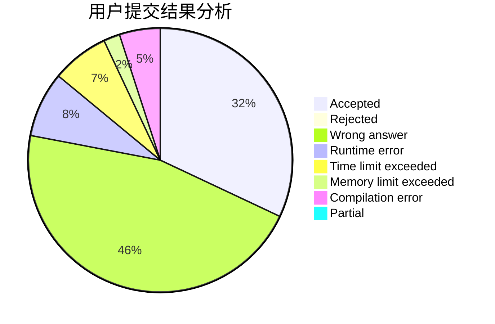
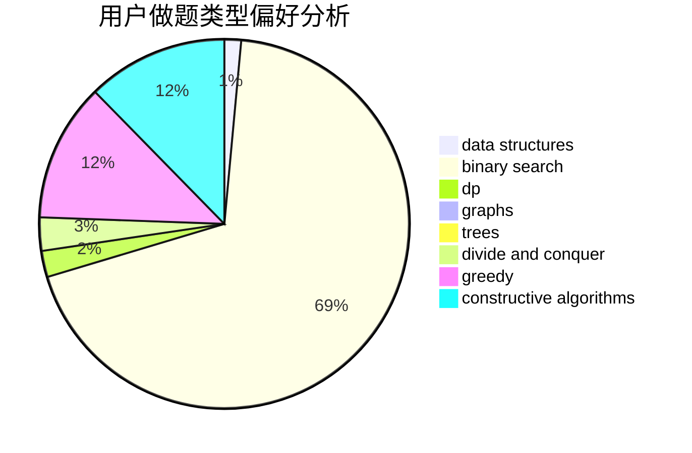
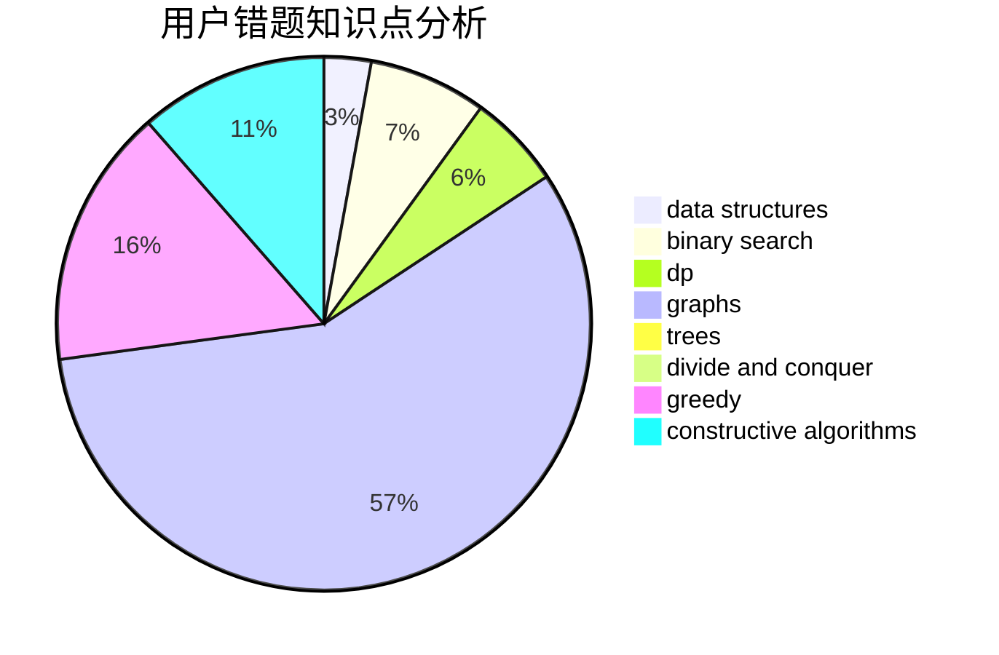

# gyh20

<!-- tabs:start -->

#### **用户提交结果分析**

#### **用户做题类型偏好分析**

#### **用户错题知识点分析**

<!-- tabs:end -->
# 推荐题目
[1513D](https://codeforces.com/contest/1513/problem/D)		constructive algorithms,
                        dsu,
                        graphs,
                        greedy,
                        number theory,
                        sortings		  
[820B](https://codeforces.com/contest/820/problem/B)		constructive algorithms,
                        geometry,
                        math		  
[845C](https://codeforces.com/contest/845/problem/C)		data structures,
                        greedy,
                        sortings		  
[1419C](https://codeforces.com/contest/1419/problem/C)		greedy,
                        implementation,
                        math		  
[1028G](https://codeforces.com/contest/1028/problem/G)		dp,
                        interactive		  
[913B](https://codeforces.com/contest/913/problem/B)		implementation,
                        trees		  
[174B](https://codeforces.com/contest/174/problem/B)		dp,
                        greedy,
                        implementation		  
[376A](https://codeforces.com/contest/376/problem/A)		implementation,
                        math		  
[662E](https://codeforces.com/contest/662/problem/E)		brute force,
                        dp,
                        greedy		  
[257D](https://codeforces.com/contest/257/problem/D)		greedy,
                        math		  
