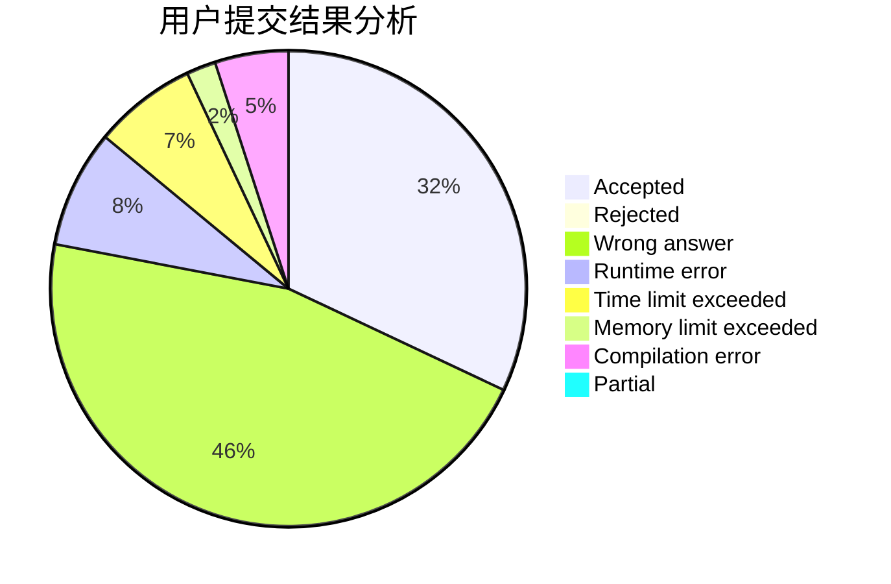
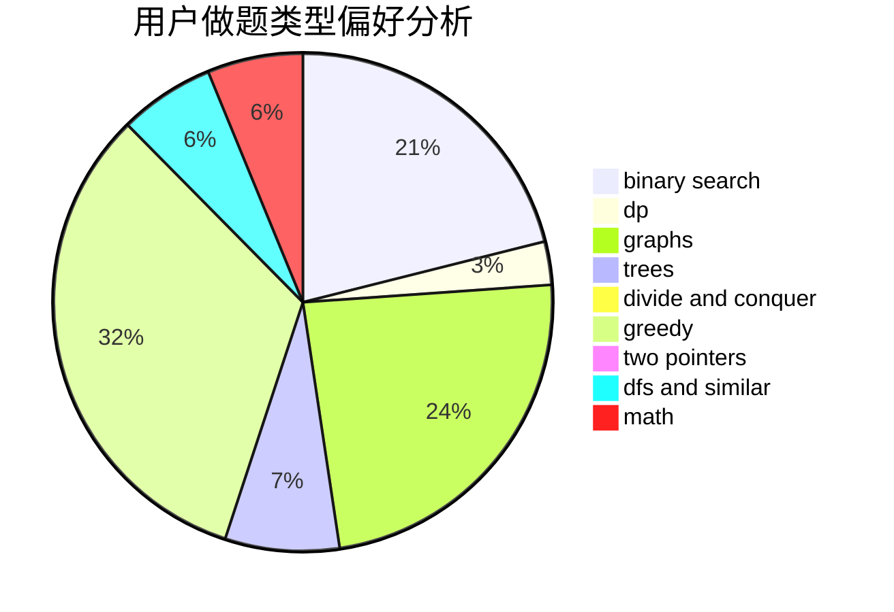

# gyh20

<!-- tabs:start -->

#### **用户提交结果分析**

#### **用户做题类型偏好分析**

<!-- tabs:end -->
# 推荐题目
[1513D](https://codeforces.com/contest/1513/problem/D)
[820B](https://codeforces.com/contest/820/problem/B)
[845C](https://codeforces.com/contest/845/problem/C)
[1419C](https://codeforces.com/contest/1419/problem/C)
[1028G](https://codeforces.com/contest/1028/problem/G)
[913B](https://codeforces.com/contest/913/problem/B)
[174B](https://codeforces.com/contest/174/problem/B)
[376A](https://codeforces.com/contest/376/problem/A)
[662E](https://codeforces.com/contest/662/problem/E)
[257D](https://codeforces.com/contest/257/problem/D)
