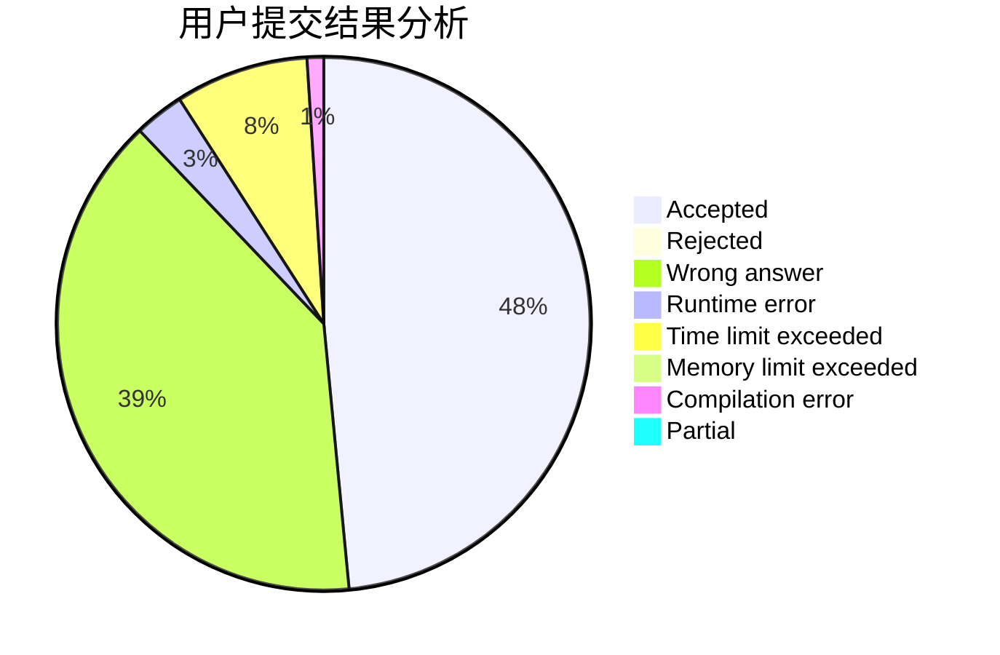
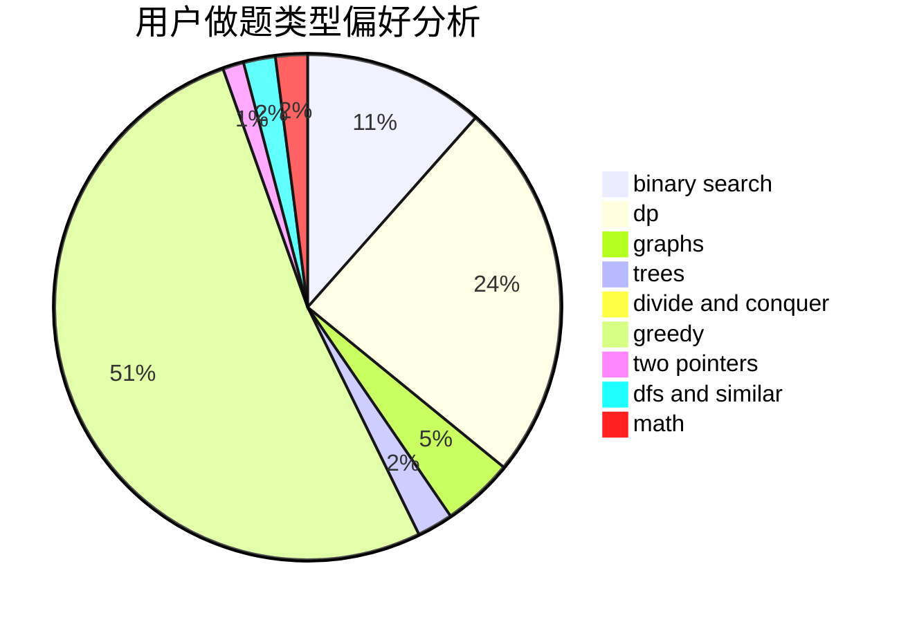

# gyz_gyz

<!-- tabs:start -->

#### **用户提交结果分析**

#### **用户做题类型偏好分析**

<!-- tabs:end -->
# 推荐题目
[1472C](https://codeforces.com/contest/1472/problem/C)
[1488B](https://codeforces.com/contest/1488/problem/B)
[1146A](https://codeforces.com/contest/1146/problem/A)
[1257E](https://codeforces.com/contest/1257/problem/E)
[967D](https://codeforces.com/contest/967/problem/D)
[996B](https://codeforces.com/contest/996/problem/B)
[1167D](https://codeforces.com/contest/1167/problem/D)
[1073G](https://codeforces.com/contest/1073/problem/G)
[525C](https://codeforces.com/contest/525/problem/C)
[389B](https://codeforces.com/contest/389/problem/B)
