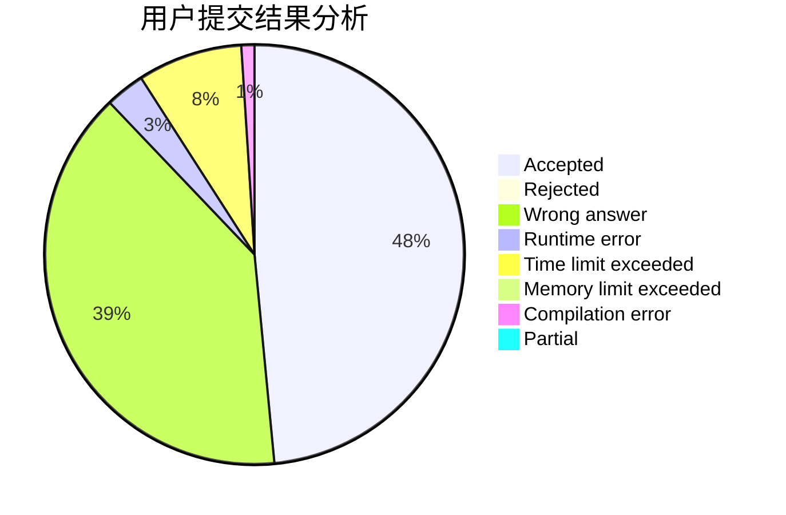
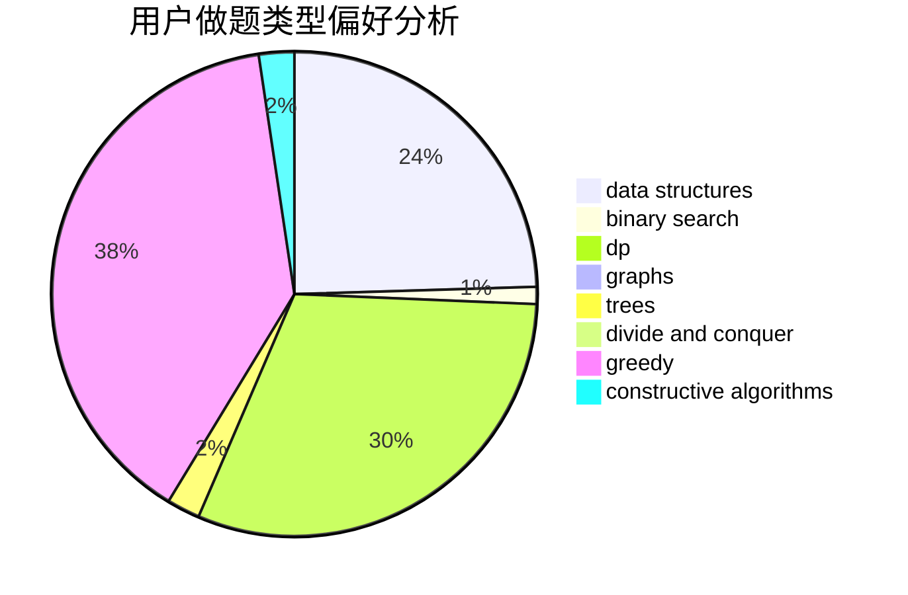
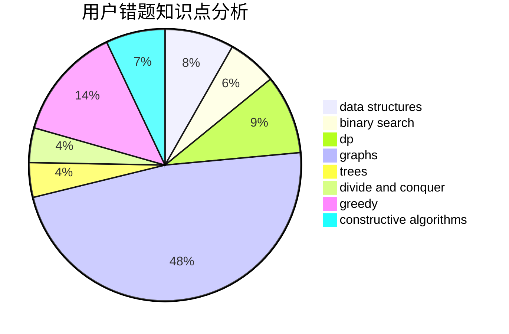

# gyz_gyz

<!-- tabs:start -->

#### **用户提交结果分析**

#### **用户做题类型偏好分析**

#### **用户错题知识点分析**

<!-- tabs:end -->
# 推荐题目
[1472C](https://codeforces.com/contest/1472/problem/C)		dp,
                        graphs		  
[1488B](https://codeforces.com/contest/1488/problem/B)		*special problem,
                        greedy		  
[1146A](https://codeforces.com/contest/1146/problem/A)		implementation,
                        strings		  
[1257E](https://codeforces.com/contest/1257/problem/E)		data structures,
                        dp,
                        greedy		  
[967D](https://codeforces.com/contest/967/problem/D)		dsu,graphs,sortings,trees		  
[996B](https://codeforces.com/contest/996/problem/B)		binary search,
                        math		  
[1167D](https://codeforces.com/contest/1167/problem/D)		constructive algorithms,
                        greedy		  
[1073G](https://codeforces.com/contest/1073/problem/G)		data structures,
                        string suffix structures		  
[525C](https://codeforces.com/contest/525/problem/C)		greedy,
                        math,
                        sortings		  
[389B](https://codeforces.com/contest/389/problem/B)		greedy,
                        implementation		  
