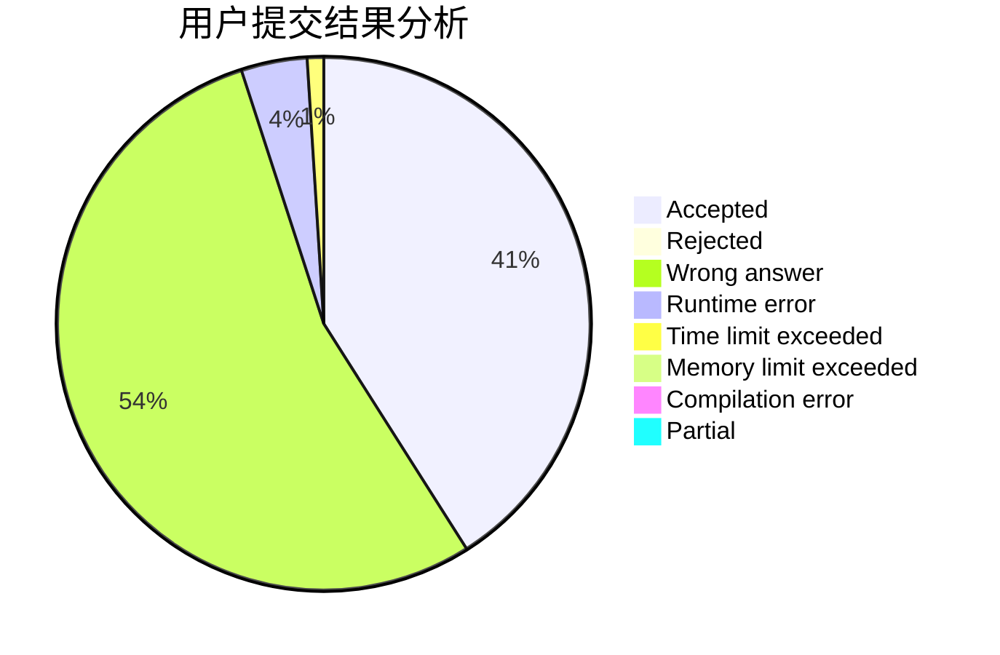
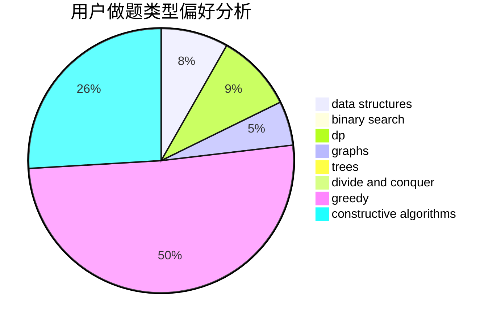
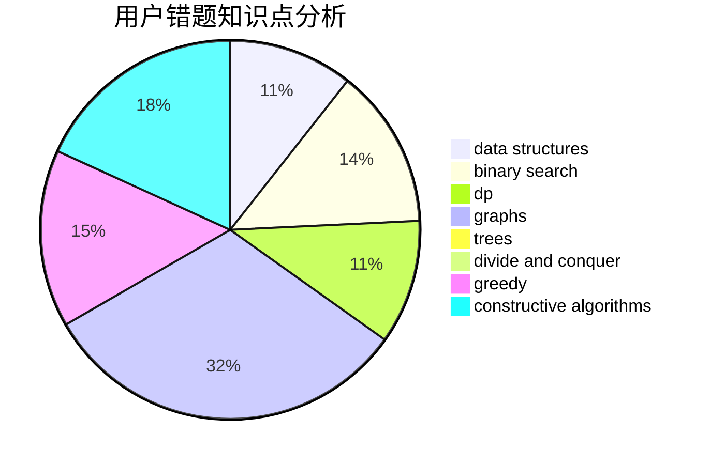

# gzchenben

<!-- tabs:start -->

#### **用户提交结果分析**

#### **用户做题类型偏好分析**

#### **用户错题知识点分析**

<!-- tabs:end -->
# 推荐题目
[268B](https://codeforces.com/contest/268/problem/B)		implementation,
                        math		  
[979E](https://codeforces.com/contest/979/problem/E)		dp		  
[656E](https://codeforces.com/contest/656/problem/E)		*special problem		  
[659F](https://codeforces.com/contest/659/problem/F)		dfs and similar,
                        dsu,
                        graphs,
                        greedy,
                        sortings		  
[886F](https://codeforces.com/contest/886/problem/F)		geometry		  
[628B](https://codeforces.com/contest/628/problem/B)		dp		  
[49E](https://codeforces.com/contest/49/problem/E)		dp		  
[1190D](https://codeforces.com/contest/1190/problem/D)		data structures,
                        divide and conquer,
                        sortings,
                        two pointers		  
[725D](https://codeforces.com/contest/725/problem/D)		data structures,
                        greedy		  
[545C](https://codeforces.com/contest/545/problem/C)		dp,
                        greedy		  
