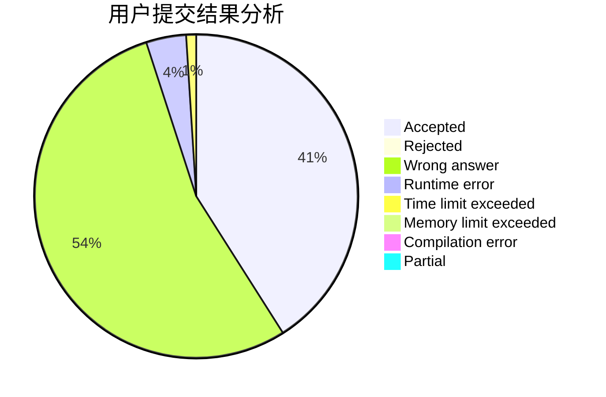
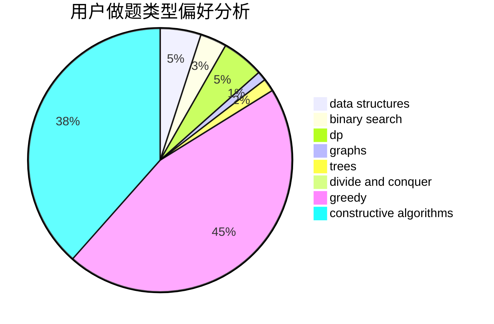
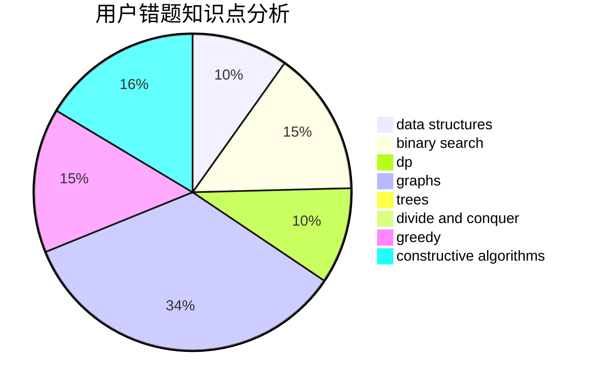

# gzchenben

<!-- tabs:start -->

#### **用户提交结果分析**

#### **用户做题类型偏好分析**

#### **用户错题知识点分析**

<!-- tabs:end -->
# 推荐题目
[283C](https://codeforces.com/contest/283/problem/C)		dp		  
[993E](https://codeforces.com/contest/993/problem/E)		chinese remainder theorem,
                        fft,
                        math		  
[678E](https://codeforces.com/contest/678/problem/E)		bitmasks,
                        dp,
                        math,
                        probabilities		  
[67A](https://codeforces.com/contest/67/problem/A)		dp,
                        graphs,
                        greedy,
                        implementation		  
[906A](https://codeforces.com/contest/906/problem/A)		implementation,
                        strings		  
[656A](https://codeforces.com/contest/656/problem/A)		*special problem		  
[51F](https://codeforces.com/contest/51/problem/F)		dfs and similar,
                        dp,
                        graphs,
                        trees		  
[1196B](https://codeforces.com/contest/1196/problem/B)		constructive algorithms,
                        math		  
[743D](https://codeforces.com/contest/743/problem/D)		dfs and similar,
                        dp,
                        graphs,
                        trees		  
[56E](https://codeforces.com/contest/56/problem/E)		binary search,
                        data structures,
                        sortings		  
