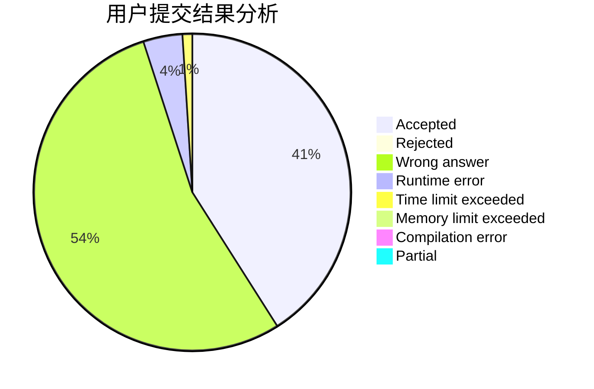
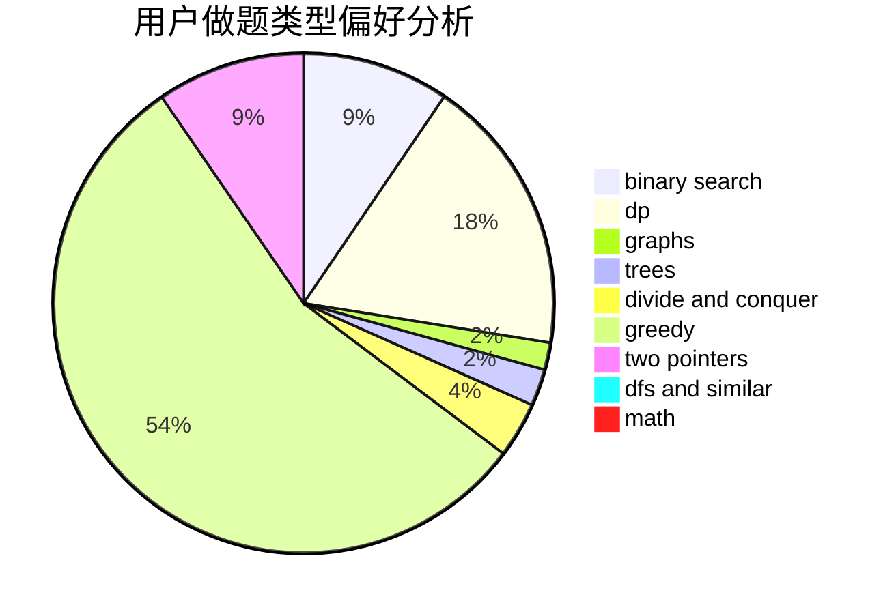

# gzchenben

<!-- tabs:start -->

#### **用户提交结果分析**

#### **用户做题类型偏好分析**

<!-- tabs:end -->
# 推荐题目
[283C](https://codeforces.com/contest/283/problem/C)
[993E](https://codeforces.com/contest/993/problem/E)
[678E](https://codeforces.com/contest/678/problem/E)
[67A](https://codeforces.com/contest/67/problem/A)
[906A](https://codeforces.com/contest/906/problem/A)
[656A](https://codeforces.com/contest/656/problem/A)
[51F](https://codeforces.com/contest/51/problem/F)
[1196B](https://codeforces.com/contest/1196/problem/B)
[743D](https://codeforces.com/contest/743/problem/D)
[56E](https://codeforces.com/contest/56/problem/E)
