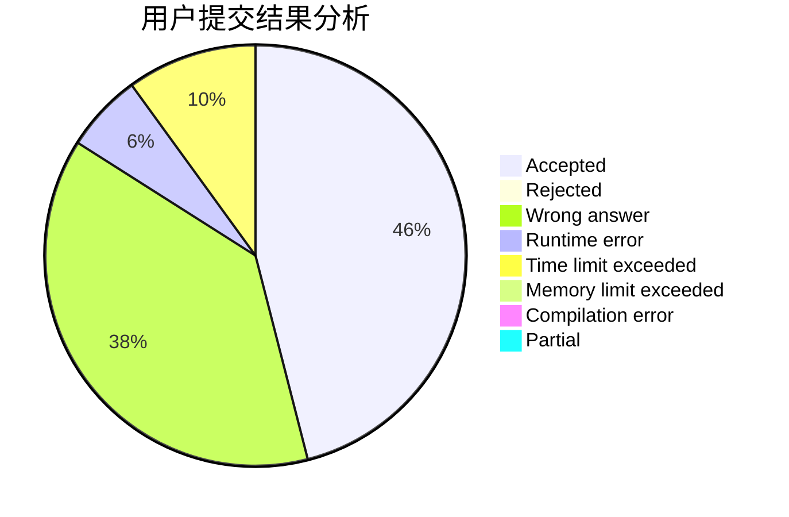
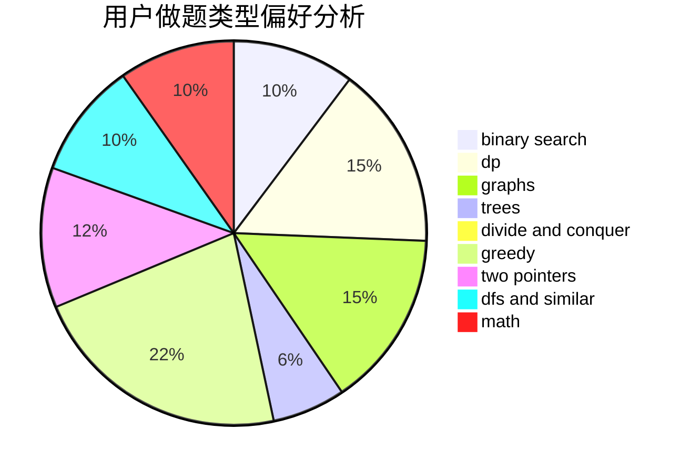

# BIG-HSY

<!-- tabs:start -->

#### **用户提交结果分析**

#### **用户做题类型偏好分析**

<!-- tabs:end -->
# 推荐题目
[1182A](https://codeforces.com/contest/1182/problem/A)
[14472](https://codeforces.com/contest/1447/problem/2)
[1265C](https://codeforces.com/contest/1265/problem/C)
[1033B](https://codeforces.com/contest/1033/problem/B)
[174B](https://codeforces.com/contest/174/problem/B)
[1131F](https://codeforces.com/contest/1131/problem/F)
[1297D](https://codeforces.com/contest/1297/problem/D)
[457D](https://codeforces.com/contest/457/problem/D)
[477D](https://codeforces.com/contest/477/problem/D)
[478B](https://codeforces.com/contest/478/problem/B)
