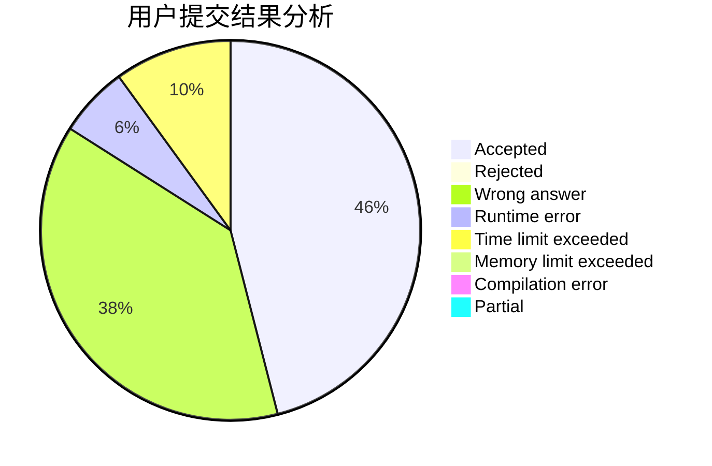
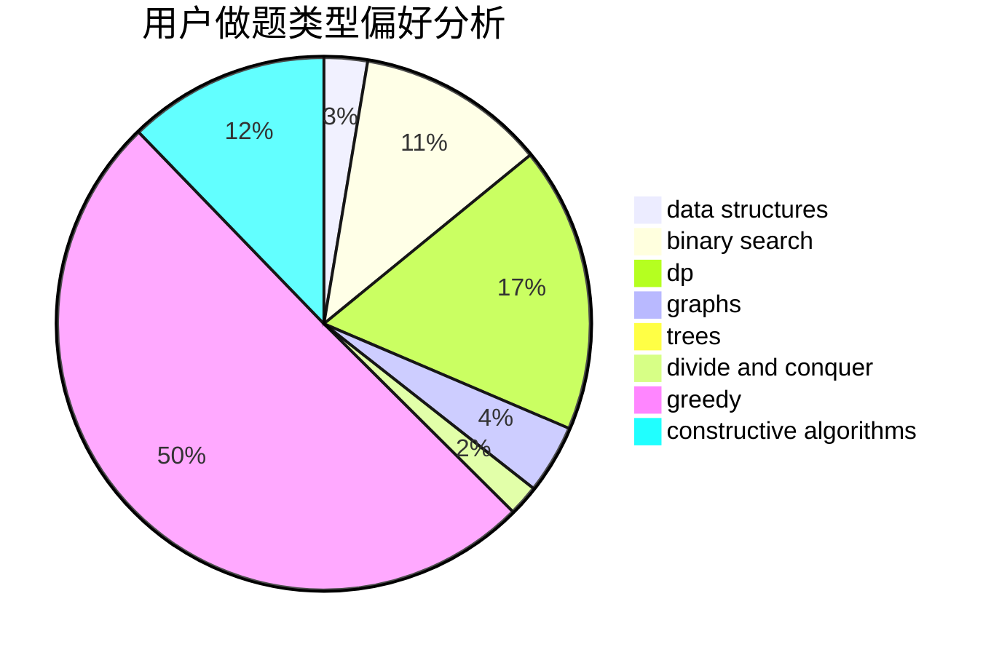
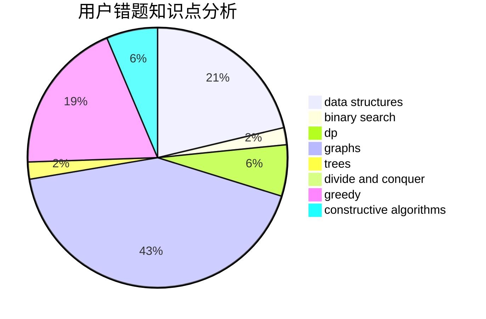

# BIG-HSY

<!-- tabs:start -->

#### **用户提交结果分析**

#### **用户做题类型偏好分析**

#### **用户错题知识点分析**

<!-- tabs:end -->
# 推荐题目
[1179B](https://codeforces.com/contest/1179/problem/B)		constructive algorithms		  
[1437C](https://codeforces.com/contest/1437/problem/C)		dp,
                        flows,
                        graph matchings,
                        greedy,
                        math,
                        sortings		  
[125A](https://codeforces.com/contest/125/problem/A)		math		  
[1032E](https://codeforces.com/contest/1032/problem/E)		dp,
                        math		  
[1513F](https://codeforces.com/contest/1513/problem/F)		brute force,
                        constructive algorithms,
                        data structures,
                        sortings		  
[112A](https://codeforces.com/contest/112/problem/A)		implementation,
                        strings		  
[1291A](https://codeforces.com/contest/1291/problem/A)		greedy,
                        math,
                        strings		  
[436D](https://codeforces.com/contest/436/problem/D)		dp		  
[457D](https://codeforces.com/contest/457/problem/D)		combinatorics,
                        math,
                        probabilities		  
[459C](https://codeforces.com/contest/459/problem/C)		combinatorics,
                        constructive algorithms,
                        math		  
