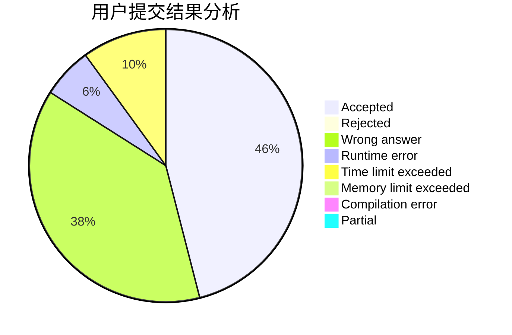
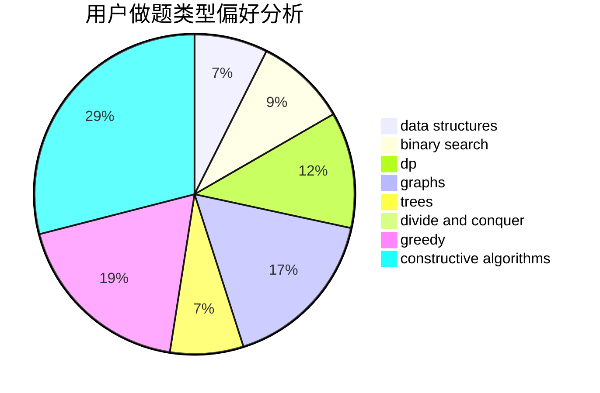
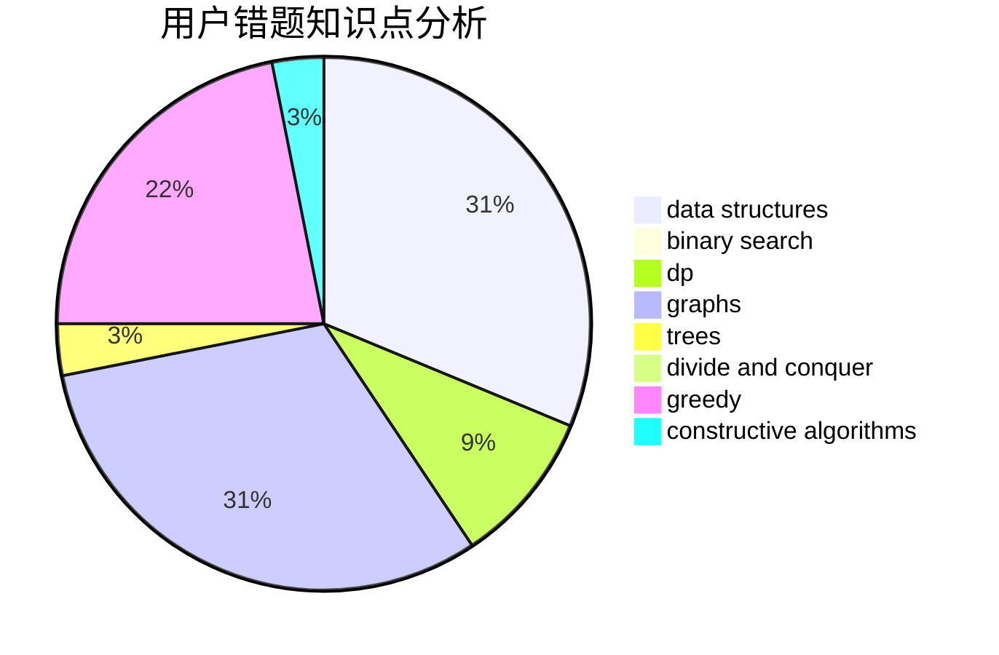

# BIG-HSY

<!-- tabs:start -->

#### **用户提交结果分析**

#### **用户做题类型偏好分析**

#### **用户错题知识点分析**

<!-- tabs:end -->
# 推荐题目
[1182A](https://codeforces.com/contest/1182/problem/A)		dp,
                        math		  
[14472](https://codeforces.com/contest/1447/problem/2)		dsu,graphs,sortings,trees		  
[1265C](https://codeforces.com/contest/1265/problem/C)		dsu,graphs,sortings,trees		  
[1033B](https://codeforces.com/contest/1033/problem/B)		math,
                        number theory		  
[174B](https://codeforces.com/contest/174/problem/B)		dp,
                        greedy,
                        implementation		  
[1131F](https://codeforces.com/contest/1131/problem/F)		constructive algorithms,
                        dsu		  
[1297D](https://codeforces.com/contest/1297/problem/D)		*special problem,
                        binary search,
                        greedy,
                        sortings		  
[457D](https://codeforces.com/contest/457/problem/D)		combinatorics,
                        math,
                        probabilities		  
[477D](https://codeforces.com/contest/477/problem/D)		dp,
                        strings		  
[478B](https://codeforces.com/contest/478/problem/B)		combinatorics,
                        constructive algorithms,
                        greedy,
                        math		  
