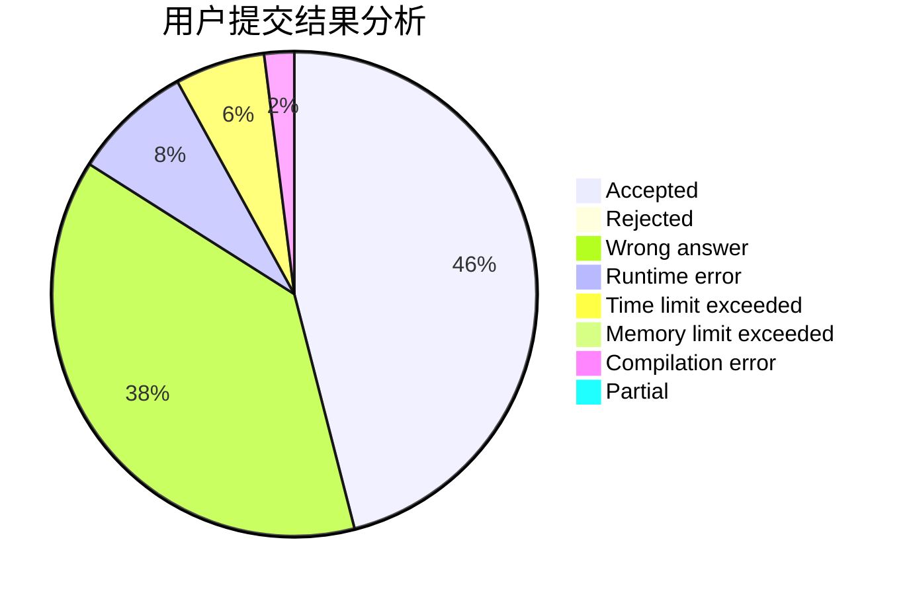
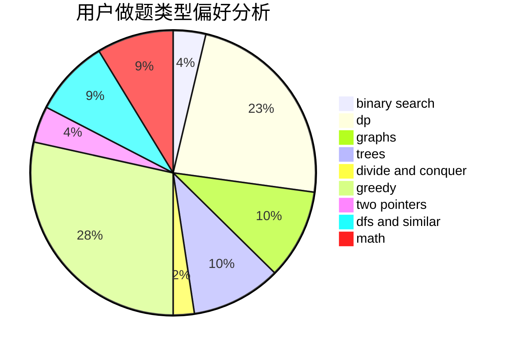

# gzchenyin

<!-- tabs:start -->

#### **用户提交结果分析**

#### **用户做题类型偏好分析**

<!-- tabs:end -->
# 推荐题目
[152E](https://codeforces.com/contest/152/problem/E)
[176B](https://codeforces.com/contest/176/problem/B)
[430C](https://codeforces.com/contest/430/problem/C)
[13791](https://codeforces.com/contest/1379/problem/1)
[199B](https://codeforces.com/contest/199/problem/B)
[721C](https://codeforces.com/contest/721/problem/C)
[1042F](https://codeforces.com/contest/1042/problem/F)
[1070L](https://codeforces.com/contest/1070/problem/L)
[585C](https://codeforces.com/contest/585/problem/C)
[356D](https://codeforces.com/contest/356/problem/D)
