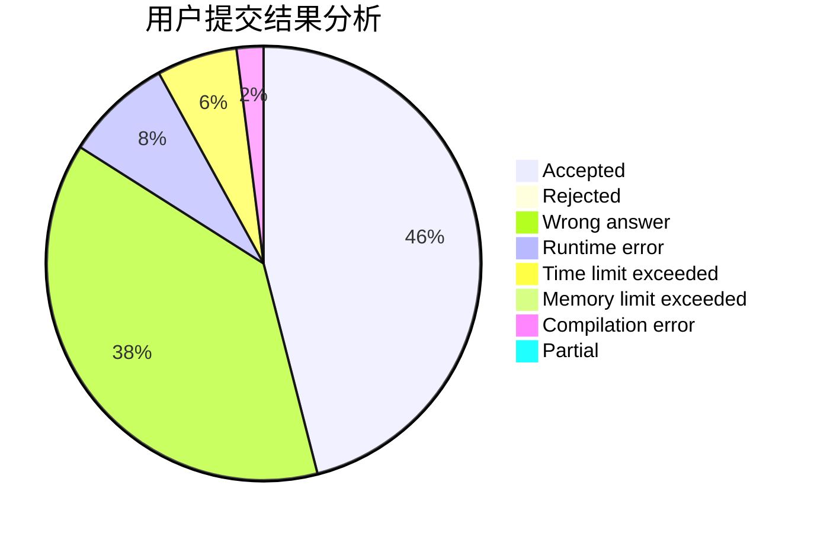
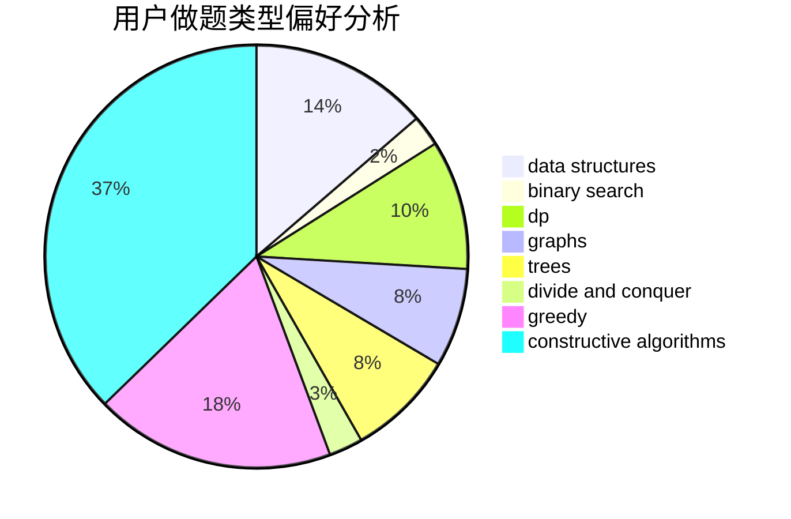

# gzchenyin

<!-- tabs:start -->

#### **用户提交结果分析**

#### **用户做题类型偏好分析**

#### **用户错题知识点分析**

<!-- tabs:end -->
# 推荐题目
[152E](https://codeforces.com/contest/152/problem/E)		bitmasks,
                        dp,
                        graphs,
                        trees		  
[176B](https://codeforces.com/contest/176/problem/B)		dp		  
[430C](https://codeforces.com/contest/430/problem/C)		dsu,graphs,sortings,trees		  
[13791](https://codeforces.com/contest/1379/problem/1)		dsu,graphs,sortings,trees		  
[199B](https://codeforces.com/contest/199/problem/B)		geometry		  
[721C](https://codeforces.com/contest/721/problem/C)		dp,
                        graphs		  
[1042F](https://codeforces.com/contest/1042/problem/F)		data structures,
                        dfs and similar,
                        dsu,
                        graphs,
                        greedy,
                        sortings,
                        trees		  
[1070L](https://codeforces.com/contest/1070/problem/L)		constructive algorithms		  
[585C](https://codeforces.com/contest/585/problem/C)		number theory		  
[356D](https://codeforces.com/contest/356/problem/D)		bitmasks,
                        constructive algorithms,
                        dp,
                        greedy		  
