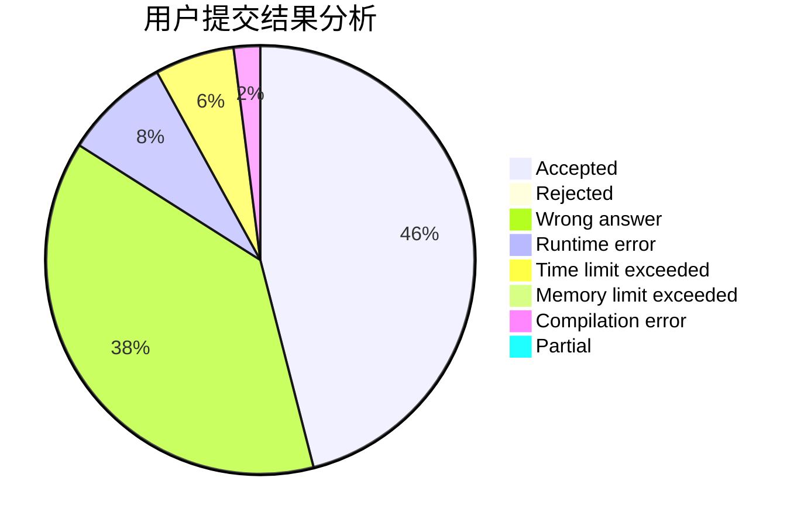
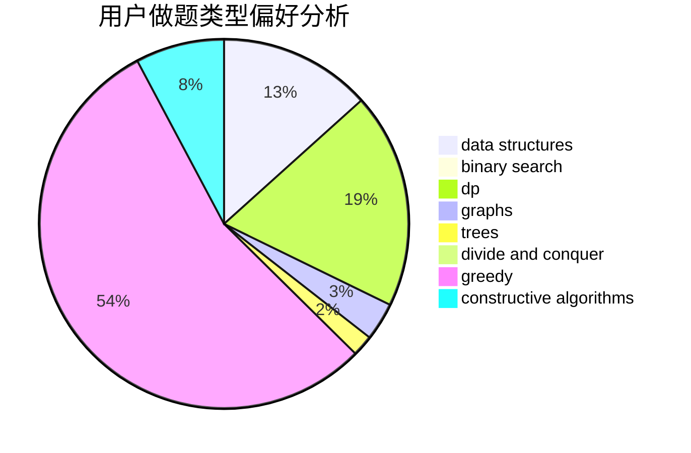
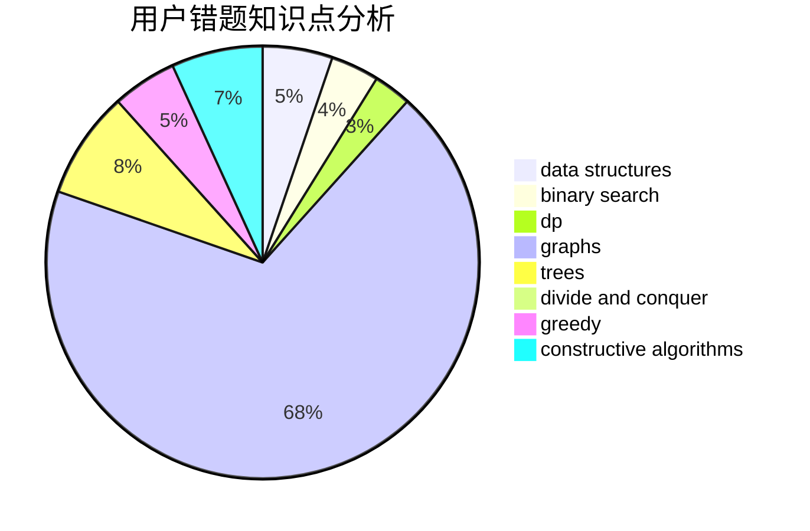

# gzchenyin

<!-- tabs:start -->

#### **用户提交结果分析**

#### **用户做题类型偏好分析**

#### **用户错题知识点分析**

<!-- tabs:end -->
# 推荐题目
[1505D](https://codeforces.com/contest/1505/problem/D)		number theory		  
[154C](https://codeforces.com/contest/154/problem/C)		graphs,
                        hashing,
                        sortings		  
[402C](https://codeforces.com/contest/402/problem/C)		brute force,
                        constructive algorithms,
                        graphs		  
[1370B](https://codeforces.com/contest/1370/problem/B)		constructive algorithms,
                        math,
                        number theory		  
[171E](https://codeforces.com/contest/171/problem/E)		*special problem		  
[702E](https://codeforces.com/contest/702/problem/E)		data structures,
                        graphs		  
[1042C](https://codeforces.com/contest/1042/problem/C)		constructive algorithms,
                        greedy,
                        math		  
[1070I](https://codeforces.com/contest/1070/problem/I)		flows,
                        graph matchings,
                        graphs		  
[566D](https://codeforces.com/contest/566/problem/D)		data structures,
                        dsu		  
[328A](https://codeforces.com/contest/328/problem/A)		implementation		  
