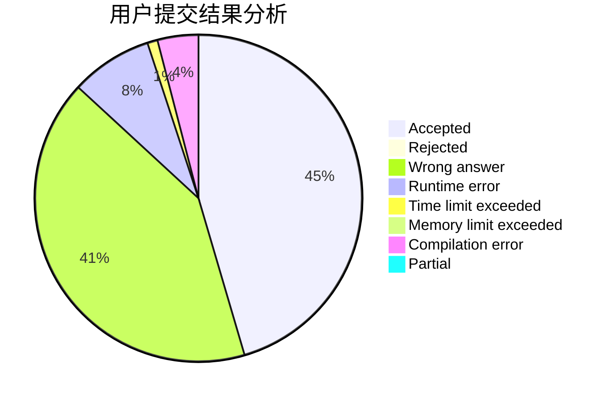
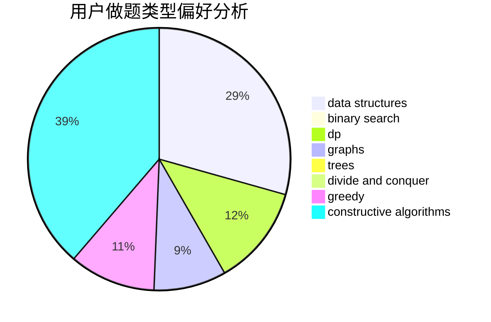
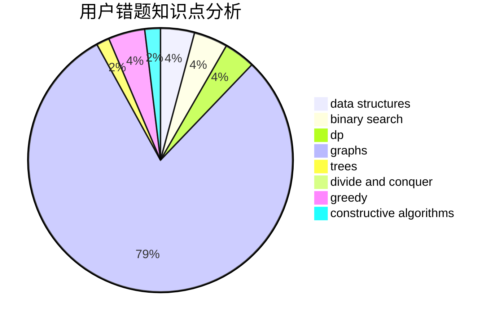

# gzhffIThh

<!-- tabs:start -->

#### **用户提交结果分析**

#### **用户做题类型偏好分析**

#### **用户错题知识点分析**

<!-- tabs:end -->
# 推荐题目
[1296A](https://codeforces.com/contest/1296/problem/A)		math		  
[584C](https://codeforces.com/contest/584/problem/C)		constructive algorithms,
                        greedy,
                        strings		  
[1195C](https://codeforces.com/contest/1195/problem/C)		dp		  
[1119G](https://codeforces.com/contest/1119/problem/G)		constructive algorithms,
                        implementation		  
[883H](https://codeforces.com/contest/883/problem/H)		brute force,
                        implementation,
                        strings		  
[364A](https://codeforces.com/contest/364/problem/A)		combinatorics,
                        data structures,
                        implementation		  
[1255A](https://codeforces.com/contest/1255/problem/A)		math		  
[601A](https://codeforces.com/contest/601/problem/A)		graphs,
                        shortest paths		  
[1375B](https://codeforces.com/contest/1375/problem/B)		constructive algorithms,
                        greedy		  
[1370F2](https://codeforces.com/contest/1370F/problem/2)		binary search,
                        dfs and similar,
                        graphs,
                        interactive,
                        shortest paths,
                        trees		  
