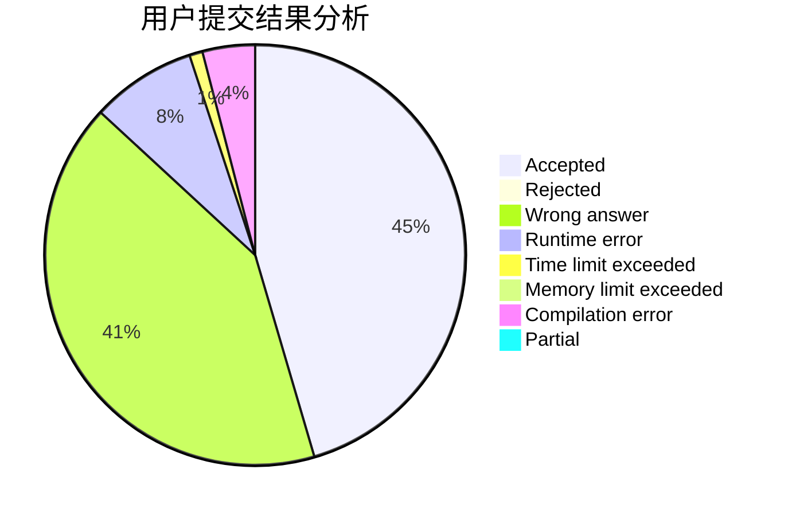
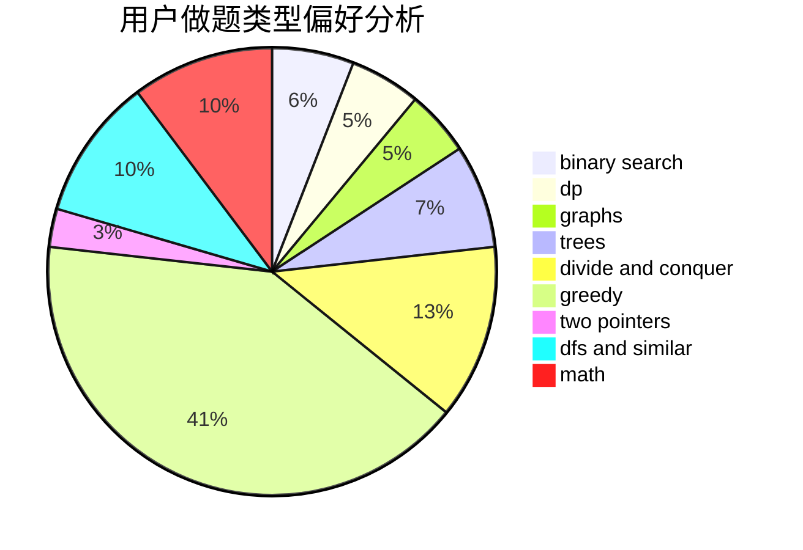

# gzhffIThh

<!-- tabs:start -->

#### **用户提交结果分析**

#### **用户做题类型偏好分析**

<!-- tabs:end -->
# 推荐题目
[1303C](https://codeforces.com/contest/1303/problem/C)
[604C](https://codeforces.com/contest/604/problem/C)
[1199E](https://codeforces.com/contest/1199/problem/E)
[1129C](https://codeforces.com/contest/1129/problem/C)
[901B](https://codeforces.com/contest/901/problem/B)
[38E](https://codeforces.com/contest/38/problem/E)
[1262A](https://codeforces.com/contest/1262/problem/A)
[620C](https://codeforces.com/contest/620/problem/C)
[13842](https://codeforces.com/contest/1384/problem/2)
[1379D](https://codeforces.com/contest/1379/problem/D)
