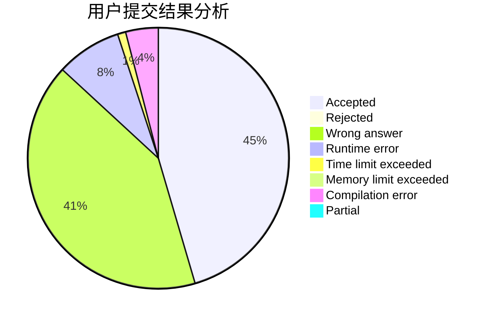
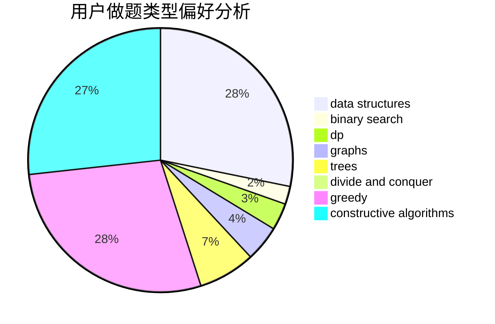
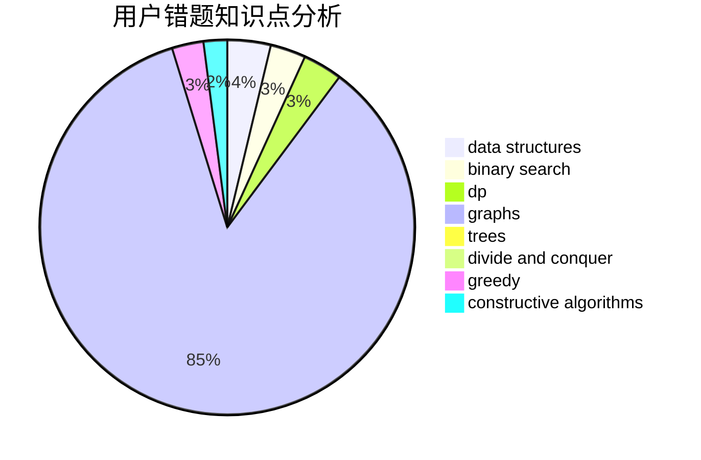

# gzhffIThh

<!-- tabs:start -->

#### **用户提交结果分析**

#### **用户做题类型偏好分析**

#### **用户错题知识点分析**

<!-- tabs:end -->
# 推荐题目
[1303C](https://codeforces.com/contest/1303/problem/C)		dfs and similar,
                        greedy,
                        implementation		  
[604C](https://codeforces.com/contest/604/problem/C)		dsu,graphs,sortings,trees		  
[1199E](https://codeforces.com/contest/1199/problem/E)		dsu,graphs,sortings,trees		  
[1129C](https://codeforces.com/contest/1129/problem/C)		binary search,
                        data structures,
                        dp,
                        hashing,
                        sortings,
                        string suffix structures,
                        strings		  
[901B](https://codeforces.com/contest/901/problem/B)		constructive algorithms,
                        math		  
[38E](https://codeforces.com/contest/38/problem/E)		dp,
                        sortings		  
[1262A](https://codeforces.com/contest/1262/problem/A)		dsu,graphs,sortings,trees		  
[620C](https://codeforces.com/contest/620/problem/C)		greedy		  
[13842](https://codeforces.com/contest/1384/problem/2)		dsu,graphs,sortings,trees		  
[1379D](https://codeforces.com/contest/1379/problem/D)		binary search,
                        brute force,
                        data structures,
                        sortings,
                        two pointers		  
