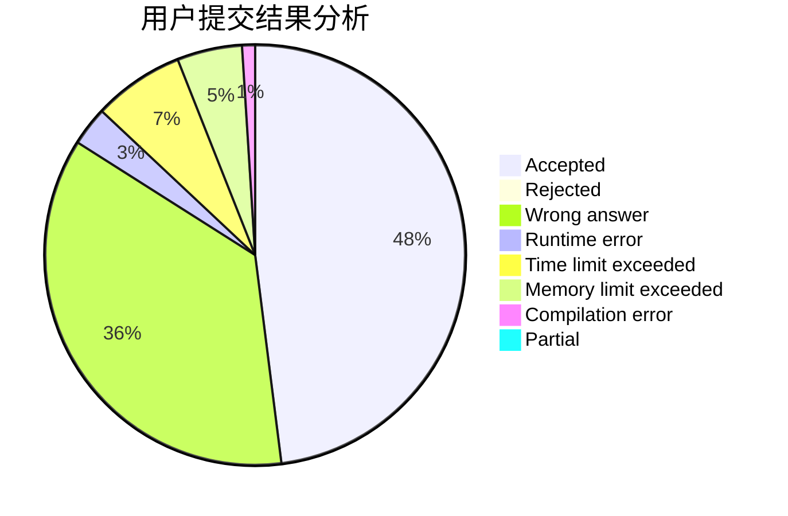
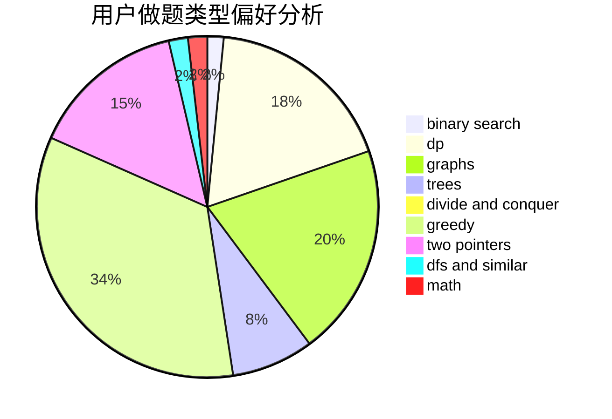

# gzshawnliang

<!-- tabs:start -->

#### **用户提交结果分析**

#### **用户做题类型偏好分析**

<!-- tabs:end -->
# 推荐题目
[1478E](https://codeforces.com/contest/1478/problem/E)
[12372](https://codeforces.com/contest/1237/problem/2)
[1178A](https://codeforces.com/contest/1178/problem/A)
[377B](https://codeforces.com/contest/377/problem/B)
[582A](https://codeforces.com/contest/582/problem/A)
[472A](https://codeforces.com/contest/472/problem/A)
[131D](https://codeforces.com/contest/131/problem/D)
[788B](https://codeforces.com/contest/788/problem/B)
[41D](https://codeforces.com/contest/41/problem/D)
[733B](https://codeforces.com/contest/733/problem/B)
