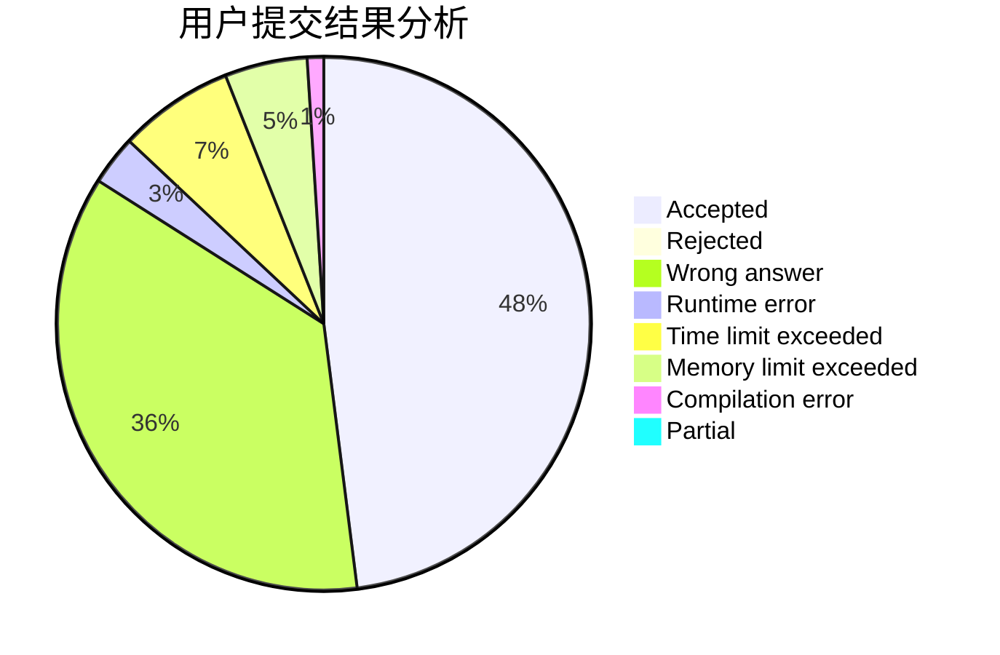
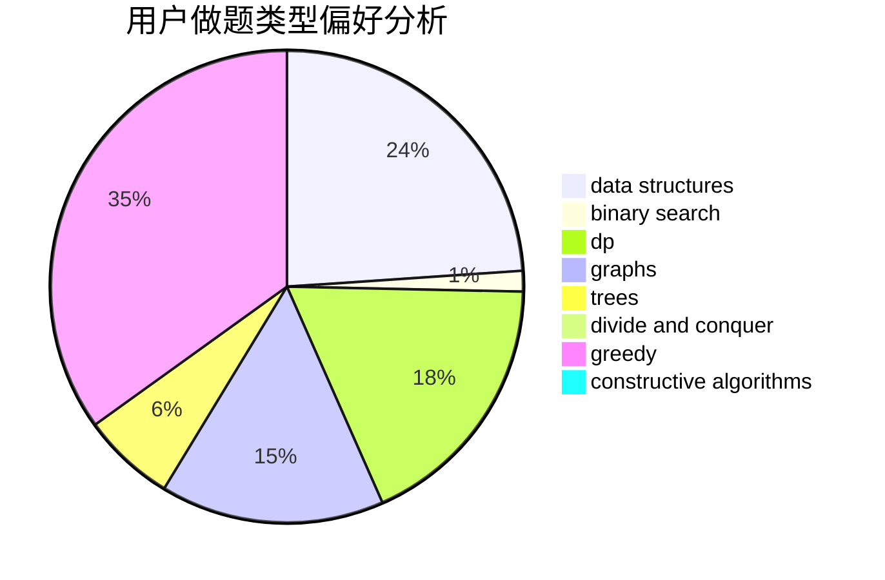
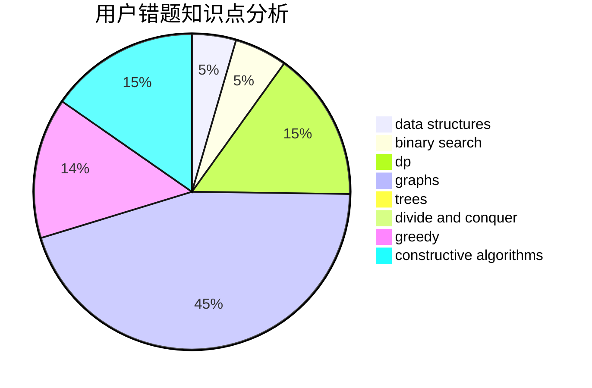

# gzshawnliang

<!-- tabs:start -->

#### **用户提交结果分析**

#### **用户做题类型偏好分析**

#### **用户错题知识点分析**

<!-- tabs:end -->
# 推荐题目
[1478E](https://codeforces.com/contest/1478/problem/E)		dsu,graphs,sortings,trees		  
[12372](https://codeforces.com/contest/1237/problem/2)		dsu,graphs,sortings,trees		  
[1178A](https://codeforces.com/contest/1178/problem/A)		greedy		  
[377B](https://codeforces.com/contest/377/problem/B)		binary search,
                        data structures,
                        greedy,
                        sortings		  
[582A](https://codeforces.com/contest/582/problem/A)		constructive algorithms,
                        greedy,
                        number theory		  
[472A](https://codeforces.com/contest/472/problem/A)		math,
                        number theory		  
[131D](https://codeforces.com/contest/131/problem/D)		dfs and similar,
                        graphs		  
[788B](https://codeforces.com/contest/788/problem/B)		combinatorics,
                        constructive algorithms,
                        dfs and similar,
                        dsu,
                        graphs		  
[41D](https://codeforces.com/contest/41/problem/D)		dp		  
[733B](https://codeforces.com/contest/733/problem/B)		math		  
