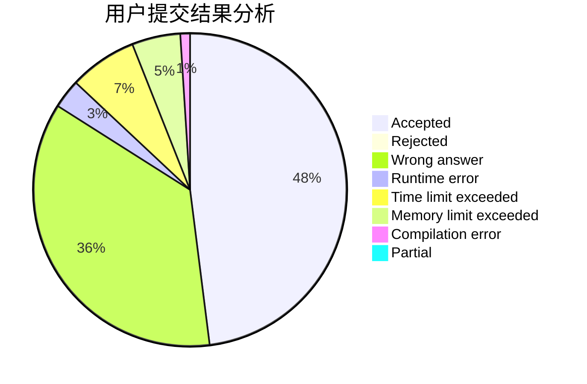
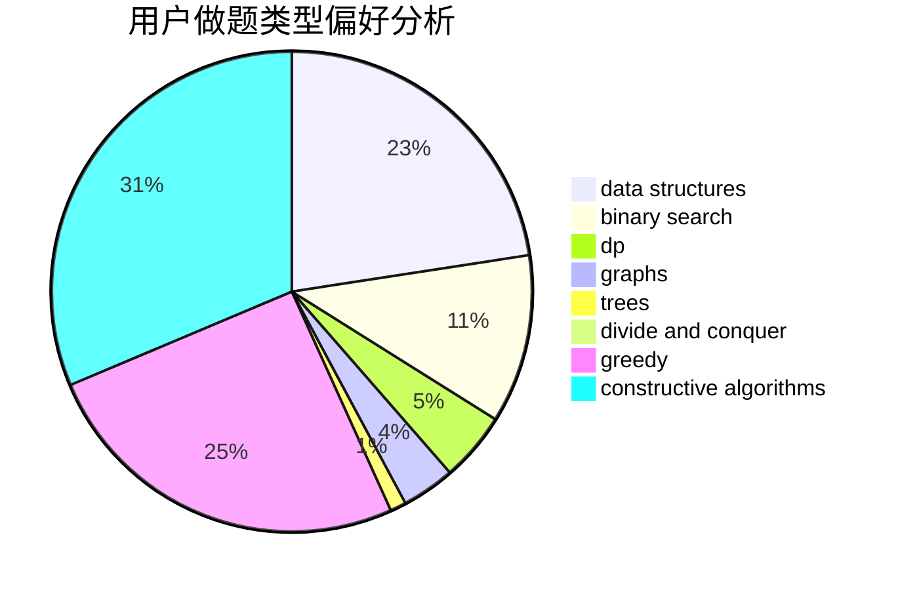
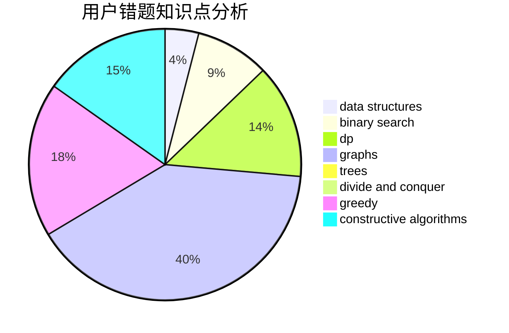

# gzshawnliang

<!-- tabs:start -->

#### **用户提交结果分析**

#### **用户做题类型偏好分析**

#### **用户错题知识点分析**

<!-- tabs:end -->
# 推荐题目
[1470B](https://codeforces.com/contest/1470/problem/B)		bitmasks,
                        graphs,
                        hashing,
                        math,
                        number theory		  
[1228B](https://codeforces.com/contest/1228/problem/B)		implementation,
                        math		  
[1175A](https://codeforces.com/contest/1175/problem/A)		implementation,
                        math		  
[34D](https://codeforces.com/contest/34/problem/D)		dfs and similar,
                        graphs		  
[559C](https://codeforces.com/contest/559/problem/C)		combinatorics,
                        dp,
                        math,
                        number theory		  
[44G](https://codeforces.com/contest/44/problem/G)		data structures,
                        implementation		  
[1310E](https://codeforces.com/contest/1310/problem/E)		dp		  
[768C](https://codeforces.com/contest/768/problem/C)		brute force,
                        dp,
                        implementation,
                        sortings		  
[38E](https://codeforces.com/contest/38/problem/E)		dp,
                        sortings		  
[714E](https://codeforces.com/contest/714/problem/E)		dsu,graphs,sortings,trees		  
