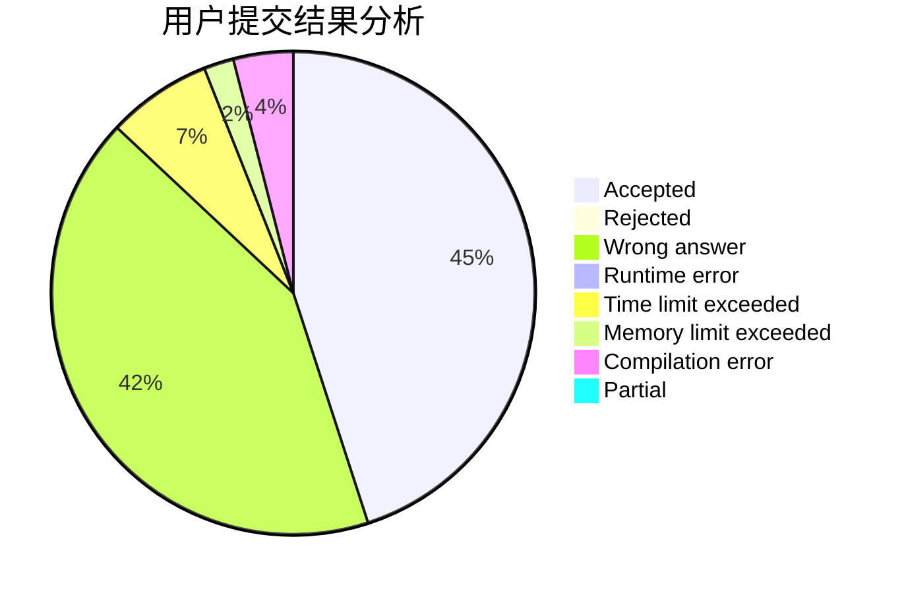
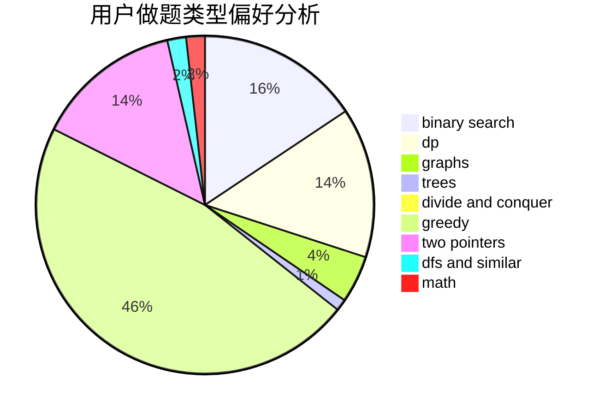

# gzu_eternity

<!-- tabs:start -->

#### **用户提交结果分析**

#### **用户做题类型偏好分析**

<!-- tabs:end -->
# 推荐题目
[845C](https://codeforces.com/contest/845/problem/C)
[12621](https://codeforces.com/contest/1262/problem/1)
[985E](https://codeforces.com/contest/985/problem/E)
[1248E](https://codeforces.com/contest/1248/problem/E)
[888C](https://codeforces.com/contest/888/problem/C)
[835E](https://codeforces.com/contest/835/problem/E)
[599E](https://codeforces.com/contest/599/problem/E)
[1101G](https://codeforces.com/contest/1101/problem/G)
[988F](https://codeforces.com/contest/988/problem/F)
[681E](https://codeforces.com/contest/681/problem/E)
