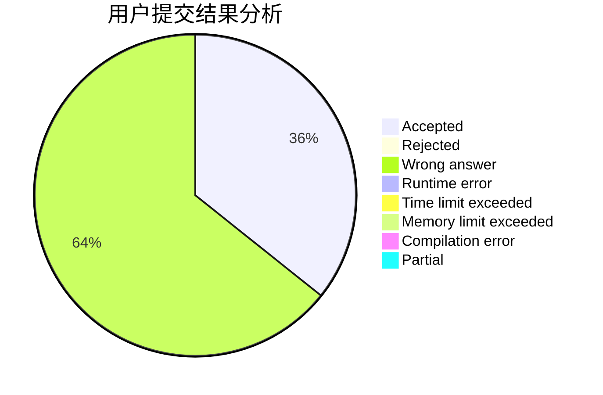
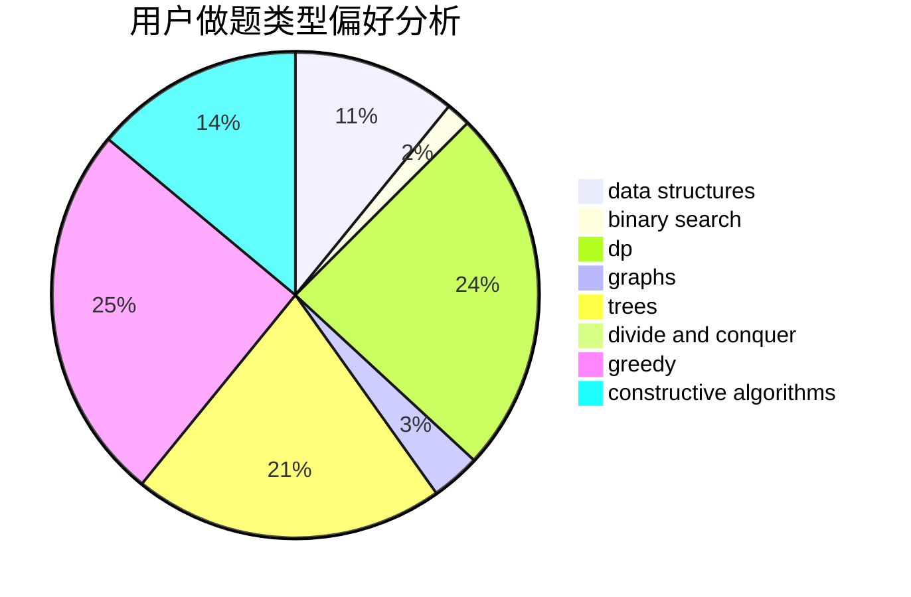
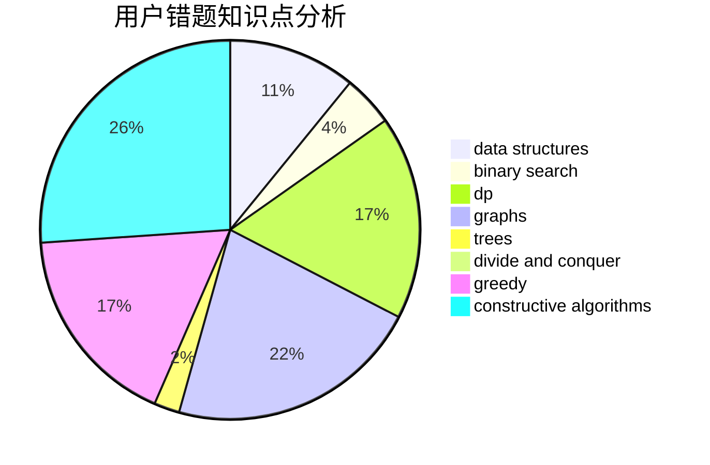

# h__a_ny

<!-- tabs:start -->

#### **用户提交结果分析**

#### **用户做题类型偏好分析**

#### **用户错题知识点分析**

<!-- tabs:end -->
# 推荐题目
[42C](https://codeforces.com/contest/42/problem/C)		brute force,
                        constructive algorithms		  
[449C](https://codeforces.com/contest/449/problem/C)		constructive algorithms,
                        number theory		  
[1379E](https://codeforces.com/contest/1379/problem/E)		constructive algorithms,
                        divide and conquer,
                        dp,
                        math,
                        trees		  
[1148D](https://codeforces.com/contest/1148/problem/D)		greedy,
                        sortings		  
[575H](https://codeforces.com/contest/575/problem/H)		combinatorics,
                        number theory		  
[580B](https://codeforces.com/contest/580/problem/B)		binary search,
                        sortings,
                        two pointers		  
[633D](https://codeforces.com/contest/633/problem/D)		brute force,
                        dp,
                        hashing,
                        implementation,
                        math		  
[722C](https://codeforces.com/contest/722/problem/C)		data structures,
                        dsu		  
[1102D](https://codeforces.com/contest/1102/problem/D)		greedy,
                        strings		  
[259D](https://codeforces.com/contest/259/problem/D)		dsu,graphs,sortings,trees		  
