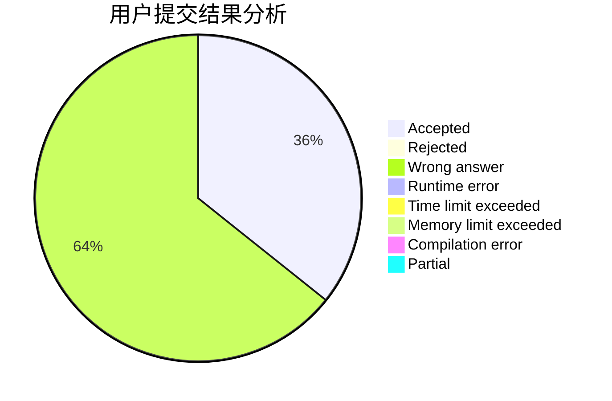
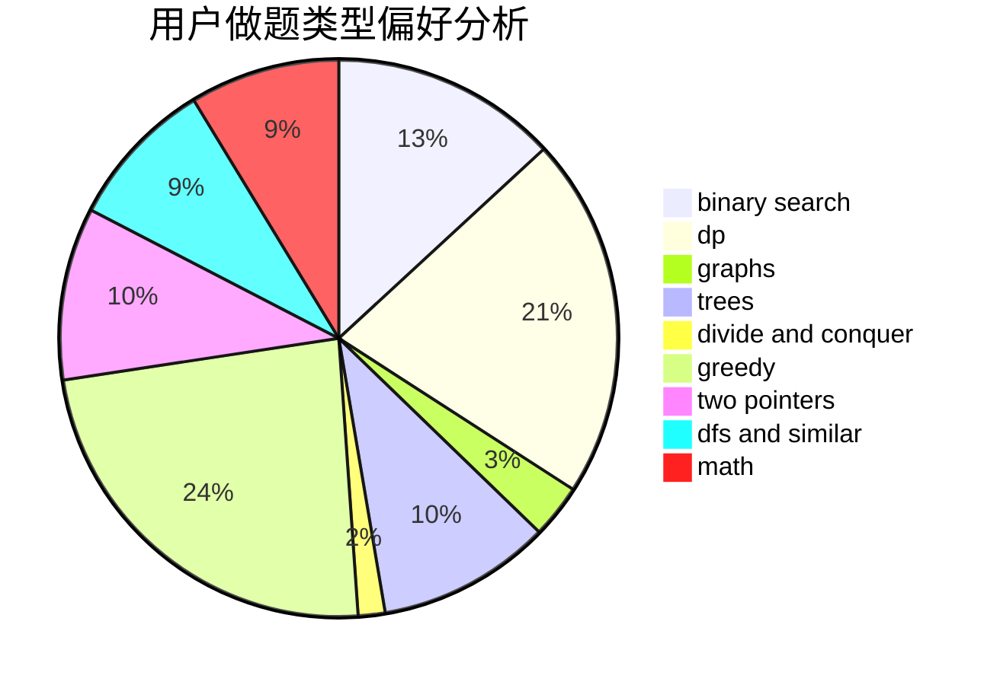

# h__a_ny

<!-- tabs:start -->

#### **用户提交结果分析**

#### **用户做题类型偏好分析**

<!-- tabs:end -->
# 推荐题目
[42C](https://codeforces.com/contest/42/problem/C)
[449C](https://codeforces.com/contest/449/problem/C)
[1379E](https://codeforces.com/contest/1379/problem/E)
[1148D](https://codeforces.com/contest/1148/problem/D)
[575H](https://codeforces.com/contest/575/problem/H)
[580B](https://codeforces.com/contest/580/problem/B)
[633D](https://codeforces.com/contest/633/problem/D)
[722C](https://codeforces.com/contest/722/problem/C)
[1102D](https://codeforces.com/contest/1102/problem/D)
[259D](https://codeforces.com/contest/259/problem/D)
