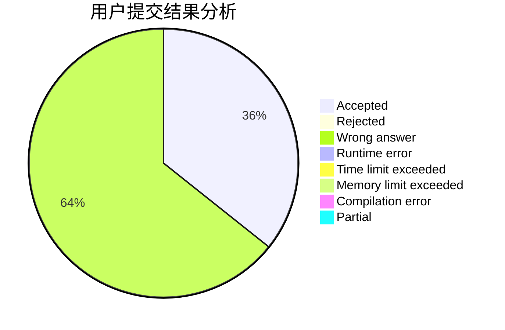
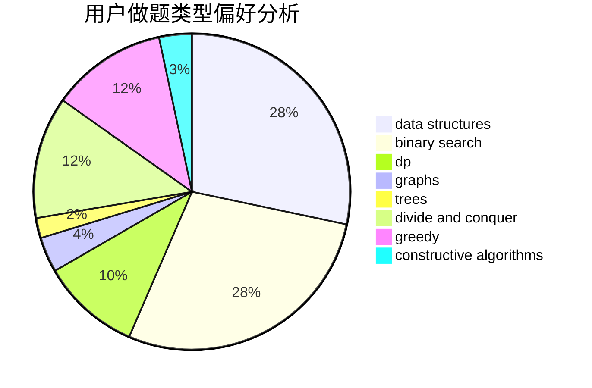
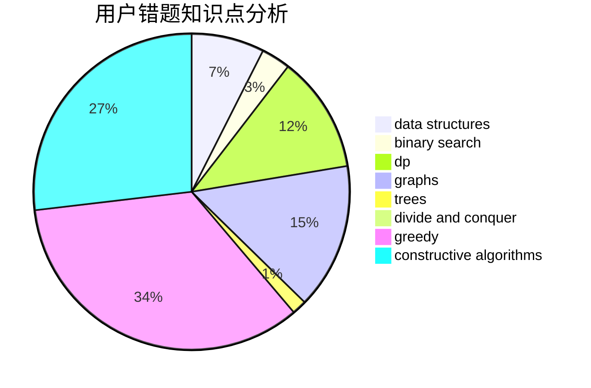

# h__a_ny

<!-- tabs:start -->

#### **用户提交结果分析**

#### **用户做题类型偏好分析**

#### **用户错题知识点分析**

<!-- tabs:end -->
# 推荐题目
[401C](https://codeforces.com/contest/401/problem/C)		constructive algorithms,
                        greedy,
                        implementation		  
[425E](https://codeforces.com/contest/425/problem/E)		dp		  
[1371A](https://codeforces.com/contest/1371/problem/A)		math		  
[1146D](https://codeforces.com/contest/1146/problem/D)		dfs and similar,
                        math,
                        number theory		  
[550D](https://codeforces.com/contest/550/problem/D)		constructive algorithms,
                        graphs,
                        implementation		  
[555E](https://codeforces.com/contest/555/problem/E)		dfs and similar,
                        graphs,
                        trees		  
[615D](https://codeforces.com/contest/615/problem/D)		math,
                        number theory		  
[703B](https://codeforces.com/contest/703/problem/B)		implementation,
                        math		  
[1102A](https://codeforces.com/contest/1102/problem/A)		math		  
[236C](https://codeforces.com/contest/236/problem/C)		dsu,graphs,sortings,trees		  
