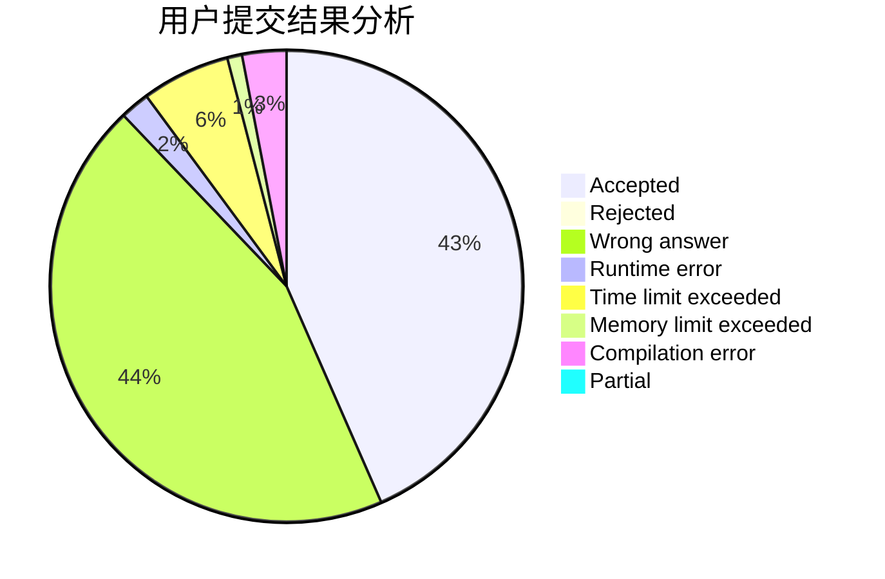
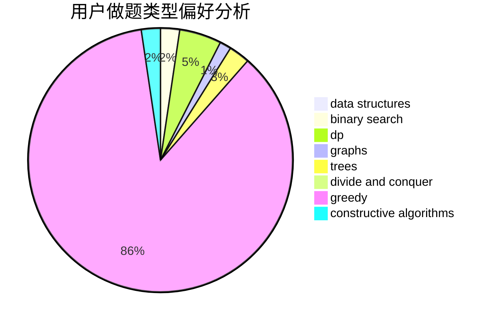

# hachuochuo.

<!-- tabs:start -->

#### **用户提交结果分析**

#### **用户做题类型偏好分析**

#### **用户错题知识点分析**

<!-- tabs:end -->
# 推荐题目
[1056A](https://codeforces.com/contest/1056/problem/A)		implementation		  
[763A](https://codeforces.com/contest/763/problem/A)		dfs and similar,
                        dp,
                        dsu,
                        graphs,
                        implementation,
                        trees		  
[707B](https://codeforces.com/contest/707/problem/B)		graphs		  
[865G](https://codeforces.com/contest/865/problem/G)		combinatorics,
                        math,
                        matrices		  
[1114A](https://codeforces.com/contest/1114/problem/A)		brute force,
                        greedy,
                        implementation		  
[764E](https://codeforces.com/contest/764/problem/E)		dsu,graphs,sortings,trees		  
[590A](https://codeforces.com/contest/590/problem/A)		implementation		  
[233A](https://codeforces.com/contest/233/problem/A)		implementation,
                        math		  
[566C](https://codeforces.com/contest/566/problem/C)		dfs and similar,
                        divide and conquer,
                        trees		  
[11E](https://codeforces.com/contest/11/problem/E)		binary search,
                        dp,
                        greedy		  
