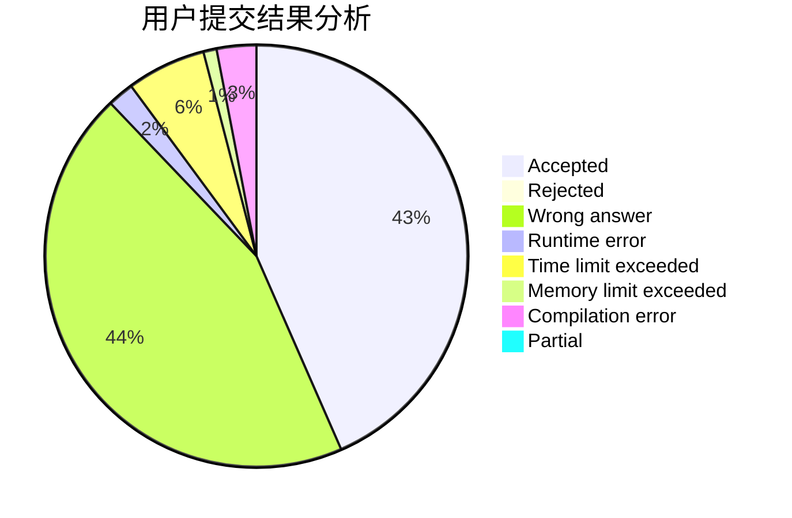
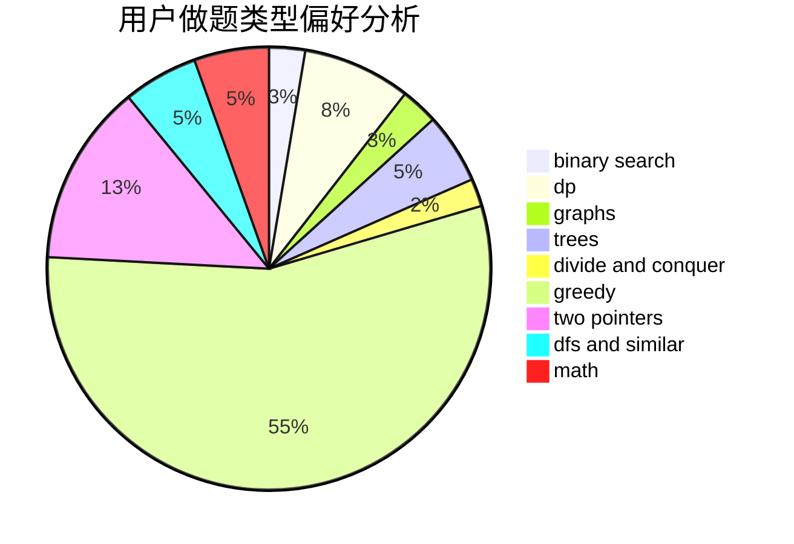

# hachuochuo.

<!-- tabs:start -->

#### **用户提交结果分析**

#### **用户做题类型偏好分析**

<!-- tabs:end -->
# 推荐题目
[1056A](https://codeforces.com/contest/1056/problem/A)
[763A](https://codeforces.com/contest/763/problem/A)
[707B](https://codeforces.com/contest/707/problem/B)
[865G](https://codeforces.com/contest/865/problem/G)
[1114A](https://codeforces.com/contest/1114/problem/A)
[764E](https://codeforces.com/contest/764/problem/E)
[590A](https://codeforces.com/contest/590/problem/A)
[233A](https://codeforces.com/contest/233/problem/A)
[566C](https://codeforces.com/contest/566/problem/C)
[11E](https://codeforces.com/contest/11/problem/E)
