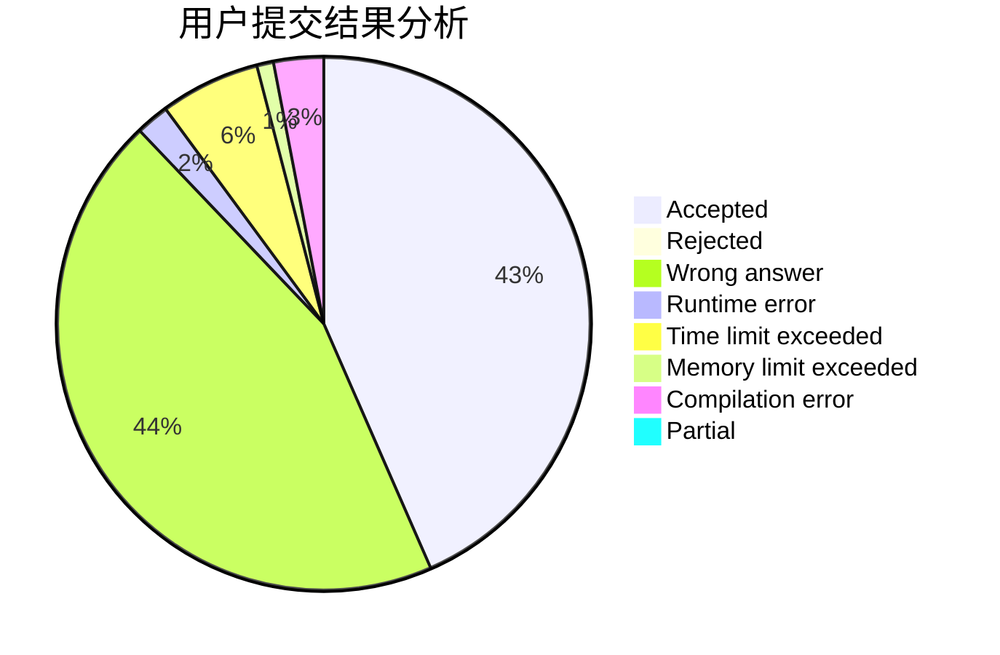
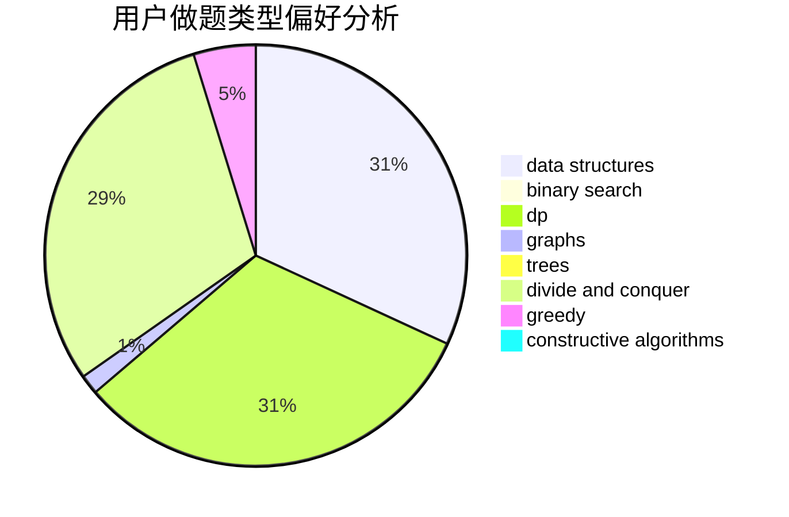

# hachuochuo.

<!-- tabs:start -->

#### **用户提交结果分析**

#### **用户做题类型偏好分析**

#### **用户错题知识点分析**

<!-- tabs:end -->
# 推荐题目
[1055D](https://codeforces.com/contest/1055/problem/D)		greedy,
                        implementation,
                        strings		  
[742D](https://codeforces.com/contest/742/problem/D)		dsu,graphs,sortings,trees		  
[683A](https://codeforces.com/contest/683/problem/A)		*special problem,
                        geometry		  
[847F](https://codeforces.com/contest/847/problem/F)		greedy,
                        sortings		  
[1113C](https://codeforces.com/contest/1113/problem/C)		dsu,graphs,sortings,trees		  
[744D](https://codeforces.com/contest/744/problem/D)		geometry		  
[56E](https://codeforces.com/contest/56/problem/E)		binary search,
                        data structures,
                        sortings		  
[213E](https://codeforces.com/contest/213/problem/E)		data structures,
                        hashing,
                        strings		  
[540B](https://codeforces.com/contest/540/problem/B)		greedy,
                        implementation		  
[1196D1](https://codeforces.com/contest/1196D/problem/1)		implementation		  
