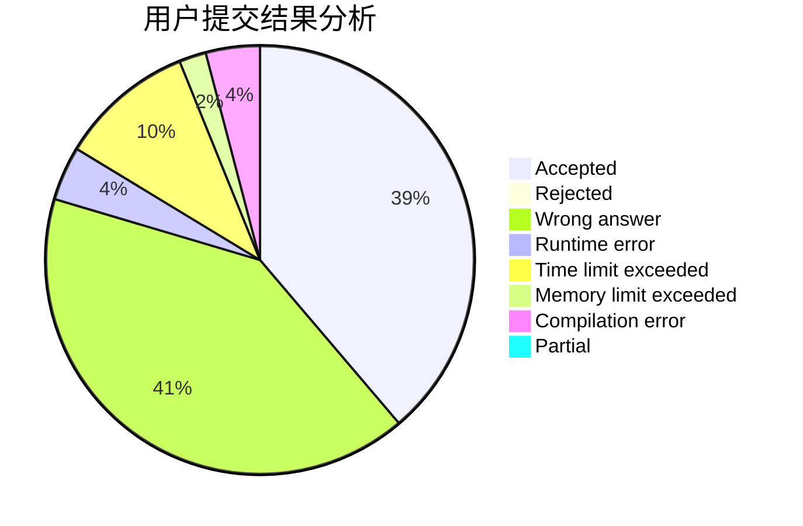
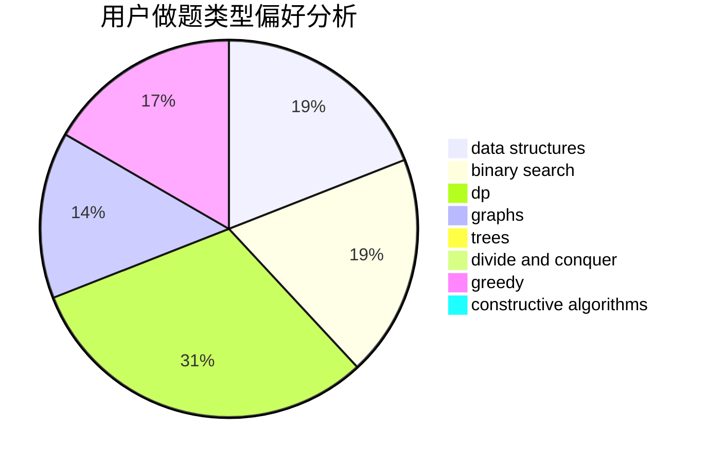

# hack_the_king

<!-- tabs:start -->

#### **用户提交结果分析**

#### **用户做题类型偏好分析**

#### **用户错题知识点分析**

<!-- tabs:end -->
# 推荐题目
[448B](https://codeforces.com/contest/448/problem/B)		implementation,
                        strings		  
[671E](https://codeforces.com/contest/671/problem/E)		data structures,
                        greedy		  
[3D](https://codeforces.com/contest/3/problem/D)		greedy		  
[414C](https://codeforces.com/contest/414/problem/C)		combinatorics,
                        divide and conquer		  
[1297C](https://codeforces.com/contest/1297/problem/C)		*special problem,
                        greedy		  
[301C](https://codeforces.com/contest/301/problem/C)		constructive algorithms		  
[1157B](https://codeforces.com/contest/1157/problem/B)		greedy		  
[1169A](https://codeforces.com/contest/1169/problem/A)		implementation,
                        math		  
[292D](https://codeforces.com/contest/292/problem/D)		data structures,
                        dfs and similar,
                        dp,
                        dsu		  
[1382A](https://codeforces.com/contest/1382/problem/A)		brute force		  
