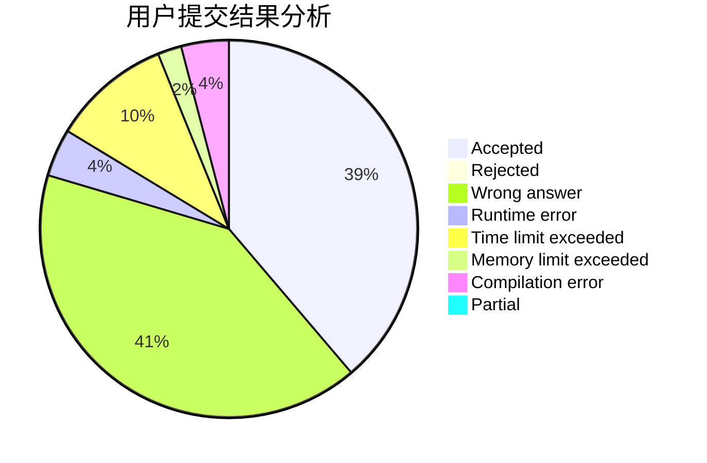
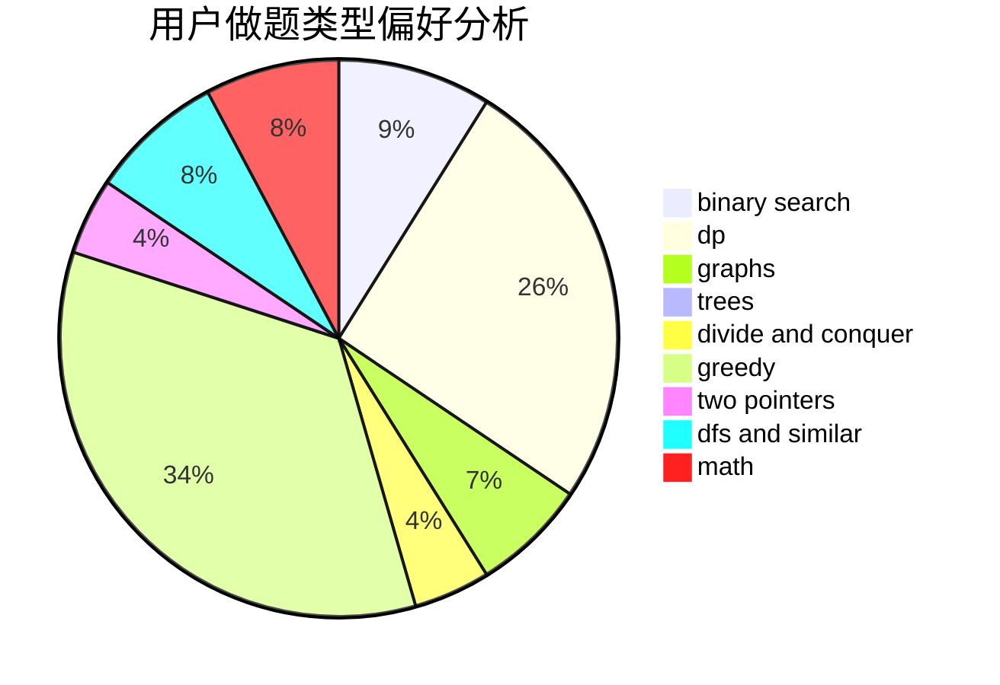

# hack_the_king

<!-- tabs:start -->

#### **用户提交结果分析**

#### **用户做题类型偏好分析**

<!-- tabs:end -->
# 推荐题目
[448B](https://codeforces.com/contest/448/problem/B)
[671E](https://codeforces.com/contest/671/problem/E)
[3D](https://codeforces.com/contest/3/problem/D)
[414C](https://codeforces.com/contest/414/problem/C)
[1297C](https://codeforces.com/contest/1297/problem/C)
[301C](https://codeforces.com/contest/301/problem/C)
[1157B](https://codeforces.com/contest/1157/problem/B)
[1169A](https://codeforces.com/contest/1169/problem/A)
[292D](https://codeforces.com/contest/292/problem/D)
[1382A](https://codeforces.com/contest/1382/problem/A)
