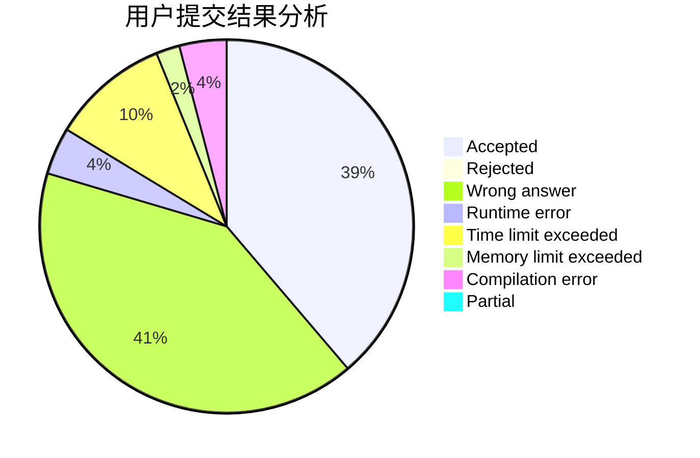
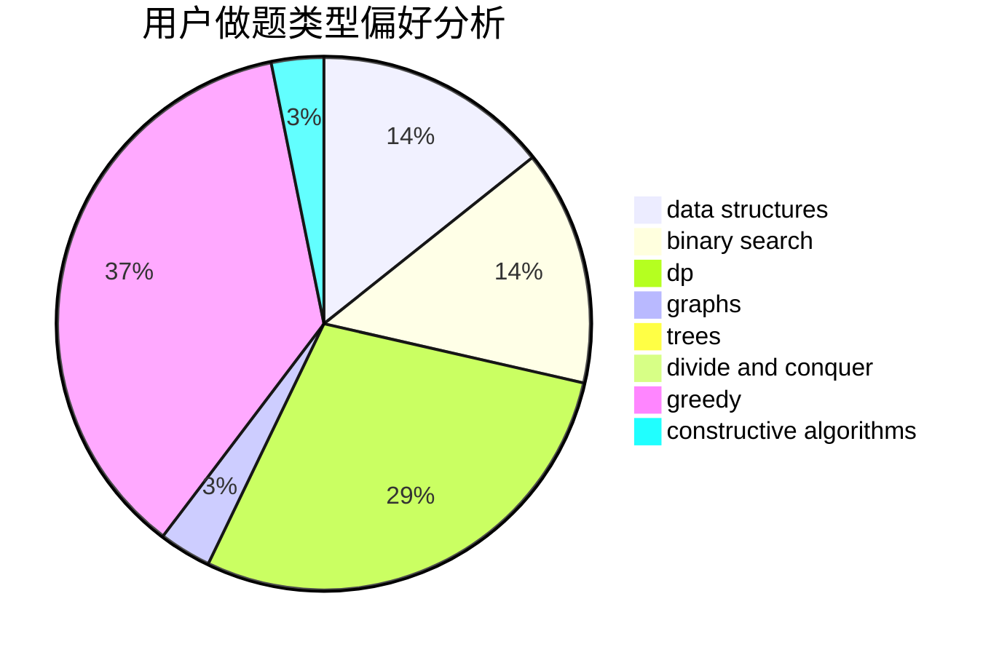
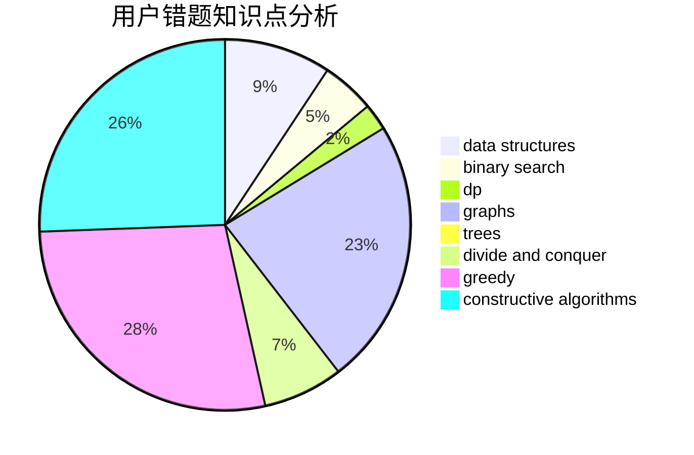

# hack_the_king

<!-- tabs:start -->

#### **用户提交结果分析**

#### **用户做题类型偏好分析**

#### **用户错题知识点分析**

<!-- tabs:end -->
# 推荐题目
[424E](https://codeforces.com/contest/424/problem/E)		dfs and similar,
                        dp,
                        probabilities		  
[645D](https://codeforces.com/contest/645/problem/D)		binary search,
                        dp,
                        graphs		  
[370B](https://codeforces.com/contest/370/problem/B)		implementation		  
[383C](https://codeforces.com/contest/383/problem/C)		data structures,
                        dfs and similar,
                        trees		  
[1290F](https://codeforces.com/contest/1290/problem/F)		dp		  
[288B](https://codeforces.com/contest/288/problem/B)		combinatorics		  
[1155D](https://codeforces.com/contest/1155/problem/D)		brute force,
                        data structures,
                        divide and conquer,
                        dp,
                        greedy		  
[1166B](https://codeforces.com/contest/1166/problem/B)		constructive algorithms,
                        math,
                        number theory		  
[277C](https://codeforces.com/contest/277/problem/C)		games,
                        implementation		  
[1373E](https://codeforces.com/contest/1373/problem/E)		brute force,
                        constructive algorithms,
                        dp,
                        greedy		  
