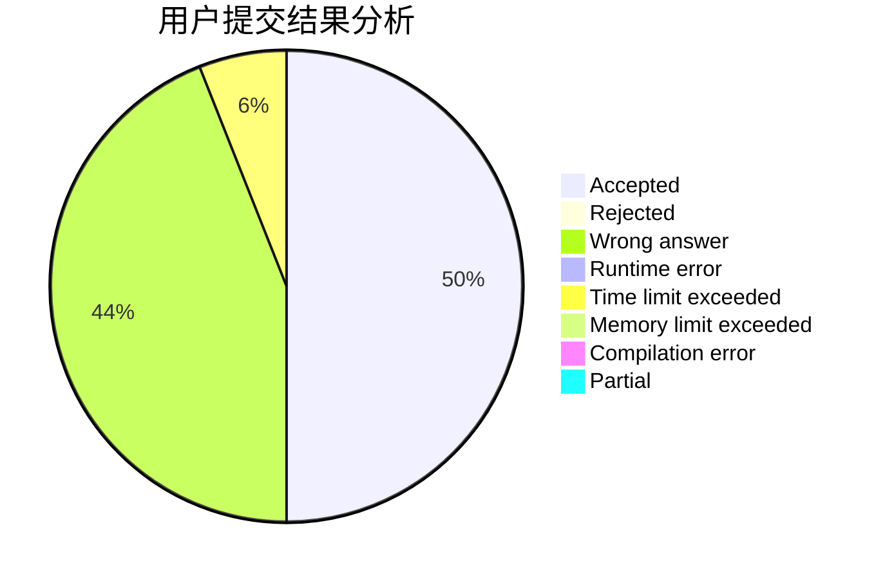
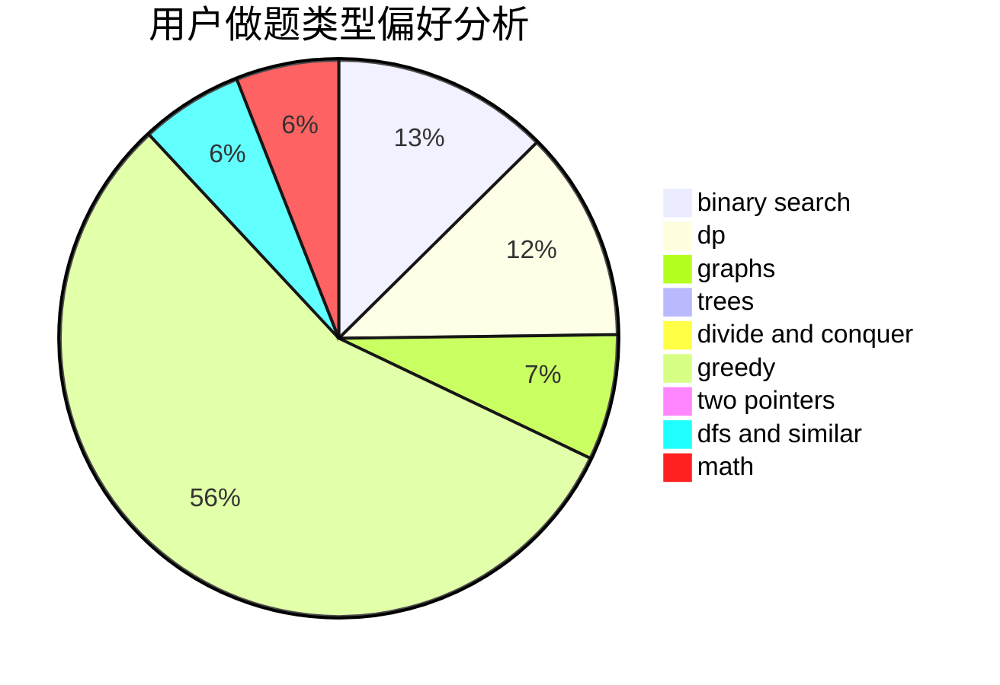

# hahaha1850

<!-- tabs:start -->

#### **用户提交结果分析**

#### **用户做题类型偏好分析**

<!-- tabs:end -->
# 推荐题目
[385E](https://codeforces.com/contest/385/problem/E)
[911A](https://codeforces.com/contest/911/problem/A)
[1005D](https://codeforces.com/contest/1005/problem/D)
[218C](https://codeforces.com/contest/218/problem/C)
[871E](https://codeforces.com/contest/871/problem/E)
[699D](https://codeforces.com/contest/699/problem/D)
[713E](https://codeforces.com/contest/713/problem/E)
[682E](https://codeforces.com/contest/682/problem/E)
[394C](https://codeforces.com/contest/394/problem/C)
[523D](https://codeforces.com/contest/523/problem/D)
