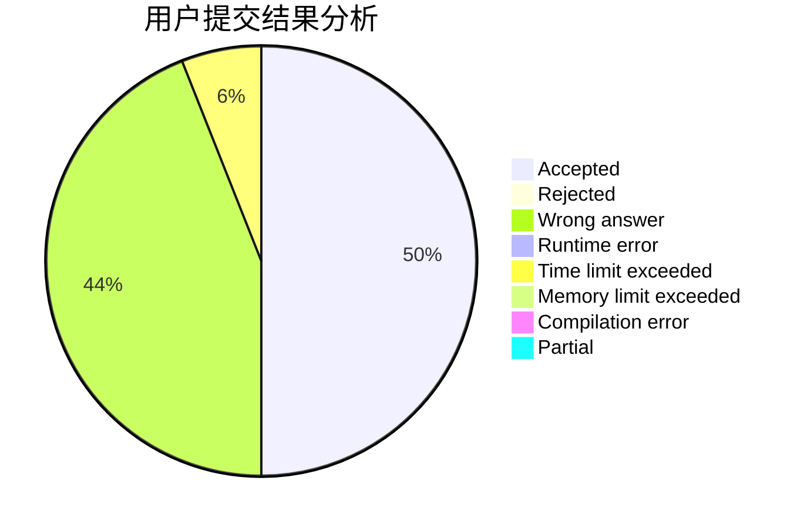
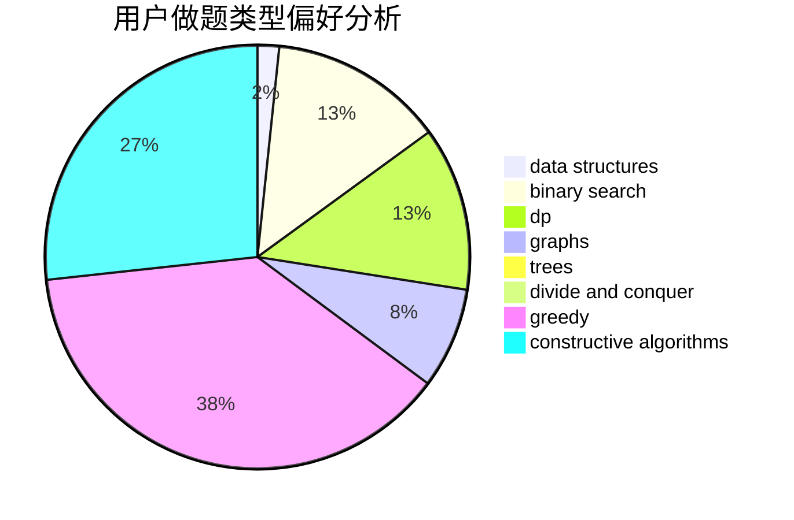
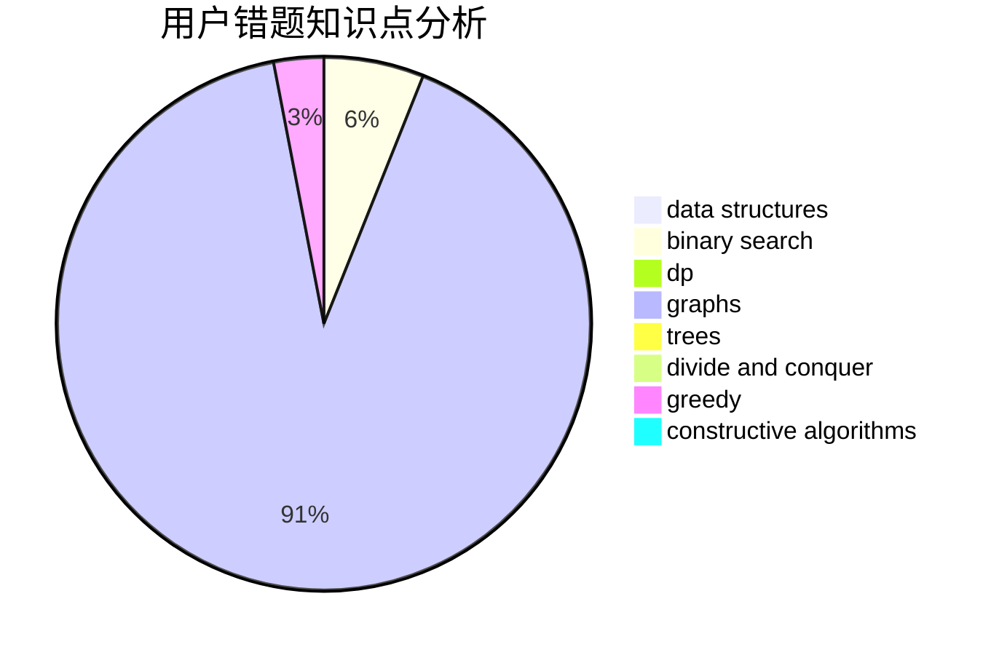

# hahaha1850

<!-- tabs:start -->

#### **用户提交结果分析**

#### **用户做题类型偏好分析**

#### **用户错题知识点分析**

<!-- tabs:end -->
# 推荐题目
[385E](https://codeforces.com/contest/385/problem/E)		math,
                        matrices		  
[911A](https://codeforces.com/contest/911/problem/A)		implementation		  
[1005D](https://codeforces.com/contest/1005/problem/D)		dp,
                        greedy,
                        number theory		  
[218C](https://codeforces.com/contest/218/problem/C)		dsu,graphs,sortings,trees		  
[871E](https://codeforces.com/contest/871/problem/E)		graphs,
                        greedy,
                        trees		  
[699D](https://codeforces.com/contest/699/problem/D)		dsu,graphs,sortings,trees		  
[713E](https://codeforces.com/contest/713/problem/E)		binary search,
                        dp		  
[682E](https://codeforces.com/contest/682/problem/E)		geometry,
                        two pointers		  
[394C](https://codeforces.com/contest/394/problem/C)		constructive algorithms,
                        greedy		  
[523D](https://codeforces.com/contest/523/problem/D)		*special problem,
                        data structures,
                        implementation		  
