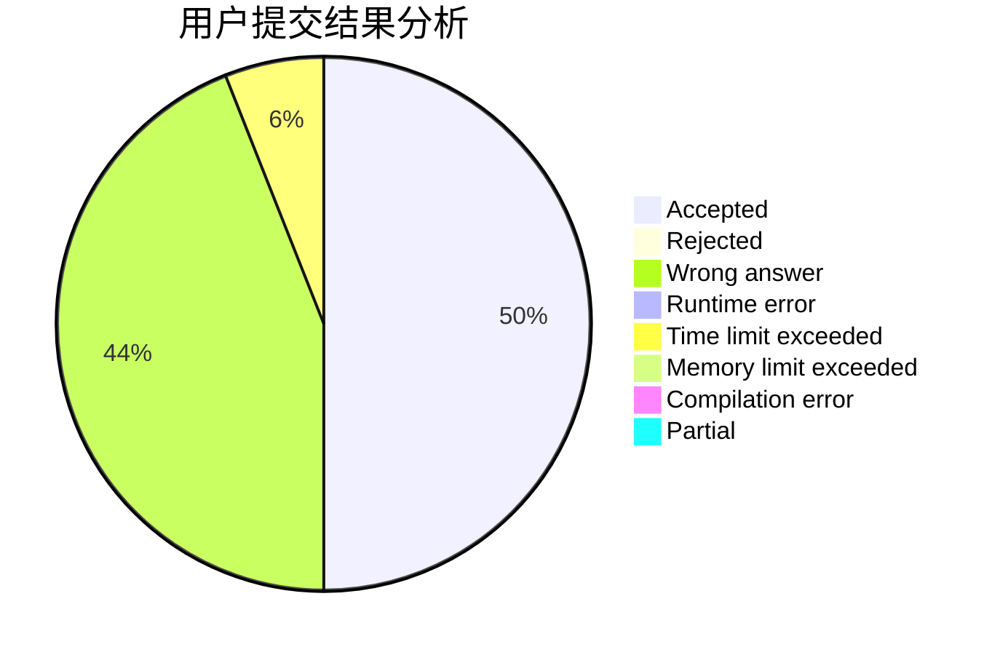
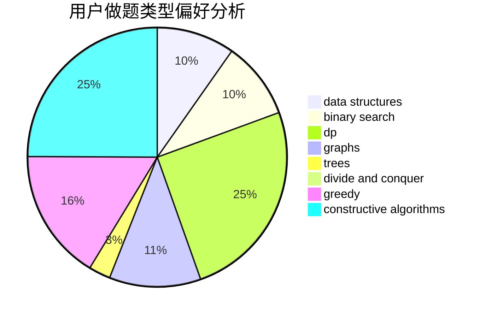
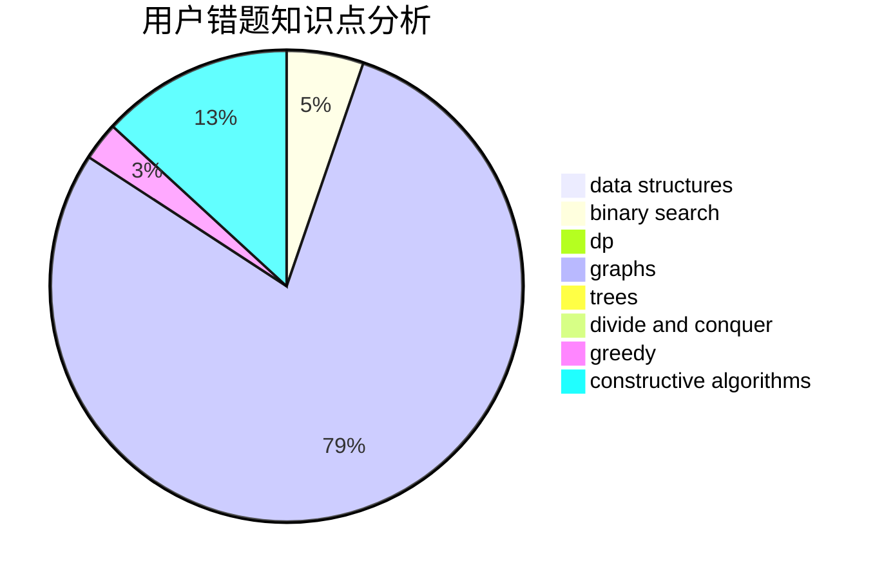

# hahaha1850

<!-- tabs:start -->

#### **用户提交结果分析**

#### **用户做题类型偏好分析**

#### **用户错题知识点分析**

<!-- tabs:end -->
# 推荐题目
[359B](https://codeforces.com/contest/359/problem/B)		constructive algorithms,
                        dp,
                        math		  
[893A](https://codeforces.com/contest/893/problem/A)		implementation		  
[1005C](https://codeforces.com/contest/1005/problem/C)		brute force,
                        greedy,
                        implementation		  
[195C](https://codeforces.com/contest/195/problem/C)		expression parsing,
                        implementation		  
[853C](https://codeforces.com/contest/853/problem/C)		data structures		  
[674G](https://codeforces.com/contest/674/problem/G)		dsu,graphs,sortings,trees		  
[697B](https://codeforces.com/contest/697/problem/B)		brute force,
                        implementation,
                        math,
                        strings		  
[662E](https://codeforces.com/contest/662/problem/E)		brute force,
                        dp,
                        greedy		  
[366C](https://codeforces.com/contest/366/problem/C)		dp		  
[501E](https://codeforces.com/contest/501/problem/E)		binary search,
                        combinatorics,
                        implementation		  
