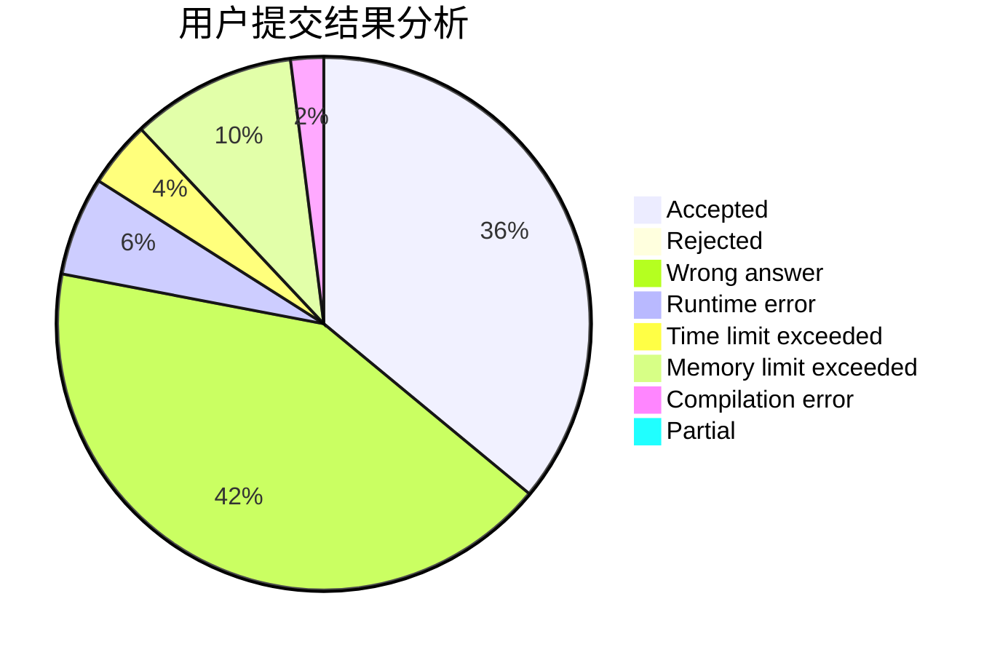
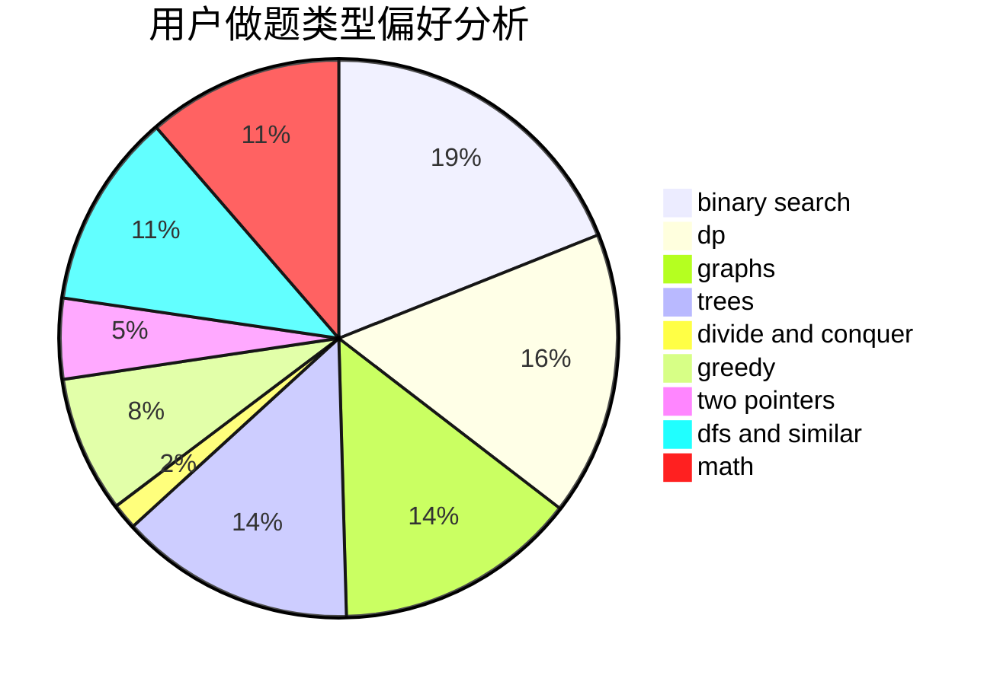

# halfsentimental

<!-- tabs:start -->

#### **用户提交结果分析**

#### **用户做题类型偏好分析**

<!-- tabs:end -->
# 推荐题目
[1029C](https://codeforces.com/contest/1029/problem/C)
[896A](https://codeforces.com/contest/896/problem/A)
[1102B](https://codeforces.com/contest/1102/problem/B)
[813F](https://codeforces.com/contest/813/problem/F)
[220E](https://codeforces.com/contest/220/problem/E)
[1082F](https://codeforces.com/contest/1082/problem/F)
[1230D](https://codeforces.com/contest/1230/problem/D)
[735C](https://codeforces.com/contest/735/problem/C)
[417C](https://codeforces.com/contest/417/problem/C)
[466E](https://codeforces.com/contest/466/problem/E)
