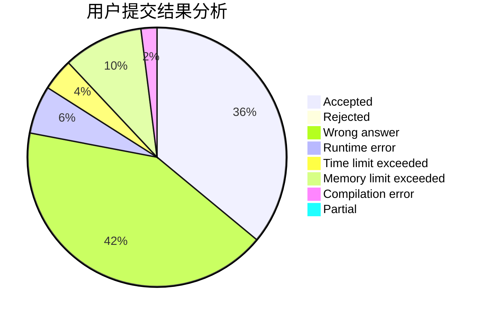
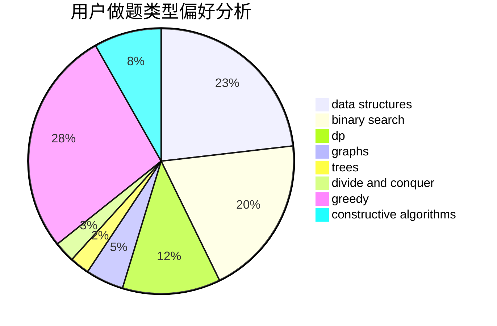
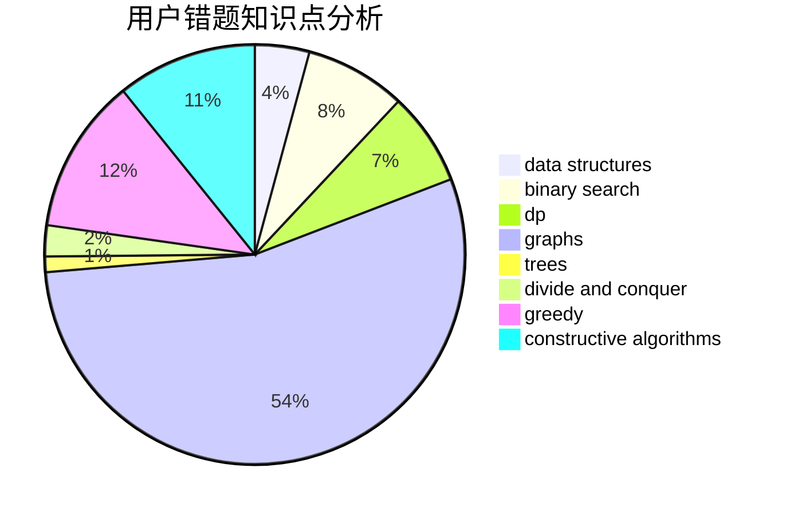

# halfsentimental
<!-- tabs:start -->
#### **用户提交结果分析**

#### **用户做题类型偏好分析**

#### **用户错题知识点分析**

<!-- tabs:end -->
# 推荐题目
[Make Square](http://codeforces.com/problemset/problem/1028/H)		math		  
[Trucks and Cities](http://codeforces.com/problemset/problem/1101/F)		binary search,
                        dp		  
[Royal Questions](http://codeforces.com/problemset/problem/875/F)		dsu,
                        graphs,
                        greedy		  
[Azembler](http://codeforces.com/problemset/problem/93/C)		brute force,
                        implementation		  
[Beautiful fountains rows](http://codeforces.com/problemset/problem/799/F)		data structures		  
[Cowboy Beblop at his computer](http://codeforces.com/problemset/problem/717/I)		geometry		  
[Chip Play](https://codeforces.com/contest/90/problem/E)		brute force,
                        data structures,
                        implementation		  
[Numbers](http://codeforces.com/problemset/problem/241/D)		nan		  
[Secret Combination](http://codeforces.com/problemset/problem/496/B)		brute force,
                        constructive algorithms,
                        implementation		  
[Tetrahedron](http://codeforces.com/problemset/problem/166/E)		dp,
                        math,
                        matrices		  
<!-- tabs:start -->
#### **data structures**
[Make Square](http://codeforces.com/problemset/problem/799/F)		data structures		  
[Trucks and Cities](https://codeforces.com/contest/90/problem/E)		brute force,
                        data structures,
                        implementation		  
[Royal Questions](http://codeforces.com/problemset/problem/1420/D)		combinatorics,
                        data structures,
                        sortings		  
[Azembler](http://codeforces.com/problemset/problem/1335/F)		data structures,
                        dfs and similar,
                        dsu,
                        graphs,
                        greedy,
                        matrices		  
[Beautiful fountains rows](http://codeforces.com/problemset/problem/187/D)		data structures		  
[Cowboy Beblop at his computer](http://codeforces.com/problemset/problem/815/D)		binary search,
                        combinatorics,
                        data structures,
                        geometry		  
[Chip Play](http://codeforces.com/problemset/problem/1474/D)		data structures,
                        dp,
                        greedy,
                        math		  
[Numbers](http://codeforces.com/problemset/problem/1492/C)		binary search,
                        data structures,
                        dp,
                        greedy,
                        two pointers		  
[Secret Combination](http://codeforces.com/problemset/problem/1490/G)		binary search,
                        data structures,
                        math		  
[Tetrahedron](http://codeforces.com/problemset/problem/1479/D)		binary search,
                        bitmasks,
                        brute force,
                        data structures,
                        probabilities,
                        trees		  
#### **binary search**
[Make Square](http://codeforces.com/problemset/problem/1101/F)		binary search,
                        dp		  
[Trucks and Cities](https://codeforces.com/contest/199/problem/E)		binary search,
                        geometry		  
[Royal Questions](http://codeforces.com/problemset/problem/1285/F)		binary search,
                        combinatorics,
                        number theory		  
[Azembler](http://codeforces.com/problemset/problem/1370/F2)		binary search,
                        dfs and similar,
                        graphs,
                        interactive,
                        shortest paths,
                        trees		  
[Beautiful fountains rows](http://codeforces.com/problemset/problem/1118/D2)		binary search,
                        greedy		  
[Cowboy Beblop at his computer](http://codeforces.com/problemset/problem/1183/C)		binary search,
                        math		  
[Chip Play](https://codeforces.com/contest/1434/problem/A)		binary search,
                        brute force,
                        dp,
                        implementation,
                        sortings,
                        two pointers		  
[Numbers](http://codeforces.com/problemset/problem/1033/E)		binary search,
                        constructive algorithms,
                        dfs and similar,
                        graphs,
                        interactive		  
[Secret Combination](http://codeforces.com/problemset/problem/911/B)		binary search,
                        brute force,
                        implementation		  
[Tetrahedron](http://codeforces.com/problemset/problem/938/C)		binary search,
                        brute force,
                        constructive algorithms		  
#### **dp**
[Make Square](http://codeforces.com/problemset/problem/1101/F)		binary search,
                        dp		  
[Trucks and Cities](http://codeforces.com/problemset/problem/166/E)		dp,
                        math,
                        matrices		  
[Royal Questions](http://codeforces.com/problemset/problem/57/D)		dp,
                        math		  
[Azembler](http://codeforces.com/problemset/problem/958/C2)		dp		  
[Beautiful fountains rows](http://codeforces.com/problemset/problem/601/C)		dp,
                        math,
                        probabilities		  
[Cowboy Beblop at his computer](http://codeforces.com/problemset/problem/1379/E)		constructive algorithms,
                        divide and conquer,
                        dp,
                        math,
                        trees		  
[Chip Play](http://codeforces.com/problemset/problem/1223/E)		dp,
                        sortings,
                        trees		  
[Numbers](http://codeforces.com/problemset/problem/888/F)		dp,
                        graphs		  
[Secret Combination](https://codeforces.com/contest/1434/problem/A)		binary search,
                        brute force,
                        dp,
                        implementation,
                        sortings,
                        two pointers		  
[Tetrahedron](http://codeforces.com/problemset/problem/1381/B)		dp		  
#### **graph**
[Make Square](http://codeforces.com/problemset/problem/875/F)		dsu,
                        graphs,
                        greedy		  
[Trucks and Cities](http://codeforces.com/problemset/problem/1370/F2)		binary search,
                        dfs and similar,
                        graphs,
                        interactive,
                        shortest paths,
                        trees		  
[Royal Questions](http://codeforces.com/problemset/problem/491/C)		flows,
                        graph matchings		  
[Azembler](http://codeforces.com/problemset/problem/1510/C)		dfs and similar,
                        graph matchings,
                        graphs		  
[Beautiful fountains rows](http://codeforces.com/problemset/problem/1325/F)		constructive algorithms,
                        dfs and similar,
                        graphs,
                        greedy		  
[Cowboy Beblop at his computer](http://codeforces.com/problemset/problem/788/B)		combinatorics,
                        constructive algorithms,
                        dfs and similar,
                        dsu,
                        graphs		  
[Chip Play](http://codeforces.com/problemset/problem/1335/F)		data structures,
                        dfs and similar,
                        dsu,
                        graphs,
                        greedy,
                        matrices		  
[Numbers](http://codeforces.com/problemset/problem/888/F)		dp,
                        graphs		  
[Secret Combination](https://codeforces.com/contest/1496/problem/F)		combinatorics,
                        dfs and similar,
                        graphs,
                        math,
                        shortest paths,
                        trees		  
[Tetrahedron](http://codeforces.com/problemset/problem/1033/E)		binary search,
                        constructive algorithms,
                        dfs and similar,
                        graphs,
                        interactive		  
#### **trees**
[Make Square](http://codeforces.com/problemset/problem/1370/F2)		binary search,
                        dfs and similar,
                        graphs,
                        interactive,
                        shortest paths,
                        trees		  
[Trucks and Cities](http://codeforces.com/problemset/problem/1379/E)		constructive algorithms,
                        divide and conquer,
                        dp,
                        math,
                        trees		  
[Royal Questions](http://codeforces.com/problemset/problem/1223/E)		dp,
                        sortings,
                        trees		  
[Azembler](https://codeforces.com/contest/1496/problem/F)		combinatorics,
                        dfs and similar,
                        graphs,
                        math,
                        shortest paths,
                        trees		  
[Beautiful fountains rows](http://codeforces.com/problemset/problem/29/D)		constructive algorithms,
                        dfs and similar,
                        trees		  
[Cowboy Beblop at his computer](http://codeforces.com/problemset/problem/1479/D)		binary search,
                        bitmasks,
                        brute force,
                        data structures,
                        probabilities,
                        trees		  
[Chip Play](http://codeforces.com/problemset/problem/1511/C)		brute force,
                        data structures,
                        implementation,
                        trees		  
[Numbers](http://codeforces.com/problemset/problem/1499/F)		combinatorics,
                        dfs and similar,
                        dp,
                        trees		  
[Secret Combination](http://codeforces.com/problemset/problem/1491/E)		brute force,
                        dfs and similar,
                        divide and conquer,
                        number theory,
                        trees		  
[Tetrahedron](http://codeforces.com/problemset/problem/1466/D)		data structures,
                        greedy,
                        sortings,
                        trees		  
#### **divide and conquer**
[Make Square](http://codeforces.com/problemset/problem/1379/E)		constructive algorithms,
                        divide and conquer,
                        dp,
                        math,
                        trees		  
[Trucks and Cities](http://codeforces.com/problemset/problem/364/E)		divide and conquer,
                        two pointers		  
[Royal Questions](http://codeforces.com/problemset/problem/1461/D)		binary search,
                        brute force,
                        data structures,
                        divide and conquer,
                        implementation,
                        sortings		  
[Azembler](http://codeforces.com/problemset/problem/1466/G)		combinatorics,
                        divide and conquer,
                        hashing,
                        math,
                        string suffix structures,
                        strings		  
[Beautiful fountains rows](http://codeforces.com/problemset/problem/1490/D)		dfs and similar,
                        divide and conquer,
                        implementation		  
[Cowboy Beblop at his computer](https://codeforces.com/contest/1483/problem/C)		data structures,
                        divide and conquer,
                        dp		  
[Chip Play](http://codeforces.com/problemset/problem/1491/E)		brute force,
                        dfs and similar,
                        divide and conquer,
                        number theory,
                        trees		  
[Numbers](http://codeforces.com/problemset/problem/1303/G)		data structures,
                        divide and conquer,
                        geometry,
                        trees		  
[Secret Combination](http://codeforces.com/problemset/problem/1494/D)		constructive algorithms,
                        data structures,
                        dfs and similar,
                        divide and conquer,
                        dsu,
                        greedy,
                        sortings,
                        trees		  
[Tetrahedron](http://codeforces.com/problemset/problem/1482/E)		data structures,
                        divide and conquer,
                        dp		  
#### **greedy**
[Make Square](http://codeforces.com/problemset/problem/875/F)		dsu,
                        graphs,
                        greedy		  
[Trucks and Cities](http://codeforces.com/problemset/problem/388/A)		greedy,
                        sortings		  
[Royal Questions](http://codeforces.com/problemset/problem/1118/D2)		binary search,
                        greedy		  
[Azembler](http://codeforces.com/problemset/problem/1204/B)		greedy,
                        math		  
[Beautiful fountains rows](http://codeforces.com/problemset/problem/1082/C)		greedy,
                        sortings		  
[Cowboy Beblop at his computer](http://codeforces.com/problemset/problem/145/A)		greedy,
                        implementation		  
[Chip Play](http://codeforces.com/problemset/problem/1325/F)		constructive algorithms,
                        dfs and similar,
                        graphs,
                        greedy		  
[Numbers](http://codeforces.com/problemset/problem/578/B)		brute force,
                        greedy		  
[Secret Combination](http://codeforces.com/problemset/problem/379/C)		greedy,
                        sortings		  
[Tetrahedron](http://codeforces.com/problemset/problem/1335/F)		data structures,
                        dfs and similar,
                        dsu,
                        graphs,
                        greedy,
                        matrices		  
#### **constructive algorithms**
[Make Square](http://codeforces.com/problemset/problem/496/B)		brute force,
                        constructive algorithms,
                        implementation		  
[Trucks and Cities](https://codeforces.com/contest/795/problem/D)		*special problem,
                        constructive algorithms,
                        sortings		  
[Royal Questions](http://codeforces.com/problemset/problem/1379/E)		constructive algorithms,
                        divide and conquer,
                        dp,
                        math,
                        trees		  
[Azembler](http://codeforces.com/problemset/problem/1325/F)		constructive algorithms,
                        dfs and similar,
                        graphs,
                        greedy		  
[Beautiful fountains rows](http://codeforces.com/problemset/problem/788/B)		combinatorics,
                        constructive algorithms,
                        dfs and similar,
                        dsu,
                        graphs		  
[Cowboy Beblop at his computer](http://codeforces.com/problemset/problem/1033/E)		binary search,
                        constructive algorithms,
                        dfs and similar,
                        graphs,
                        interactive		  
[Chip Play](http://codeforces.com/problemset/problem/29/D)		constructive algorithms,
                        dfs and similar,
                        trees		  
[Numbers](http://codeforces.com/problemset/problem/938/C)		binary search,
                        brute force,
                        constructive algorithms		  
[Secret Combination](http://codeforces.com/problemset/problem/439/C)		brute force,
                        constructive algorithms,
                        implementation,
                        number theory		  
[Tetrahedron](http://codeforces.com/problemset/problem/42/C)		brute force,
                        constructive algorithms		  
#### **sortings**
[Make Square](http://codeforces.com/problemset/problem/388/A)		greedy,
                        sortings		  
[Trucks and Cities](https://codeforces.com/contest/795/problem/D)		*special problem,
                        constructive algorithms,
                        sortings		  
[Royal Questions](http://codeforces.com/problemset/problem/1420/D)		combinatorics,
                        data structures,
                        sortings		  
[Azembler](http://codeforces.com/problemset/problem/1082/C)		greedy,
                        sortings		  
[Beautiful fountains rows](http://codeforces.com/problemset/problem/1223/E)		dp,
                        sortings,
                        trees		  
[Cowboy Beblop at his computer](http://codeforces.com/problemset/problem/379/C)		greedy,
                        sortings		  
[Chip Play](https://codeforces.com/contest/1434/problem/A)		binary search,
                        brute force,
                        dp,
                        implementation,
                        sortings,
                        two pointers		  
[Numbers](http://codeforces.com/problemset/problem/1121/A)		implementation,
                        sortings		  
[Secret Combination](https://codeforces.com/contest/1496/problem/C)		geometry,
                        greedy,
                        math,
                        sortings		  
[Tetrahedron](http://codeforces.com/problemset/problem/1495/A)		geometry,
                        greedy,
                        math,
                        sortings		  
<!-- tabs:end -->
