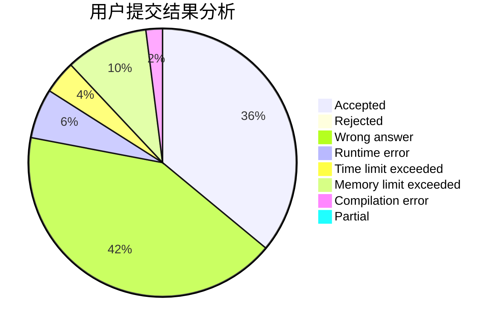
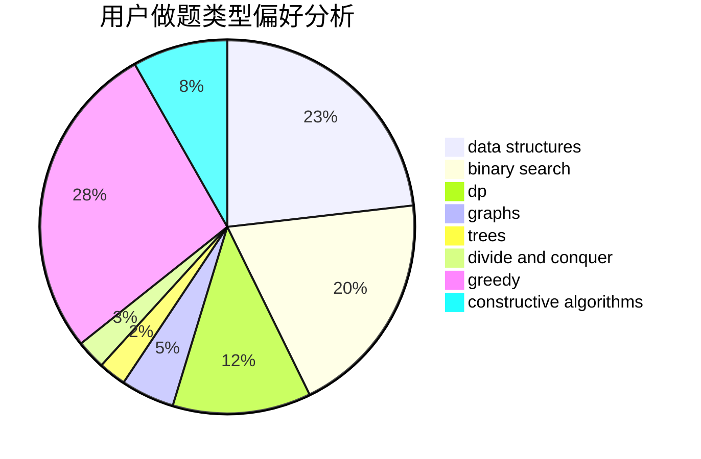
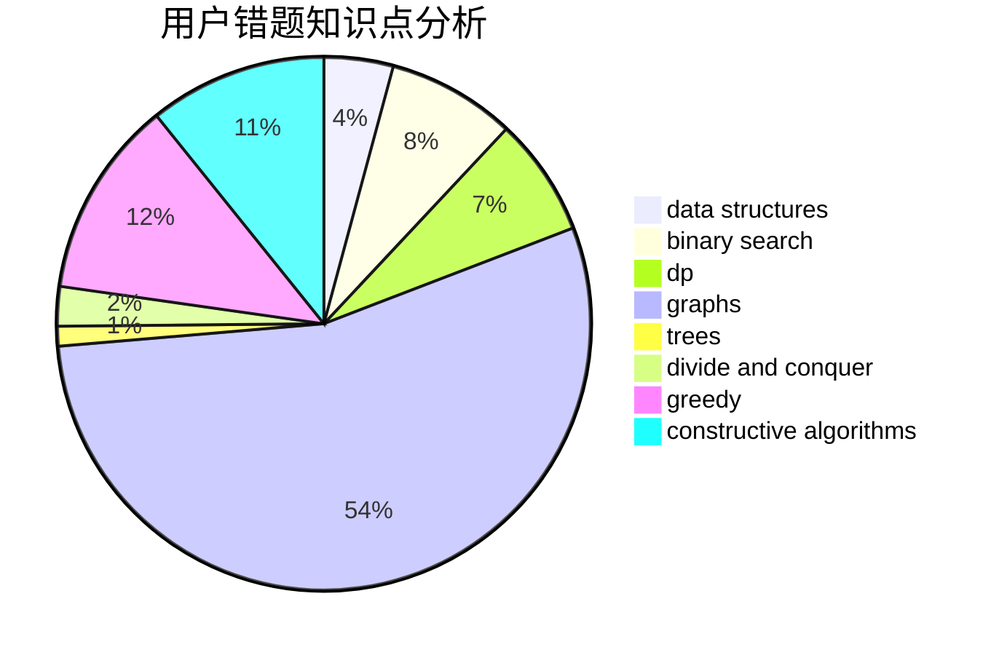

# halfsentimental

<!-- tabs:start -->

#### **用户提交结果分析**

#### **用户做题类型偏好分析**

#### **用户错题知识点分析**

<!-- tabs:end -->
# 推荐题目
[1028H](https://codeforces.com/contest/1028/problem/H)		math		  
[875F](https://codeforces.com/contest/875/problem/F)		dsu,
                        graphs,
                        greedy		  
[1101F](https://codeforces.com/contest/1101/problem/F)		binary search,
                        dp		  
[799F](https://codeforces.com/contest/799/problem/F)		data structures		  
[199E](https://codeforces.com/contest/199/problem/E)		dsu,graphs,sortings,trees		  
[1082C](https://codeforces.com/contest/1082/problem/C)		greedy,
                        sortings		  
[1223E](https://codeforces.com/contest/1223/problem/E)		dp,
                        sortings,
                        trees		  
[717I](https://codeforces.com/contest/717/problem/I)		geometry		  
[388A](https://codeforces.com/contest/388/problem/A)		greedy,
                        sortings		  
[446D](https://codeforces.com/contest/446/problem/D)		math,
                        matrices,
                        probabilities		  
