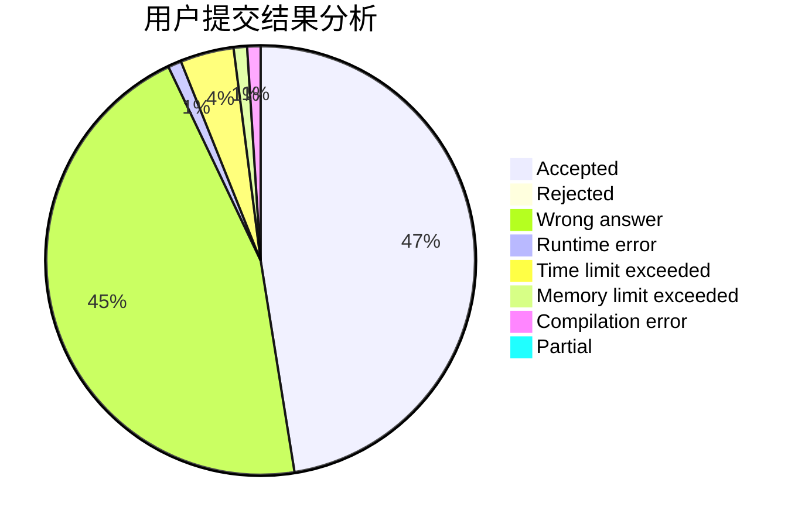
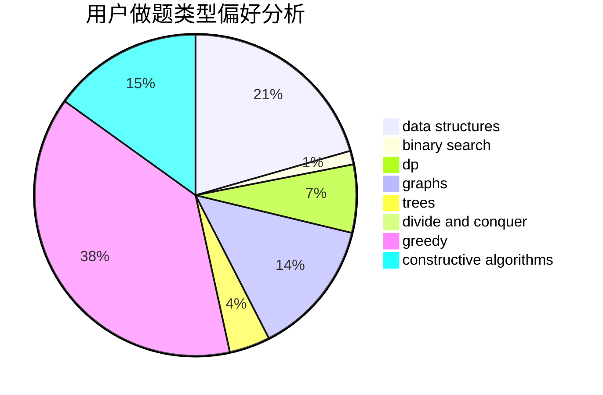

# handlecurrentinuse

<!-- tabs:start -->

#### **用户提交结果分析**

#### **用户做题类型偏好分析**

#### **用户错题知识点分析**

<!-- tabs:end -->
# 推荐题目
[1384E](https://codeforces.com/contest/1384/problem/E)		dsu,graphs,sortings,trees		  
[1063F](https://codeforces.com/contest/1063/problem/F)		data structures,
                        dp,
                        string suffix structures		  
[228E](https://codeforces.com/contest/228/problem/E)		2-sat,
                        dfs and similar,
                        dsu,
                        graphs		  
[1005C](https://codeforces.com/contest/1005/problem/C)		brute force,
                        greedy,
                        implementation		  
[984A](https://codeforces.com/contest/984/problem/A)		sortings		  
[605D](https://codeforces.com/contest/605/problem/D)		data structures,
                        dfs and similar		  
[755F](https://codeforces.com/contest/755/problem/F)		bitmasks,
                        dp,
                        greedy		  
[11721](https://codeforces.com/contest/1172/problem/1)		dsu,graphs,sortings,trees		  
[765E](https://codeforces.com/contest/765/problem/E)		dfs and similar,
                        dp,
                        greedy,
                        implementation,
                        trees		  
[908G](https://codeforces.com/contest/908/problem/G)		dp,
                        math		  
