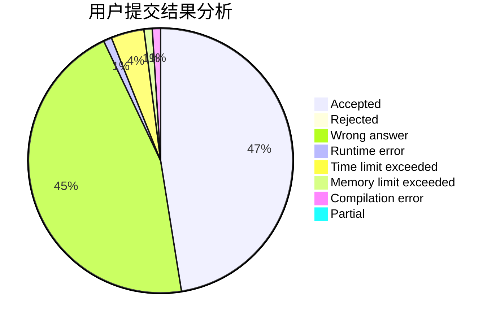
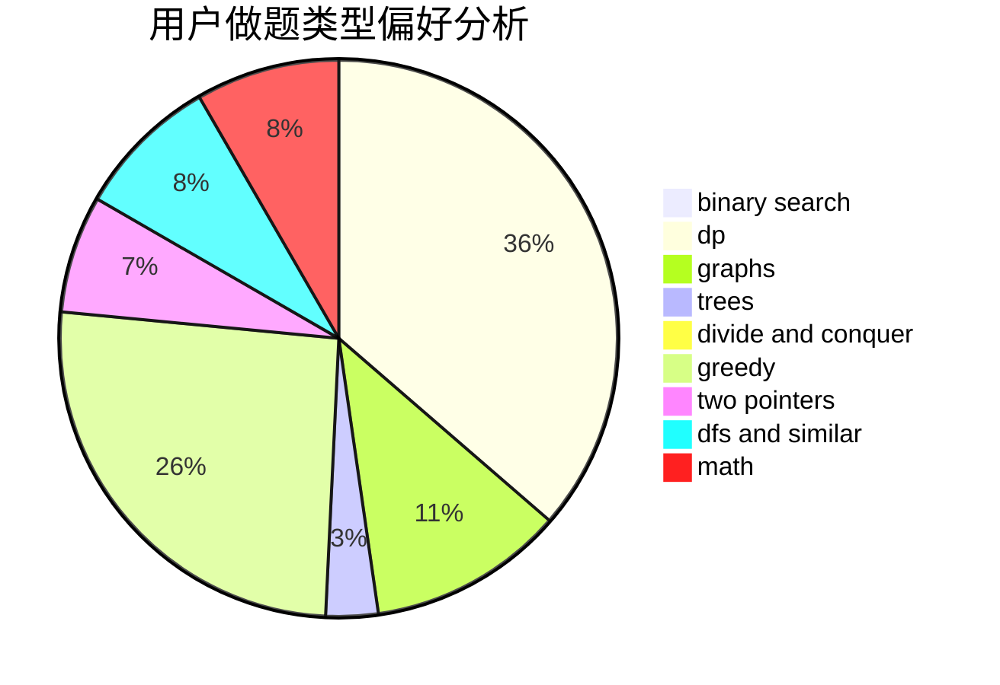

# handlecurrentinuse

<!-- tabs:start -->

#### **用户提交结果分析**

#### **用户做题类型偏好分析**

<!-- tabs:end -->
# 推荐题目
[1384E](https://codeforces.com/contest/1384/problem/E)
[1063F](https://codeforces.com/contest/1063/problem/F)
[228E](https://codeforces.com/contest/228/problem/E)
[1005C](https://codeforces.com/contest/1005/problem/C)
[984A](https://codeforces.com/contest/984/problem/A)
[605D](https://codeforces.com/contest/605/problem/D)
[755F](https://codeforces.com/contest/755/problem/F)
[11721](https://codeforces.com/contest/1172/problem/1)
[765E](https://codeforces.com/contest/765/problem/E)
[908G](https://codeforces.com/contest/908/problem/G)
