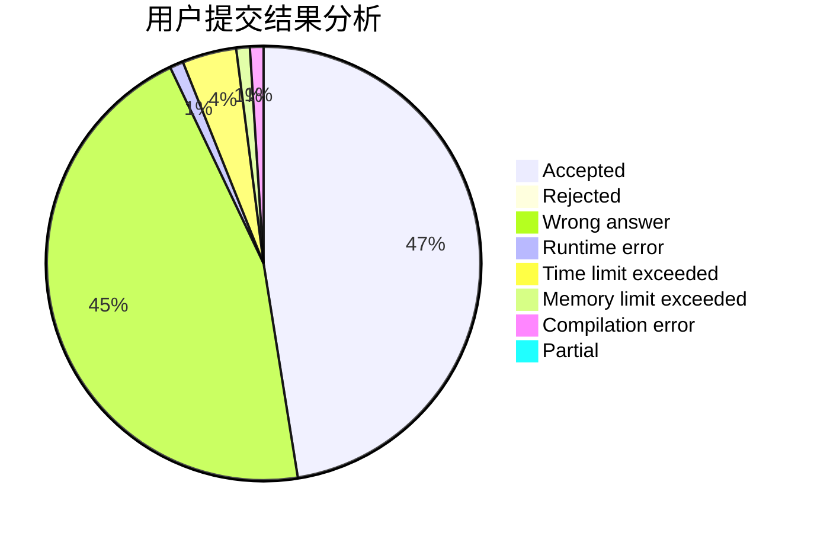
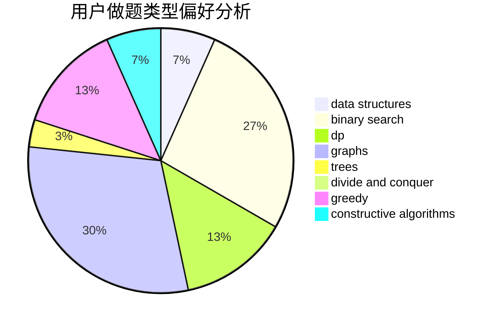
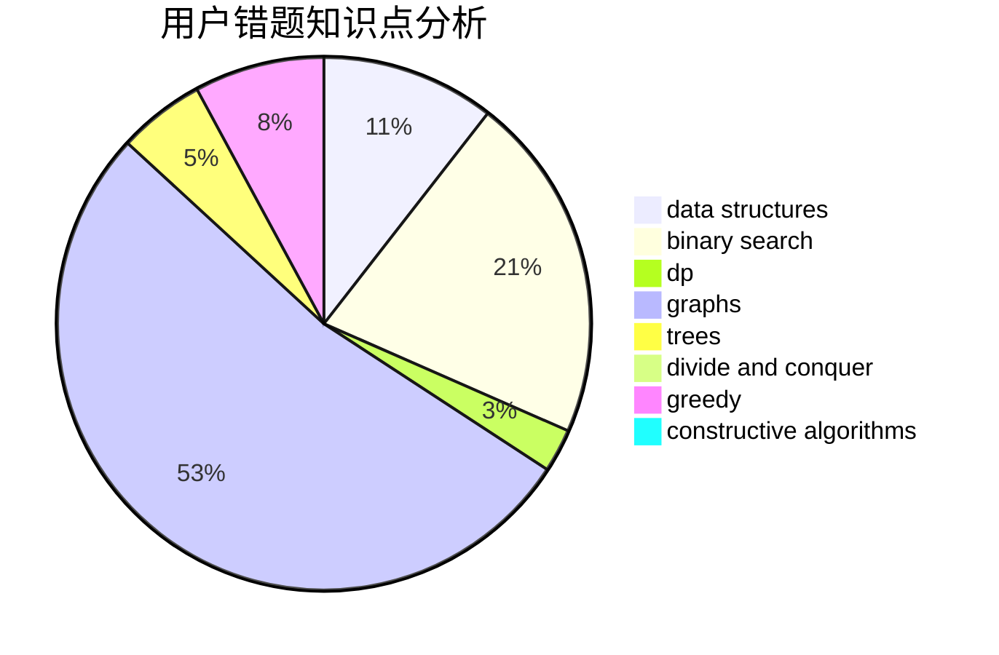

# handlecurrentinuse

<!-- tabs:start -->

#### **用户提交结果分析**

#### **用户做题类型偏好分析**

#### **用户错题知识点分析**

<!-- tabs:end -->
# 推荐题目
[1375F](https://codeforces.com/contest/1375/problem/F)		constructive algorithms,
                        games,
                        interactive,
                        math		  
[1063C](https://codeforces.com/contest/1063/problem/C)		binary search,
                        constructive algorithms,
                        geometry,
                        interactive		  
[204E](https://codeforces.com/contest/204/problem/E)		data structures,
                        implementation,
                        string suffix structures,
                        two pointers		  
[1005B](https://codeforces.com/contest/1005/problem/B)		brute force,
                        implementation,
                        strings		  
[961E](https://codeforces.com/contest/961/problem/E)		data structures		  
[585C](https://codeforces.com/contest/585/problem/C)		number theory		  
[734F](https://codeforces.com/contest/734/problem/F)		bitmasks,
                        constructive algorithms,
                        implementation,
                        math		  
[1167B](https://codeforces.com/contest/1167/problem/B)		brute force,
                        divide and conquer,
                        interactive,
                        math		  
[746C](https://codeforces.com/contest/746/problem/C)		constructive algorithms,
                        implementation,
                        math		  
[889D](https://codeforces.com/contest/889/problem/D)		dsu,graphs,sortings,trees		  
