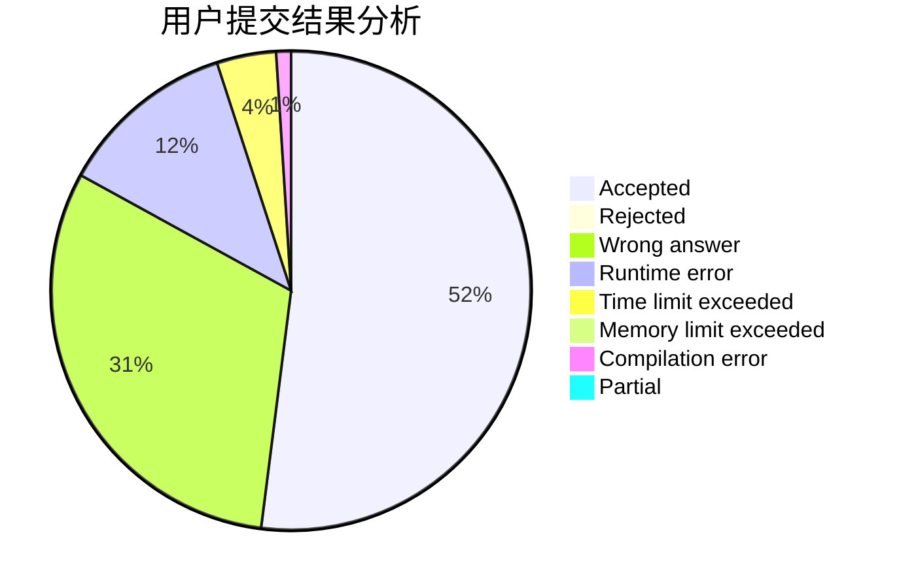
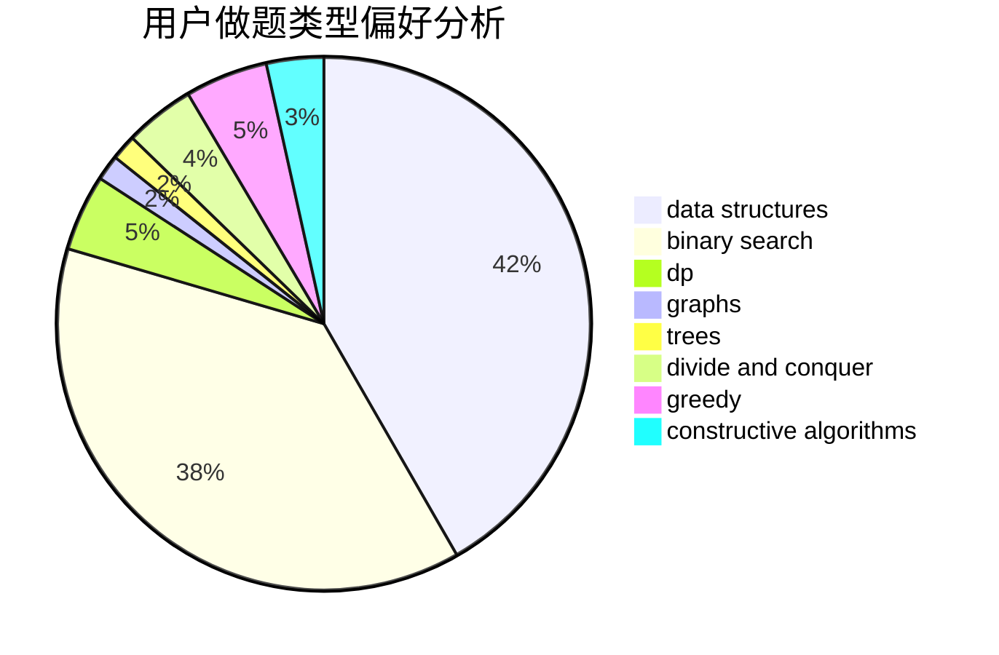

# BLUESKY007

<!-- tabs:start -->

#### **用户提交结果分析**

#### **用户做题类型偏好分析**

#### **用户错题知识点分析**

<!-- tabs:end -->
# 推荐题目
[1388B](https://codeforces.com/contest/1388/problem/B)		greedy,
                        math		  
[1088B](https://codeforces.com/contest/1088/problem/B)		implementation,
                        sortings		  
[460B](https://codeforces.com/contest/460/problem/B)		brute force,
                        implementation,
                        math,
                        number theory		  
[459E](https://codeforces.com/contest/459/problem/E)		dp,
                        sortings		  
[1389F](https://codeforces.com/contest/1389/problem/F)		data structures,
                        dp,
                        graph matchings,
                        sortings		  
[1367F1](https://codeforces.com/contest/1367F/problem/1)		dp,
                        greedy,
                        two pointers		  
[1077F1](https://codeforces.com/contest/1077F/problem/1)		dp		  
[460A](https://codeforces.com/contest/460/problem/A)		brute force,
                        implementation,
                        math		  
[1080D](https://codeforces.com/contest/1080/problem/D)		constructive algorithms,
                        implementation,
                        math		  
[45D](https://codeforces.com/contest/45/problem/D)		greedy,
                        meet-in-the-middle,
                        sortings		  
