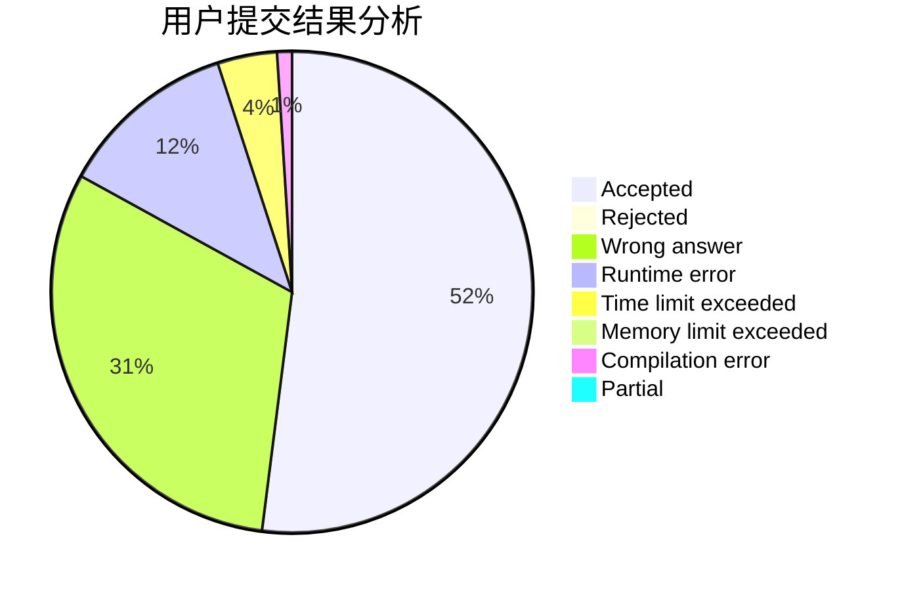
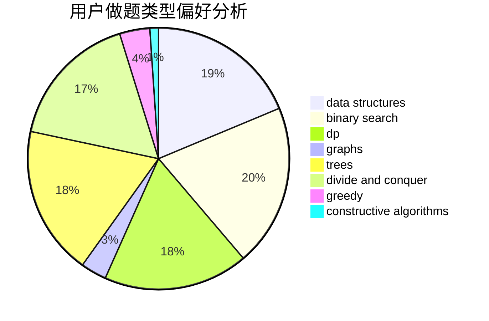

# BLUESKY007

<!-- tabs:start -->

#### **用户提交结果分析**

#### **用户做题类型偏好分析**

#### **用户错题知识点分析**

<!-- tabs:end -->
# 推荐题目
[1397E](https://codeforces.com/contest/1397/problem/E)		dsu,graphs,sortings,trees		  
[1088E](https://codeforces.com/contest/1088/problem/E)		dp,
                        greedy,
                        math,
                        trees		  
[479E](https://codeforces.com/contest/479/problem/E)		combinatorics,
                        dp		  
[478D](https://codeforces.com/contest/478/problem/D)		dp		  
[13992](https://codeforces.com/contest/1399/problem/2)		dsu,graphs,sortings,trees		  
[1374C](https://codeforces.com/contest/1374/problem/C)		greedy,
                        strings		  
[1078B](https://codeforces.com/contest/1078/problem/B)		dsu,graphs,sortings,trees		  
[479C](https://codeforces.com/contest/479/problem/C)		greedy,
                        sortings		  
[1081A](https://codeforces.com/contest/1081/problem/A)		constructive algorithms,
                        math		  
[479A](https://codeforces.com/contest/479/problem/A)		brute force,
                        math		  
