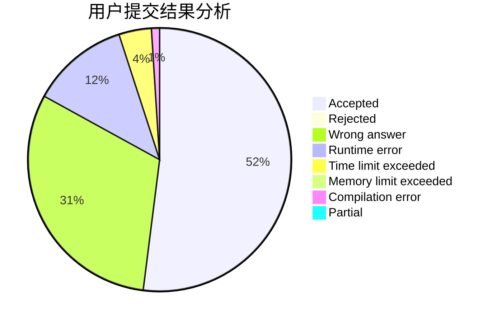
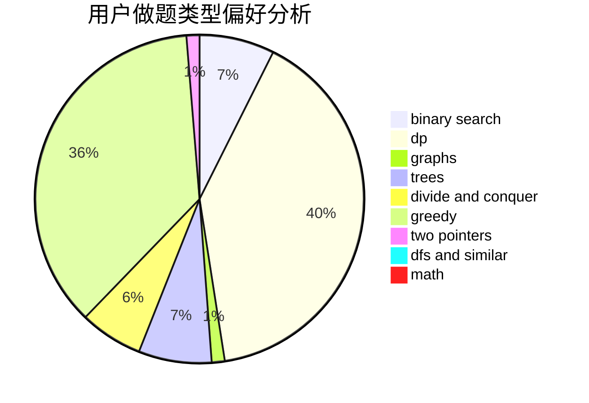

# BLUESKY007

<!-- tabs:start -->

#### **用户提交结果分析**

#### **用户做题类型偏好分析**

<!-- tabs:end -->
# 推荐题目
[1397E](https://codeforces.com/contest/1397/problem/E)
[1088E](https://codeforces.com/contest/1088/problem/E)
[479E](https://codeforces.com/contest/479/problem/E)
[478D](https://codeforces.com/contest/478/problem/D)
[13992](https://codeforces.com/contest/1399/problem/2)
[1374C](https://codeforces.com/contest/1374/problem/C)
[1078B](https://codeforces.com/contest/1078/problem/B)
[479C](https://codeforces.com/contest/479/problem/C)
[1081A](https://codeforces.com/contest/1081/problem/A)
[479A](https://codeforces.com/contest/479/problem/A)
