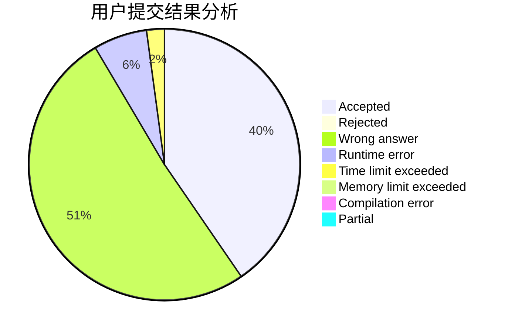
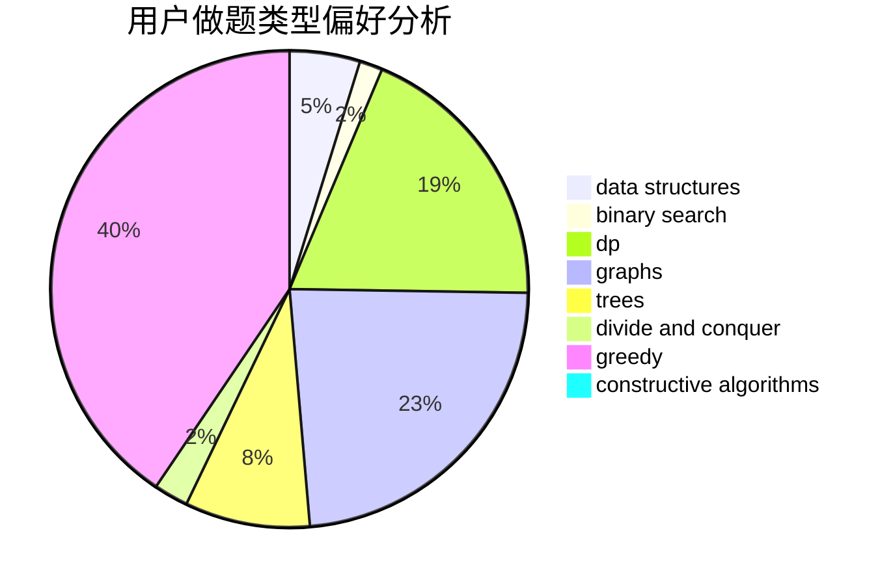
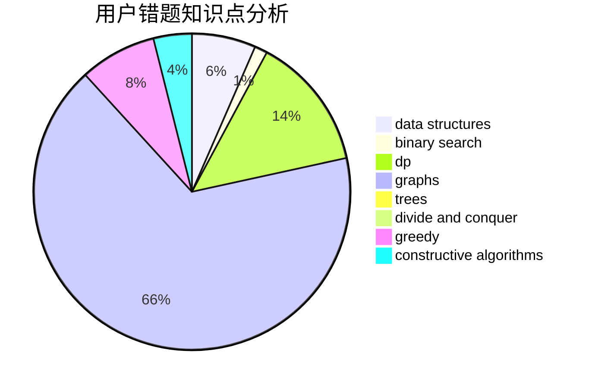

# hanguandong

<!-- tabs:start -->

#### **用户提交结果分析**

#### **用户做题类型偏好分析**

#### **用户错题知识点分析**

<!-- tabs:end -->
# 推荐题目
[1132B](https://codeforces.com/contest/1132/problem/B)		greedy,
                        sortings		  
[258B](https://codeforces.com/contest/258/problem/B)		brute force,
                        combinatorics,
                        dp		  
[1367D](https://codeforces.com/contest/1367/problem/D)		constructive algorithms,
                        greedy,
                        implementation,
                        sortings		  
[494E](https://codeforces.com/contest/494/problem/E)		data structures,
                        games		  
[762B](https://codeforces.com/contest/762/problem/B)		greedy,
                        implementation,
                        sortings,
                        two pointers		  
[1162C](https://codeforces.com/contest/1162/problem/C)		dsu,graphs,sortings,trees		  
[295B](https://codeforces.com/contest/295/problem/B)		dp,
                        graphs,
                        shortest paths		  
[576D](https://codeforces.com/contest/576/problem/D)		dp,
                        matrices		  
[778C](https://codeforces.com/contest/778/problem/C)		brute force,
                        dfs and similar,
                        dsu,
                        hashing,
                        strings,
                        trees		  
[1389E](https://codeforces.com/contest/1389/problem/E)		math,
                        number theory		  
