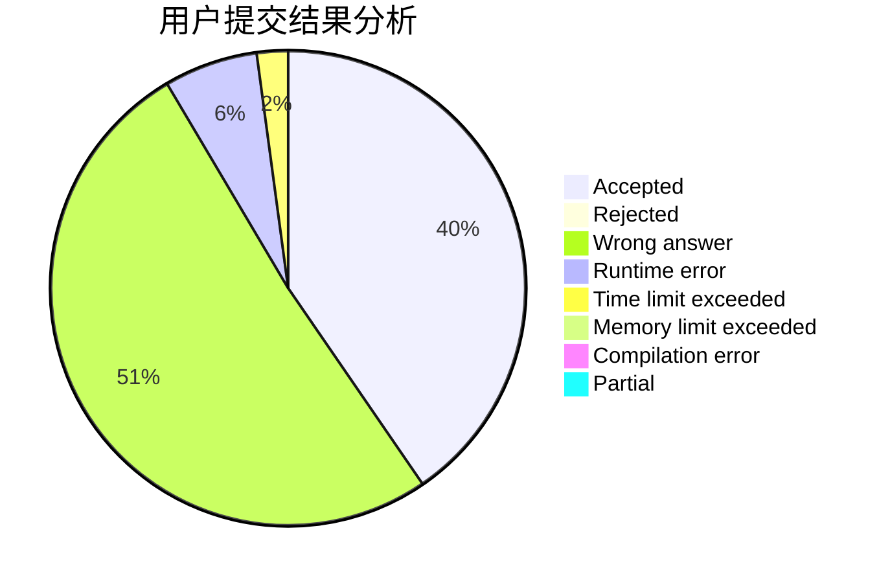
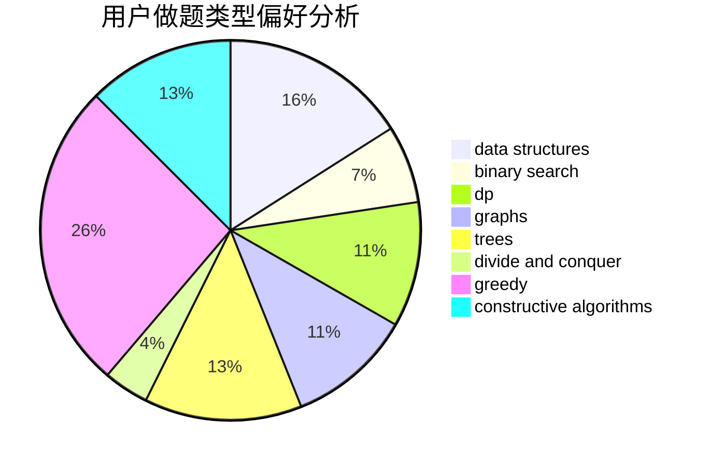
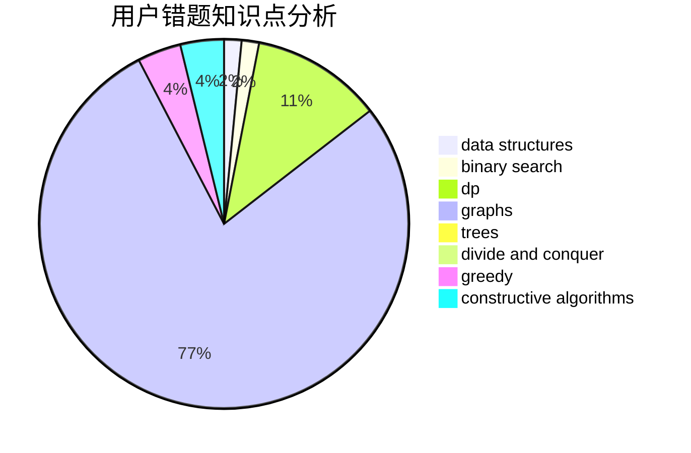

# hanguandong

<!-- tabs:start -->

#### **用户提交结果分析**

#### **用户做题类型偏好分析**

#### **用户错题知识点分析**

<!-- tabs:end -->
# 推荐题目
[1136A](https://codeforces.com/contest/1136/problem/A)		implementation		  
[275A](https://codeforces.com/contest/275/problem/A)		implementation		  
[1374A](https://codeforces.com/contest/1374/problem/A)		math		  
[515A](https://codeforces.com/contest/515/problem/A)		math		  
[780F](https://codeforces.com/contest/780/problem/F)		bitmasks,
                        dp,
                        graphs,
                        matrices		  
[1164J](https://codeforces.com/contest/1164/problem/J)		dsu,graphs,sortings,trees		  
[311E](https://codeforces.com/contest/311/problem/E)		flows		  
[598D](https://codeforces.com/contest/598/problem/D)		dfs and similar,
                        graphs,
                        shortest paths		  
[796D](https://codeforces.com/contest/796/problem/D)		constructive algorithms,
                        dfs and similar,
                        dp,
                        graphs,
                        shortest paths,
                        trees		  
[13991](https://codeforces.com/contest/1399/problem/1)		dsu,graphs,sortings,trees		  
