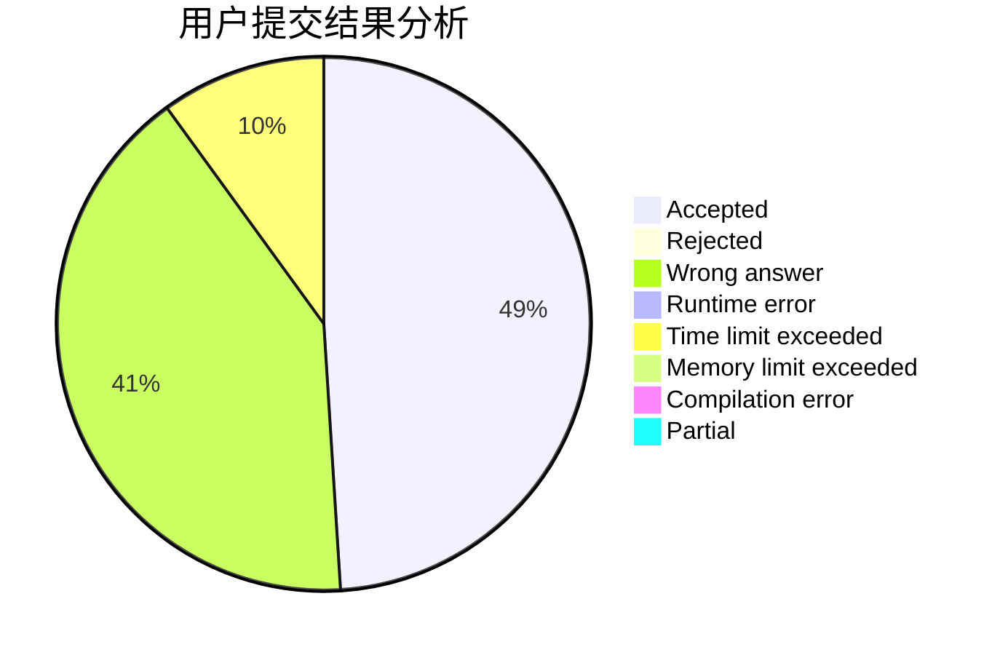
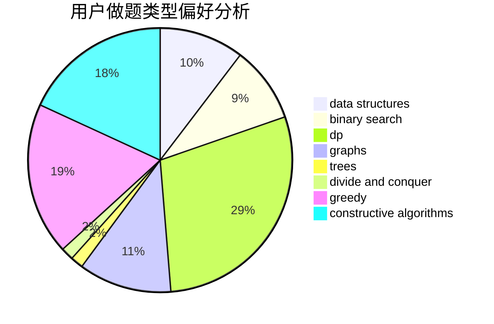
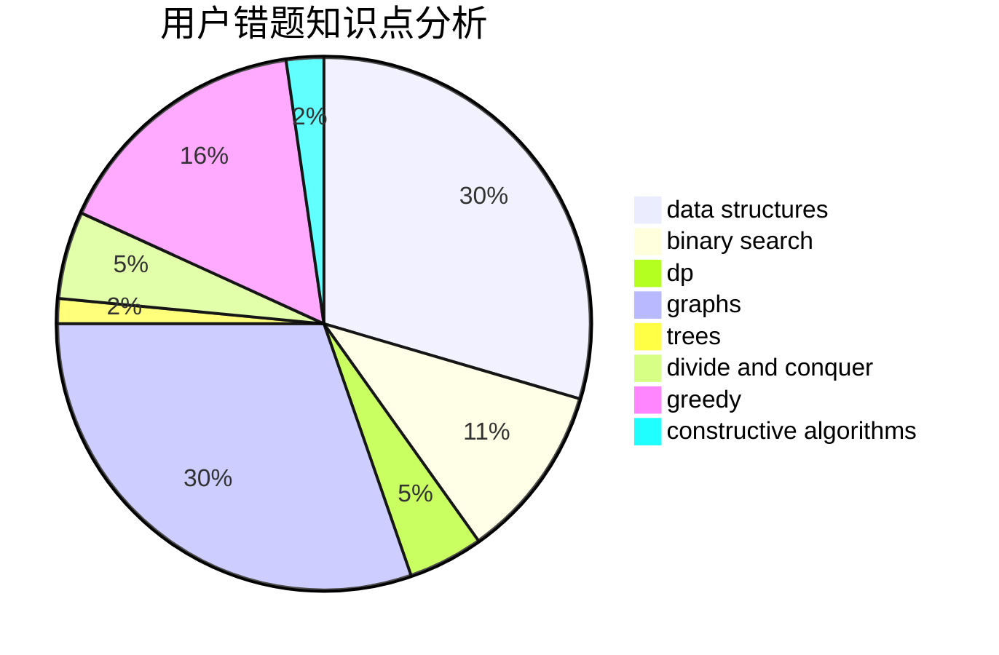

# hangyesheng

<!-- tabs:start -->

#### **用户提交结果分析**

#### **用户做题类型偏好分析**

#### **用户错题知识点分析**

<!-- tabs:end -->
# 推荐题目
[597B](https://codeforces.com/contest/597/problem/B)		dp,
                        greedy,
                        sortings		  
[11302](https://codeforces.com/contest/1130/problem/2)		dsu,graphs,sortings,trees		  
[11951](https://codeforces.com/contest/1195/problem/1)		dsu,graphs,sortings,trees		  
[113C](https://codeforces.com/contest/113/problem/C)		brute force,
                        math,
                        number theory		  
[520C](https://codeforces.com/contest/520/problem/C)		math,
                        strings		  
[1241B](https://codeforces.com/contest/1241/problem/B)		dsu,graphs,sortings,trees		  
[876F](https://codeforces.com/contest/876/problem/F)		dsu,graphs,sortings,trees		  
[377D](https://codeforces.com/contest/377/problem/D)		data structures		  
[760B](https://codeforces.com/contest/760/problem/B)		binary search,
                        greedy		  
[588B](https://codeforces.com/contest/588/problem/B)		math		  
