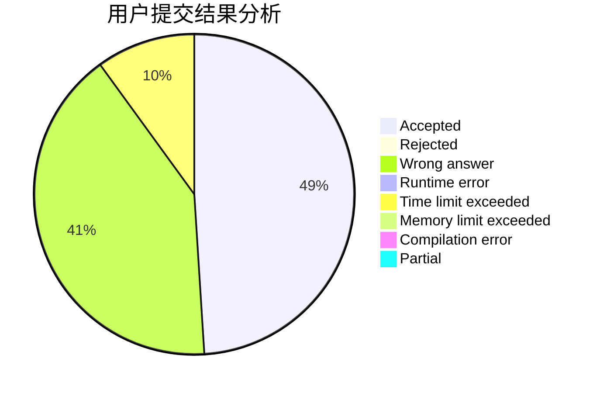
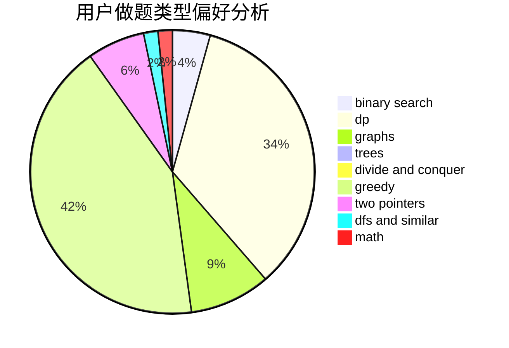

# hangyesheng

<!-- tabs:start -->

#### **用户提交结果分析**

#### **用户做题类型偏好分析**

<!-- tabs:end -->
# 推荐题目
[597B](https://codeforces.com/contest/597/problem/B)
[11302](https://codeforces.com/contest/1130/problem/2)
[11951](https://codeforces.com/contest/1195/problem/1)
[113C](https://codeforces.com/contest/113/problem/C)
[520C](https://codeforces.com/contest/520/problem/C)
[1241B](https://codeforces.com/contest/1241/problem/B)
[876F](https://codeforces.com/contest/876/problem/F)
[377D](https://codeforces.com/contest/377/problem/D)
[760B](https://codeforces.com/contest/760/problem/B)
[588B](https://codeforces.com/contest/588/problem/B)
