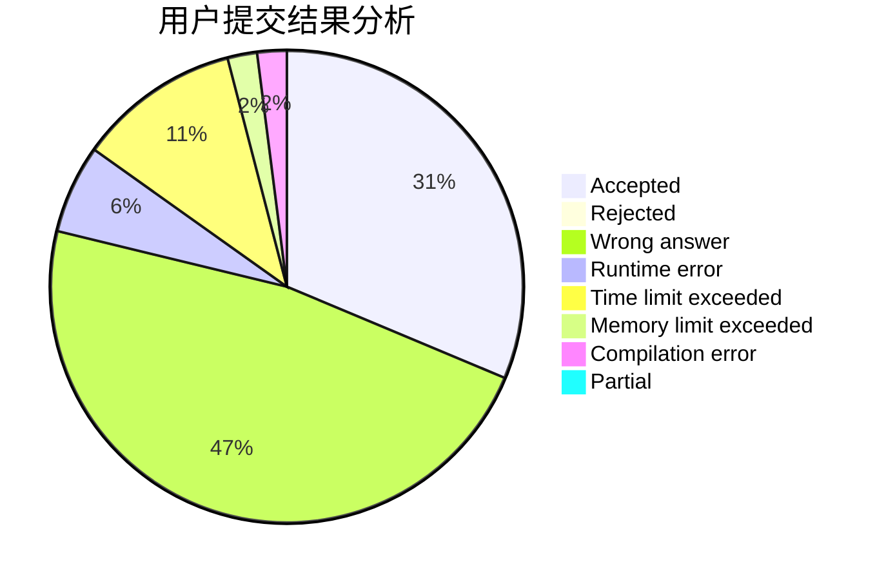
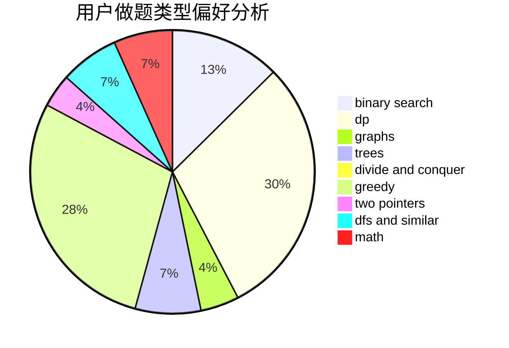

# hanyuwei

<!-- tabs:start -->

#### **用户提交结果分析**

#### **用户做题类型偏好分析**

<!-- tabs:end -->
# 推荐题目
[843A](https://codeforces.com/contest/843/problem/A)
[472C](https://codeforces.com/contest/472/problem/C)
[592A](https://codeforces.com/contest/592/problem/A)
[871A](https://codeforces.com/contest/871/problem/A)
[713E](https://codeforces.com/contest/713/problem/E)
[1279F](https://codeforces.com/contest/1279/problem/F)
[1055D](https://codeforces.com/contest/1055/problem/D)
[405D](https://codeforces.com/contest/405/problem/D)
[782C](https://codeforces.com/contest/782/problem/C)
[294B](https://codeforces.com/contest/294/problem/B)
