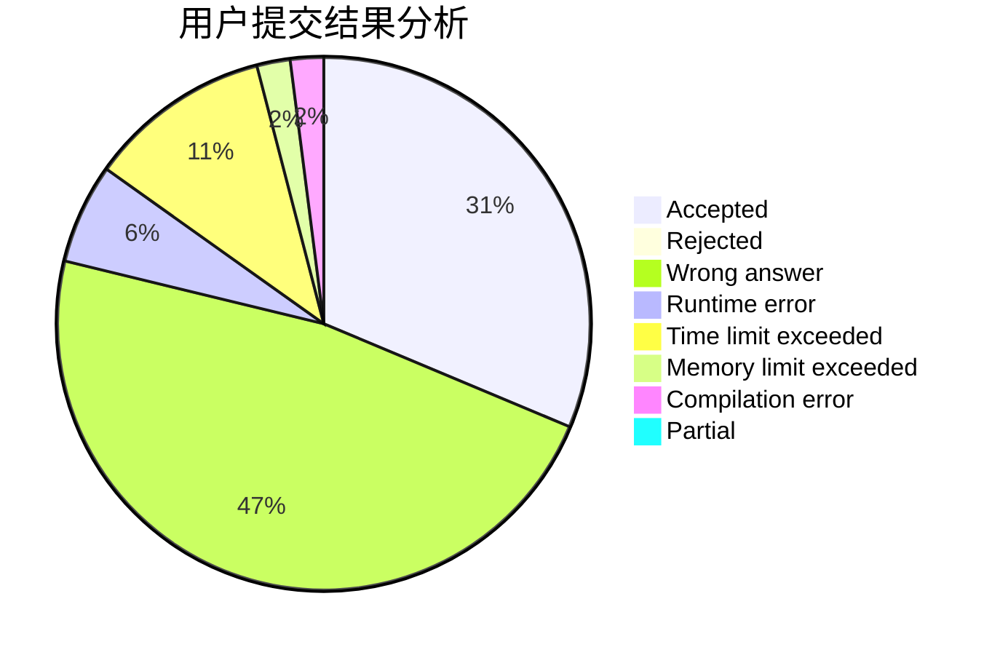
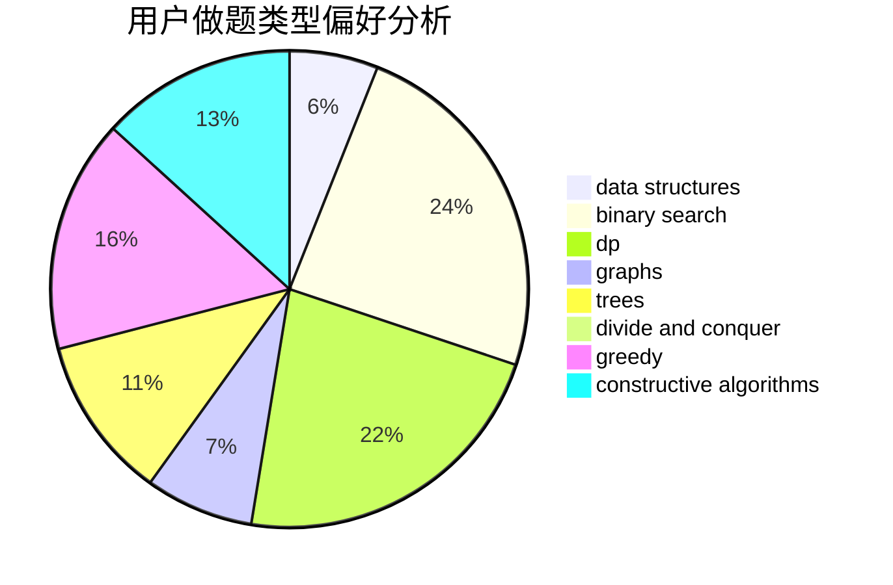
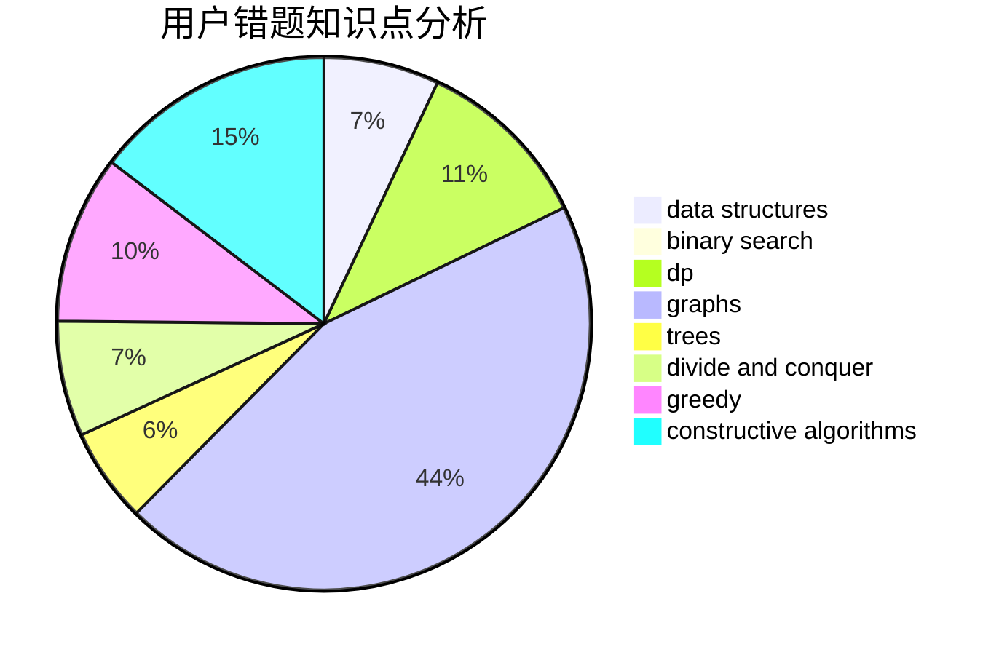

# hanyuwei

<!-- tabs:start -->

#### **用户提交结果分析**

#### **用户做题类型偏好分析**

#### **用户错题知识点分析**

<!-- tabs:end -->
# 推荐题目
[843A](https://codeforces.com/contest/843/problem/A)		dfs and similar,
                        dsu,
                        implementation,
                        math,
                        sortings		  
[472C](https://codeforces.com/contest/472/problem/C)		greedy		  
[592A](https://codeforces.com/contest/592/problem/A)		implementation		  
[871A](https://codeforces.com/contest/871/problem/A)		dsu,graphs,sortings,trees		  
[713E](https://codeforces.com/contest/713/problem/E)		binary search,
                        dp		  
[1279F](https://codeforces.com/contest/1279/problem/F)		binary search,
                        dp		  
[1055D](https://codeforces.com/contest/1055/problem/D)		greedy,
                        implementation,
                        strings		  
[405D](https://codeforces.com/contest/405/problem/D)		greedy,
                        implementation,
                        math		  
[782C](https://codeforces.com/contest/782/problem/C)		dsu,graphs,sortings,trees		  
[294B](https://codeforces.com/contest/294/problem/B)		dp,
                        greedy		  
