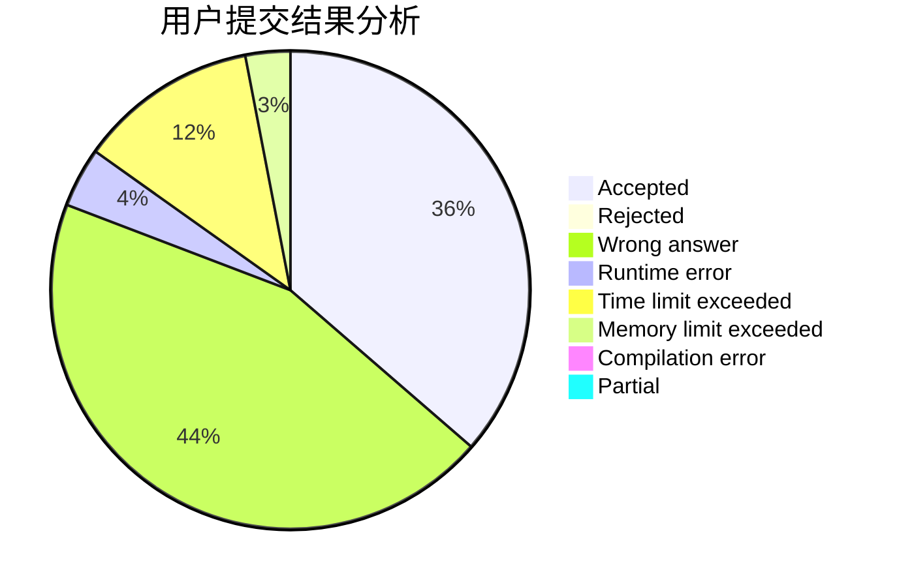
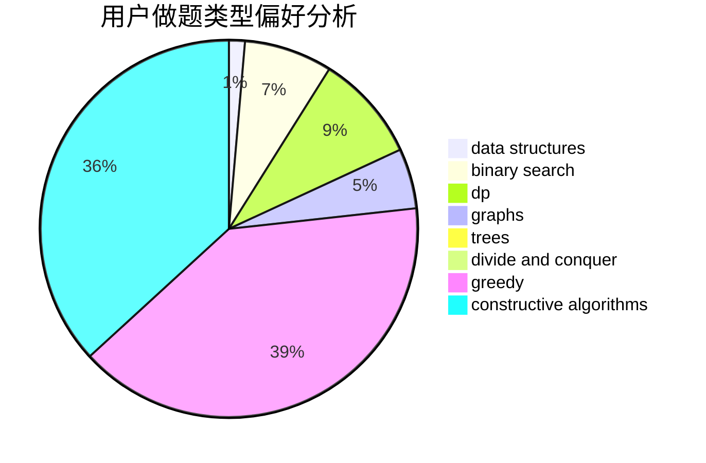
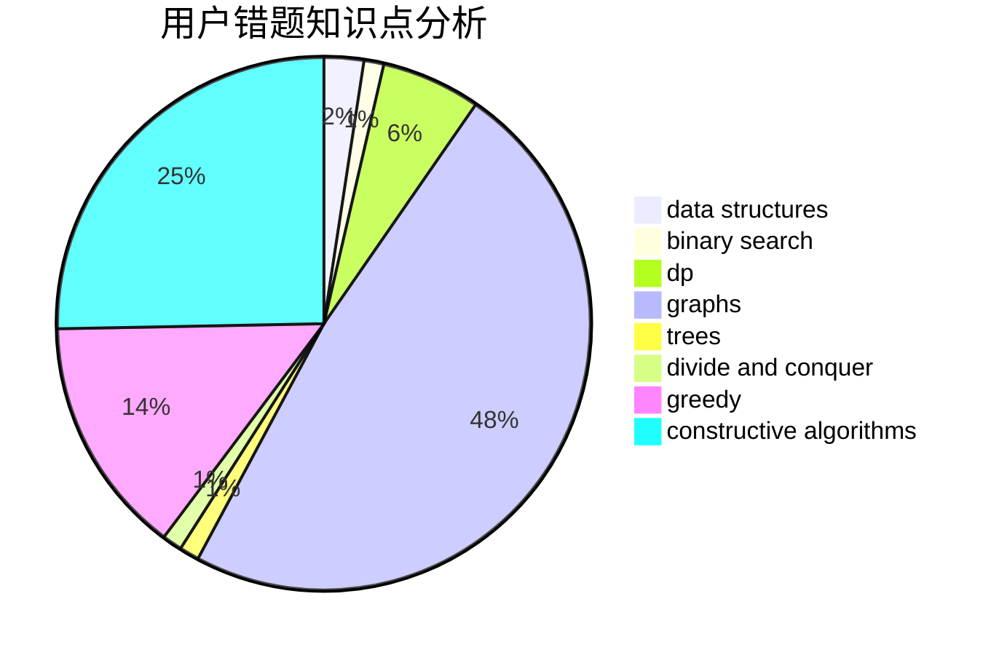

# hao_qing233

<!-- tabs:start -->

#### **用户提交结果分析**

#### **用户做题类型偏好分析**

#### **用户错题知识点分析**

<!-- tabs:end -->
# 推荐题目
[1164M](https://codeforces.com/contest/1164/problem/M)		dsu,graphs,sortings,trees		  
[417C](https://codeforces.com/contest/417/problem/C)		constructive algorithms,
                        graphs,
                        implementation		  
[593D](https://codeforces.com/contest/593/problem/D)		data structures,
                        dfs and similar,
                        graphs,
                        math,
                        trees		  
[523A](https://codeforces.com/contest/523/problem/A)		*special problem,
                        implementation		  
[782A](https://codeforces.com/contest/782/problem/A)		dsu,graphs,sortings,trees		  
[846A](https://codeforces.com/contest/846/problem/A)		brute force,
                        implementation		  
[2A](https://codeforces.com/contest/2/problem/A)		hashing,
                        implementation		  
[1488A](https://codeforces.com/contest/1488/problem/A)		*special problem,
                        math		  
[1351B](https://codeforces.com/contest/1351/problem/B)		brute force,
                        implementation,
                        math		  
[754B](https://codeforces.com/contest/754/problem/B)		brute force,
                        implementation		  
